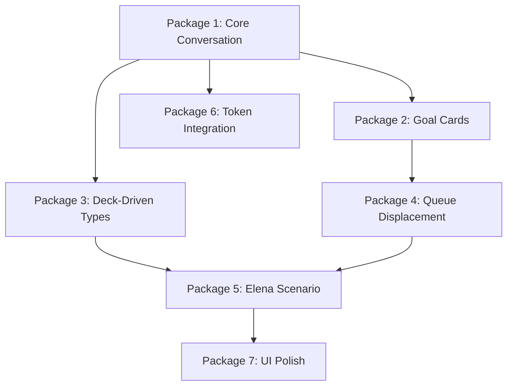

# Wayfarer POC Implementation Plan

## Executive Summary
This document provides a brutally honest assessment of what needs to be implemented to achieve the full POC as described in `poc-verification-checklist.md`. Based on actual code verification and testing, most core mechanics are either missing or incorrectly implemented.

## Current State Assessment

### ✅ What's Actually Working
- Basic location navigation (spot movement)
- Simple resource display (coins/health/hunger/attention)
- Basic exchange system with Marcus
- Work action (trades attention for coins)
- Basic queue display (shows obligations)
- Simple LISTEN/SPEAK structure in conversations

### ❌ Critical Systems Missing/Broken

#### 1. **Conversation System** - 20% Implemented
**Documentation Requirements:**
- 9 emotional states with specific card filtering
- Momentum system (-3 to +3) affecting weight limits
- Depth requirements for card access
- One card per turn rule
- Token-modified success rates

**Current Reality:**
- Generic card pool for all states (NO filtering)
- No momentum system
- No depth gating
- Draws wrong number of cards (6 instead of 2)
- Token bonuses not integrated

#### 2. **Goal Card System** - 0% Implemented
**Documentation Requirements:**
- One goal card shuffled per conversation
- 3-turn urgency rule
- Letter/Promise/Resolution/Crisis goal types
- Goals create obligations in queue

**Current Reality:**
- No goal cards exist
- No urgency mechanics
- No goal-to-obligation flow

#### 3. **Deck-Driven Conversation Types** - 0% Implemented
**Documentation Requirements:**
- Deck contents determine available conversation types
- Letter cards → "Letter Offer" conversation
- Burden cards → "Make Amends" conversation
- Exchange deck → "Quick Exchange"

**Current Reality:**
- Conversation types are hardcoded
- No deck analysis
- No dynamic conversation generation

#### 4. **Queue Displacement Mechanics** - 10% Implemented
**Documentation Requirements:**
- Automatic displacement through card play
- Token burning on displacement
- Cascade effects
- Forced sequential completion

**Current Reality:**
- Queue displays but doesn't enforce rules
- No automatic displacement
- No token burning
- No cascade mechanics

#### 5. **Observation Card Integration** - 30% Implemented
**Documentation Requirements:**
- Observation cards playable in conversations
- State changes from observation cards
- Card freshness/decay

**Current Reality:**
- Observations create cards
- Cards can't be used strategically in conversations
- No proper decay system

## Implementation Work Packages

### PACKAGE 1: Core Conversation Mechanics
**Owner:** Systems Architect
**Priority:** CRITICAL - Blocks everything else
**Complexity:** High (40 hours)

#### 1.1 Emotional State Filtering System
```csharp
// Required implementation in ConversationManager.cs
Dictionary<EmotionalState, CardFilter> stateFilters = new {
    DESPERATE → Trust + Crisis cards only,
    TENSE → Shadow + Trust cards,
    NEUTRAL → Balanced mix,
    GUARDED → State cards only,
    // ... etc for all 9 states
}
```

#### 1.2 Momentum System
- Track momentum -3 to +3
- Modify weight limits based on momentum
- Update success rates with momentum

#### 1.3 Depth Access System
- Enforce comfort requirements for card depth
- Display "Too Deep" for inaccessible cards
- Update UI to show depth access range

#### 1.4 Fix Card Draw Counts
- NEUTRAL: 2 cards
- OPEN: 3 cards  
- DESPERATE: 4 cards
- Implement proper draw rules per state

**Acceptance Criteria:**
- [ ] Screenshot showing DESPERATE drawing only Trust/Crisis cards
- [ ] Screenshot showing depth-locked cards marked "Too Deep"
- [ ] Screenshot showing momentum affecting weight limits
- [ ] Test all 9 states filter correctly

---

### PACKAGE 2: Goal Card System
**Owner:** Game Mechanics Designer
**Priority:** CRITICAL - Required for POC scenario
**Complexity:** High (30 hours)

#### 2.1 Goal Card Architecture
- Create GoalCard base class
- Implement Letter/Promise/Resolution/Crisis goal types
- One goal per conversation enforcement

#### 2.2 Goal Urgency System
- 3-turn countdown after goal drawn
- Force play or conversation fails
- UI urgency indicators

#### 2.3 Goal-to-Obligation Flow
- Letter goals create delivery obligations
- Promise goals create meeting obligations
- Automatic queue insertion

**Acceptance Criteria:**
- [ ] Screenshot of goal card with urgency timer
- [ ] Screenshot of failed conversation if goal not played in 3 turns
- [ ] Screenshot of obligation created from goal card

---

### PACKAGE 3: Deck-Driven Conversation Types
**Owner:** Systems Architect
**Priority:** HIGH - Core architecture requirement
**Complexity:** Medium (20 hours)

#### 3.1 Deck Analysis System
```csharp
public List<ConversationType> DetermineAvailableConversations(NPC npc) {
    var types = new List<ConversationType>();
    
    if (npc.LetterDeck.Any()) types.Add(ConversationType.LetterOffer);
    if (npc.BurdenCards.Count >= 2) types.Add(ConversationType.MakeAmends);
    if (npc.ExchangeDeck.Any()) types.Add(ConversationType.QuickExchange);
    types.Add(ConversationType.Standard); // Always available
    
    return types;
}
```

#### 3.2 Conversation Routing
- Each type draws from correct deck
- Each type has specific rules (no LISTEN in exchanges)
- Goal card selection per type

**Acceptance Criteria:**
- [ ] Screenshot showing Elena with "Letter Offer" option (has letter cards)
- [ ] Screenshot showing "Make Amends" only when 2+ burden cards
- [ ] Test each conversation type draws from correct deck

---

### PACKAGE 4: Queue Displacement System
**Owner:** Systems Architect + Content Integrator  
**Priority:** HIGH - Core mechanic
**Complexity:** Medium (25 hours)

#### 4.1 Automatic Displacement
- Poor letter negotiation forces position 1
- Cascade displacement of existing items
- No manual UI needed

#### 4.2 Token Burning
- Calculate tokens to burn per displaced NPC
- Apply burns automatically
- Show burn notifications

#### 4.3 Delivery Card System
- Add delivery card to recipient's deck
- Enable "Deliver Letter" conversation
- Remove obligation on successful delivery

**Acceptance Criteria:**
- [ ] Screenshot of automatic queue reorganization
- [ ] Screenshot of token burn notification
- [ ] Screenshot of delivery conversation at recipient

---

### PACKAGE 5: Elena's Letter Scenario
**Owner:** Content Integrator
**Priority:** HIGH - POC demonstration
**Complexity:** Medium (15 hours)

#### 5.1 Elena Configuration
- DESPERATE emotional state
- Crisis Letter card in deck
- Trust tokens available
- Correct dialogue/narrative

#### 5.2 Lord Blackwood Setup
- Noble District access (checkpoint)
- Delivery card reception
- Payment mechanics

#### 5.3 Full Scenario Flow
- Elena conversation → Letter acceptance → Queue displacement → Travel → Delivery

**Acceptance Criteria:**
- [ ] Complete Elena scenario per POC checklist
- [ ] All 7.1-7.9 checkpoints verified with screenshots

---

### PACKAGE 6: Token Integration
**Owner:** Game Mechanics Designer
**Priority:** MEDIUM - Enhancement
**Complexity:** Low (10 hours)

#### 6.1 Success Rate Calculation
```csharp
var successRate = baseRate + (tokenCount * 5);
```

#### 6.2 Token Display in UI
- Show tokens with bonuses
- Update on changes
- Clear visual feedback

**Acceptance Criteria:**
- [ ] Screenshot showing +5% per token
- [ ] Test token burns on displacement

---

### PACKAGE 7: UI Compliance
**Owner:** General Purpose Agent
**Priority:** LOW - After mechanics work
**Complexity:** Medium (20 hours)

#### 7.1 Conversation Screen
- Match mockup exactly
- Cards as cards, not buttons
- Proper header with resources

#### 7.2 Queue Display
- Position badges
- Deadline warnings
- Must complete position 1 text

**Acceptance Criteria:**
- [ ] Screenshots matching all UI mockups

---

## Integration Points & Dependencies



## Testing Strategy

### Phase 1: Unit Testing
- Each package tested in isolation
- Mock data for dependencies
- Screenshot verification

### Phase 2: Integration Testing
- Test package interactions
- Full scenario walkthroughs
- Performance testing

### Phase 3: POC Verification
- Complete checklist verification
- Every checkbox with screenshot
- No claims without proof

## Timeline & Resources

### Week 1: Foundation (Packages 1 & 2)
- Systems Architect: Core conversation mechanics
- Game Mechanics Designer: Goal card system

### Week 2: Architecture (Packages 3 & 4)  
- Systems Architect: Deck-driven types & displacement
- Content Integrator: Queue integration

### Week 3: Scenario (Packages 5 & 6)
- Content Integrator: Elena scenario
- Game Mechanics Designer: Token integration

### Week 4: Polish & Testing (Package 7)
- General Purpose Agent: UI compliance
- All: POC verification checklist

## Success Criteria

**POC is ONLY complete when:**
1. All 311 checkboxes in `poc-verification-checklist.md` verified
2. Screenshots prove every mechanic works
3. Elena scenario playable start to finish
4. No manual queue management needed
5. Deck contents drive conversation types
6. All 9 emotional states filter correctly

## Risk Mitigation

### High Risk Areas:
1. **State Machine Complexity**: 9 states with transitions
   - Mitigation: Implement incrementally, test each state
   
2. **Queue Displacement Logic**: Complex cascade effects
   - Mitigation: Extensive unit testing, visual debugging
   
3. **Performance**: Many card draws and calculations
   - Mitigation: Profile early, optimize critical paths

## Conclusion

The current implementation is approximately **25% complete** relative to POC requirements. The missing 75% consists primarily of core mechanical depth rather than UI polish. 

**Critical Path:** Packages 1→2→4→5 must be completed for basic POC demonstration.

**Estimated Total Effort:** 160 developer hours to reach full POC compliance.

**Recommendation:** Focus on mechanical implementation over visual polish. A mechanically complete game with basic UI is better than a beautiful UI with broken mechanics.