# Wayfarer Action Flow Diagrams

## Location Action Complete Flow

## Letter Queue Action Flow

```mermaid
sequenceDiagram
    participant UI as LetterQueueDisplay.razor
    participant GF as GameFacade
    participant LQS as LetterQueueUIService
    participant LQM as LetterQueueManager
    participant CTM as ConnectionTokenManager
    participant GW as GameWorld

    Note over UI: Skip Letter Action
    UI->>GF: SkipLetterAsync(position)
    GF->>LQS: SkipLetterAsync(position)
    
    LQS->>LQM: GetLetterAtPosition(position)
    LQM-->>LQS: Letter
    
    LQS->>CTM: GetTokensForNPC(npcId)
    CTM-->>LQS: Token count
    
    LQS->>LQS: Calculate skip cost
    Note over LQS: Base cost × position multiplier
    
    alt Has enough tokens
        LQS->>CTM: SpendTokens(npcId, cost)
        CTM->>GW: Update token state
        LQS->>LQM: MoveToPosition(letter, 1)
        LQM->>GW: Update queue state
        LQS-->>GF: Success
    else Insufficient tokens
        LQS-->>GF: Failure
    end
    
    GF-->>UI: Result
    UI->>UI: RefreshViewModel()
    UI->>UI: StateHasChanged()
```

## Conversation Flow with State Management

## Market Transaction Flow

## Travel Action Flow with Route Validation

## Command Discovery Filtering Flow

## Error Propagation Flow

## State Change Notification Gap

These diagrams illustrate the complete action flows through the Wayfarer system, highlighting both the successful paths and the gaps identified in the audit.