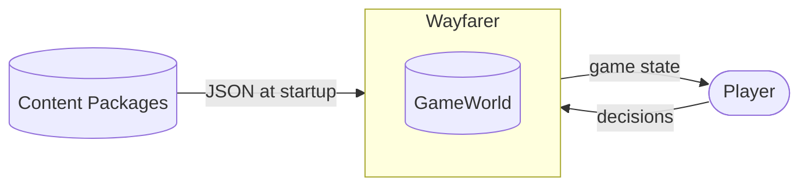
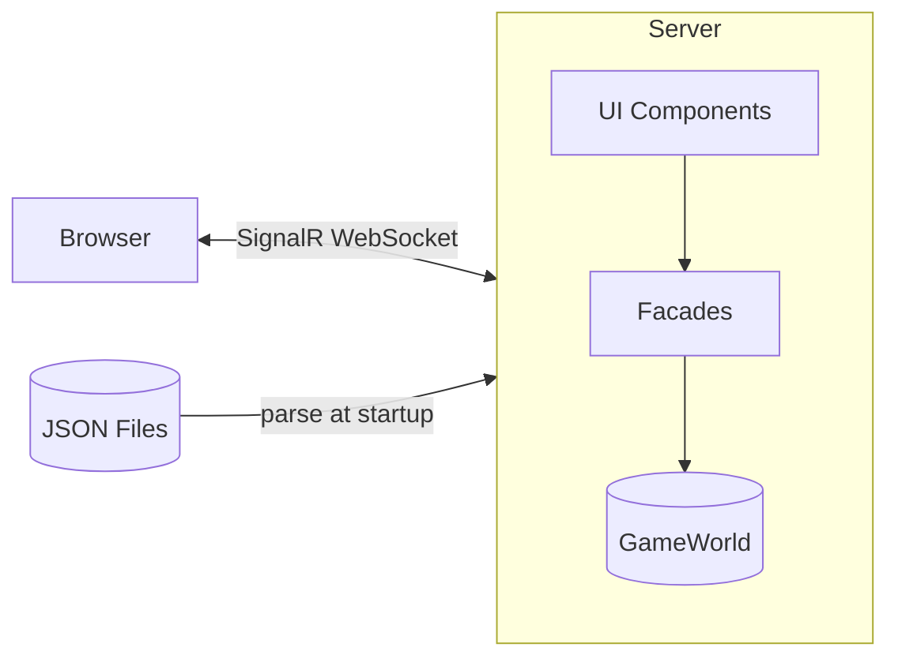

# 3. Context and Scope

This section delimits Wayfarer from its environment and defines external interfaces.

---

## 3.1 Business Context

Wayfarer is a standalone single-player game with minimal external dependencies.

| Partner | Input | Output |
|---------|-------|--------|
| **Player** | Strategic choices, tactical card plays, navigation | Game state, narrative text, resource status |
| **Content Packages** | JSON files (NPCs, locations, scenes, cards) | — (read-only) |

---

## 3.2 Technical Context

| Channel | Protocol | Purpose |
|---------|----------|---------|
| Browser ↔ Server | SignalR/WebSocket | Real-time UI, user input |
| Server ← Files | File system | One-time content load |

---

## 3.3 External Systems

Wayfarer has no external runtime dependencies: no database, no authentication, no network APIs, no cloud services. This eliminates external failure modes.

---

## Related Documentation

- [07_deployment_view.md](07_deployment_view.md) — Deployment details
- [02_constraints.md](02_constraints.md) — Technical constraints
