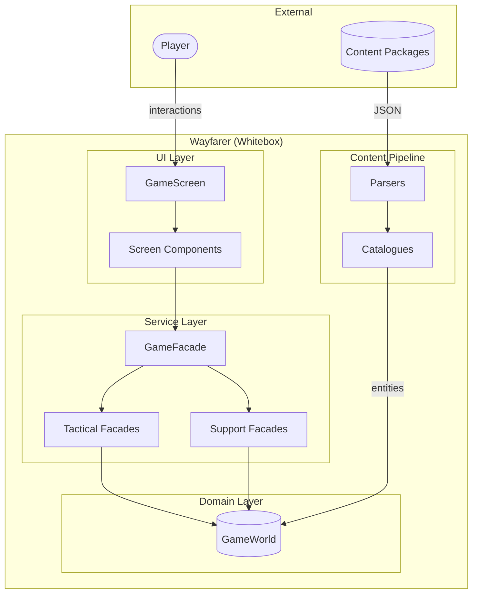
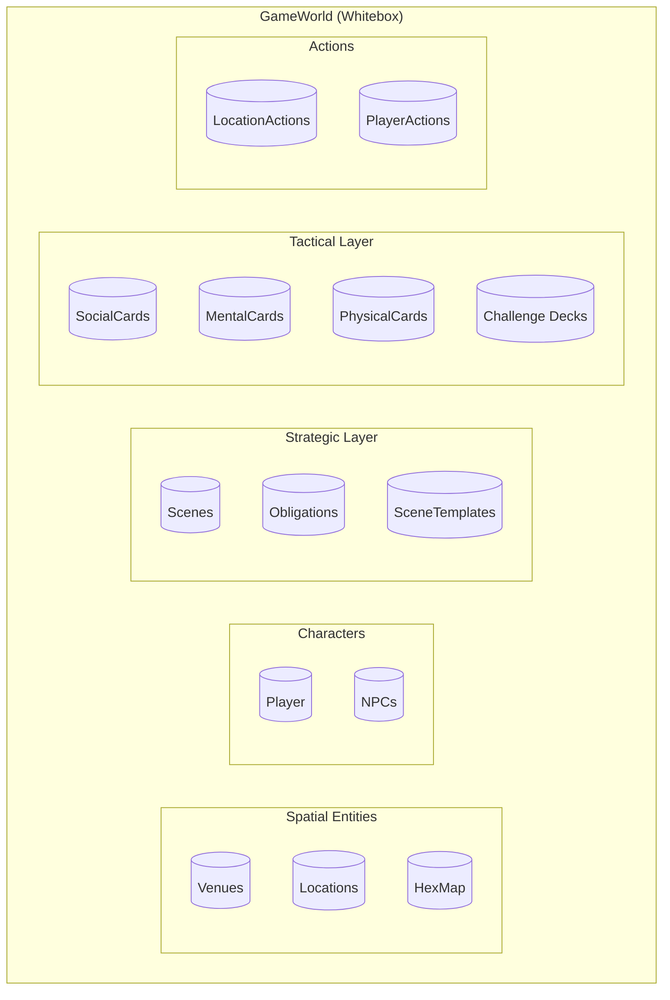
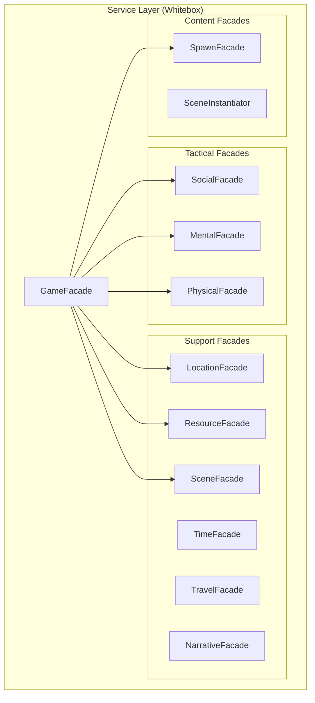

# 5. Building Block View

This section shows the static decomposition of Wayfarer into building blocks. Level 1 opens the blackbox from the context diagram, revealing the system's internal structure.

---

## 5.1 Level 1: Overall System Whitebox

The context diagram showed Wayfarer as a blackbox receiving player input and content packages. This whitebox reveals the internal decomposition.



| Building Block | Responsibility |
|----------------|----------------|
| **UI Layer** | Blazor components rendering game state; captures player input; contains no game logic |
| **GameFacade** | Orchestrates cross-cutting operations; delegates to specialized facades; single entry point for UI |
| **Tactical Facades** | Business logic for three parallel challenge systems (Social, Mental, Physical) |
| **Support Facades** | Business logic for game systems (Location, Resource, Time, Travel, Token, Narrative) |
| **GameWorld** | Single source of truth; holds all game state; zero external dependencies |
| **Parsers** | Convert JSON to DTOs; invoke catalogues for translation; create domain entities |
| **Catalogues** | Translate categorical properties to concrete values at parse-time |

**Decomposition Rationale:** The layered structure enforces dependency inversion—all arrows point toward GameWorld. The separation between tactical facades (challenge systems) and support facades (game systems) reflects the two-layer architecture from the solution strategy.

---

## 5.2 Level 2: GameWorld Whitebox

GameWorld is the central state container. This whitebox shows its internal collections.



| Building Block | Responsibility |
|----------------|----------------|
| **Venues** | Top-level location clusters; contain multiple locations |
| **Locations** | Specific places; hold hex position as spatial source of truth |
| **HexMap** | Grid-based world representation; enables pathfinding |
| **Player** | Single player instance; resources, stats, position, inventory |
| **NPCs** | Non-player characters; relationships, personalities, locations |
| **Scenes** | Persistent narrative containers; embed situations |
| **Obligations** | Quest definitions; trigger scene spawning |
| **SceneTemplates** | Immutable archetypes; define scene patterns |
| **SocialCards/MentalCards/PhysicalCards** | Tactical cards for three challenge systems |
| **Challenge Decks** | Card collections defining challenge configurations |
| **LocationActions/PlayerActions** | Atmospheric scaffolding; persistent gameplay actions |

**Decomposition Rationale:** Collections group by concern—spatial entities define the world, characters populate it, strategic entities drive narrative, tactical entities enable challenges. This mirrors the two-layer architecture.

---

## 5.3 Level 2: Service Layer Whitebox

The service layer contains facades that operate on GameWorld.



| Building Block | Responsibility |
|----------------|----------------|
| **GameFacade** | Pure orchestrator; routes requests to specialized facades; no business logic |
| **SocialFacade** | Conversation challenges; momentum, initiative, connection state |
| **MentalFacade** | Investigation challenges; progress, attention, exposure |
| **PhysicalFacade** | Obstacle challenges; breakthrough, exertion, danger |
| **LocationFacade** | Movement validation; spot management; location properties |
| **ResourceFacade** | Permanent resources (coins, health, stamina, hunger, focus) |
| **SceneFacade** | Scene activation; situation advancement; action instantiation |
| **TimeFacade** | Time progression; segment transitions |
| **TravelFacade** | Route discovery; travel validation |
| **NarrativeFacade** | Message system; observation rewards |
| **SpawnFacade** | Scene spawn condition evaluation |
| **SceneInstantiator** | Scene creation from templates; deferred/active state transitions |

### Location Subsystem Services

LocationFacade delegates validation to specialized services:

| Service | Responsibility |
|---------|----------------|
| **MovementValidator** | Validates intra-venue movement; checks venue match; delegates accessibility |
| **LocationAccessibilityService** | Dual-model accessibility: authored (always) vs dependent (scene-gated) |

**Dependency Chain:**
```
LocationFacade.MoveToSpot()
    └─ MovementValidator.ValidateMovement()
        └─ LocationAccessibilityService.IsLocationAccessible()
            ├─ Provenance == null → true (authored, always accessible)
            └─ Provenance != null → CheckSceneGrantsAccess() (dependent)
```

See [§8.11 Location Accessibility Architecture](08_crosscutting_concepts.md#811-location-accessibility-architecture) and [ADR-012](09_architecture_decisions.md#adr-012-dual-model-location-accessibility).

**Decomposition Rationale:** GameFacade delegates everything—it contains no business logic. Tactical facades handle the three parallel challenge systems with equivalent depth. Support facades handle game systems. This ensures single responsibility and testability.

---

## Related Documentation

- [03_context_and_scope.md](03_context_and_scope.md) — Context diagram showing system as blackbox
- [04_solution_strategy.md](04_solution_strategy.md) — Decisions driving this decomposition
- [06_runtime_view.md](06_runtime_view.md) — Dynamic behavior of these blocks
