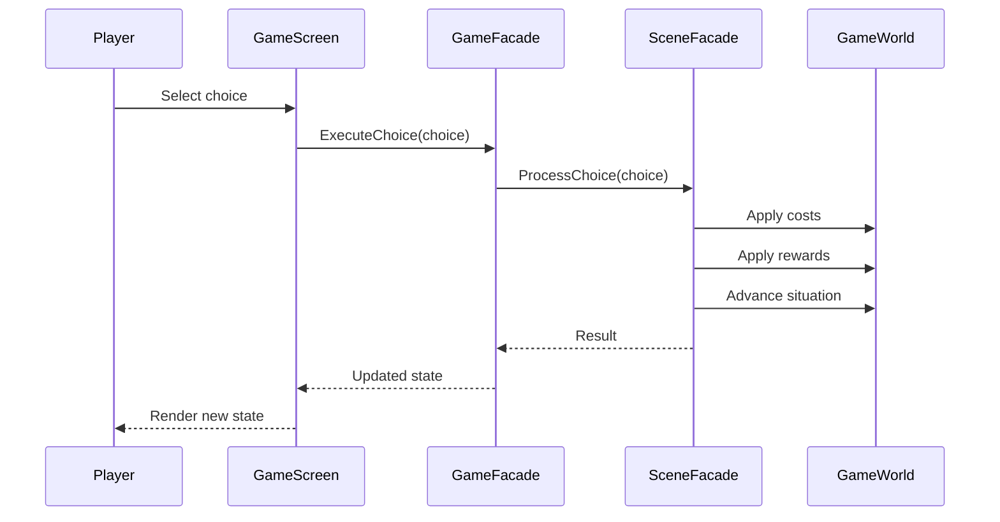
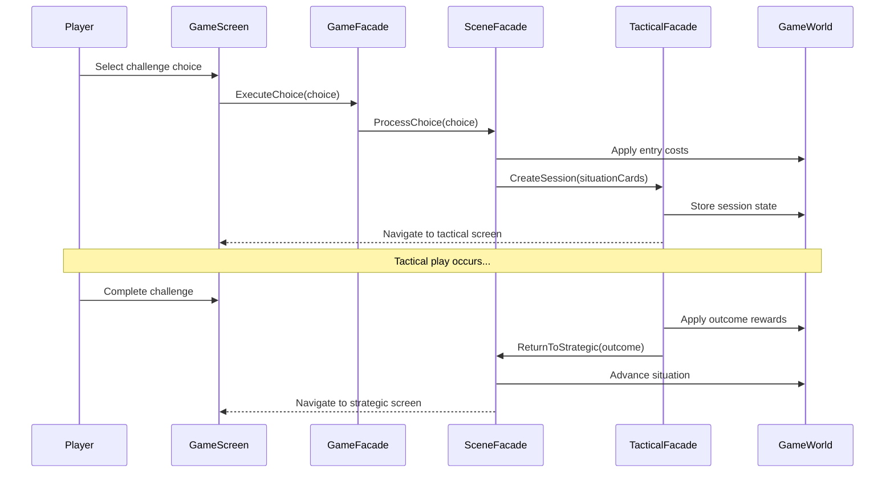
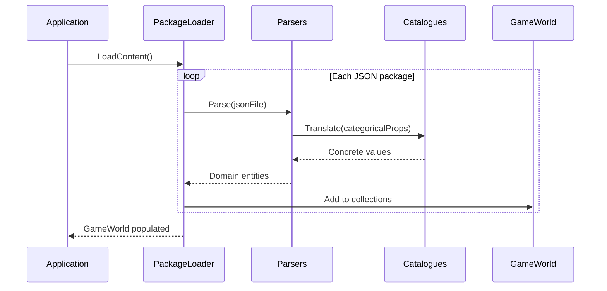

# 6. Runtime View

This section shows key runtime scenarios illustrating how building blocks interact.

---

## 6.1 Strategic Choice Execution

The most common runtime flow: player selects a choice, system applies costs/rewards, scene advances.

---

## 6.2 Strategic-Tactical Bridge

When a choice crosses from strategic to tactical layer via StartChallenge action type.

---

## 6.3 Content Loading (Startup)

One-time flow at application startup populating GameWorld.

---

## Related Documentation

- [05_building_block_view.md](05_building_block_view.md) — Static structure of these blocks
- [04_solution_strategy.md](04_solution_strategy.md) — Two-layer architecture driving these flows
