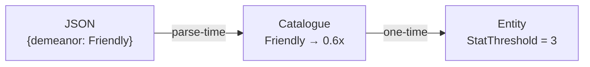
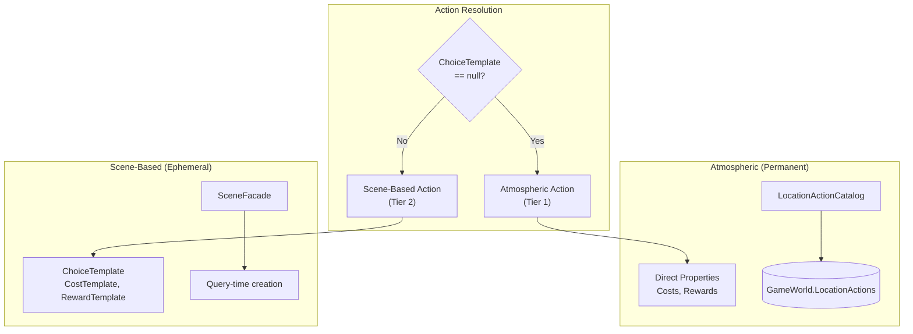
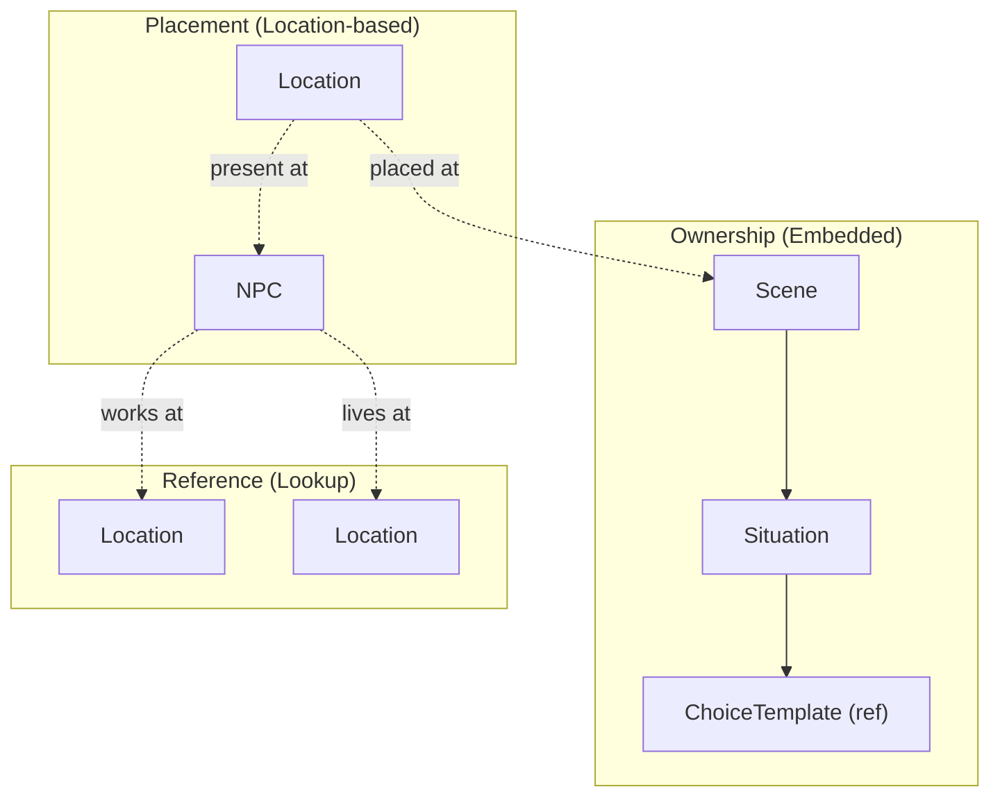

# 8. Crosscutting Concepts

This section documents patterns and practices that apply across multiple building blocks, providing conceptual integrity throughout the architecture.

---

## 8.1 HIGHLANDER Principle

**"There can be only one."**

Every piece of game state has exactly one canonical storage location. No redundant tracking, no parallel state, no caching that could desync.

**Implementation:**
- Player location stored only in `Player.CurrentPosition` (hex coordinates)
- Scene's current situation stored only in `Scene.CurrentSituation` (object reference)
- Entity relationships use direct object references, never ID strings alongside objects

**Consequences:**
- No "which is correct?" ambiguity when state disagrees
- Single update point for each state change
- Queries always hit source of truth

**Violation Example:** Storing both `CurrentLocationId` string and `CurrentLocation` object creates two representations. When they disagree, the system has no way to determine correctness.

---

## 8.2 Catalogue Pattern (Parse-Time Translation)

Content authors write categorical properties; catalogues translate to concrete mechanical values at parse-time only.



| Component | Responsibility |
|-----------|----------------|
| **JSON** | Categorical descriptions (Friendly, Premium, Hostile) |
| **Catalogue** | Translation formulas (multipliers, base values) |
| **Entity** | Concrete values only (integers, no categories) |

**Consequences:**
- AI generates balanced content without knowing game math
- Single formula change rebalances all affected content
- Zero runtime overhead (translation complete at startup)

**Forbidden:** Runtime catalogue lookups, string matching on property names, Dictionary<string, int> for costs.

---

## 8.3 Entity Identity Model

Domain entities have no instance IDs. Relationships use direct object references. Queries use categorical properties.

**Allowed:**
- Template IDs (SceneTemplate.Id) — immutable archetypes
- Object references (NPC.Location) — direct relationships
- Categorical filters (find Location where Purpose=Lodging)

**Forbidden:**
- Entity instance IDs (Scene.Id, NPC.Id, Location.Id)
- ID strings alongside object references
- ID parsing for routing logic

**Why:** Procedural generation requires categorical matching ("find a Friendly innkeeper"), not hardcoded references ("find NPC elena_001"). IDs create brittleness; categories enable infinite content.

---

## 8.4 Three-Tier Timing Model

Content instantiates lazily across three timing tiers to minimize memory usage.

| Tier | When | What | Mutability |
|------|------|------|------------|
| **Templates** | Parse-time | SceneTemplate, ChoiceTemplate | Immutable |
| **Instances** | Spawn-time | Scene, Situation | Mutable |
| **Actions** | Query-time | LocationAction, NPCAction | Ephemeral |

**Flow:**
1. Templates created once at startup, stored permanently
2. Instances spawn when triggered (obligation activates, procedural generation fires)
3. Actions materialize when player enters relevant context, deleted after execution

**Consequence:** Memory contains only currently accessible content. Scene with 5 situations × 3 choices = 15 potential actions, but only 3 exist at any moment.

---

## 8.5 Fail-Fast Philosophy

Errors surface immediately at point of failure with clear stack traces. No defensive coding that hides problems.

**Required:**
- Initialize all entity properties inline (empty List, empty string)
- Access properties directly without null checks
- Let null references crash with clear stack traces

**Forbidden:**
- Null-coalescing operators (??) hiding missing data
- TryGetValue patterns deferring errors
- Default return values masking lookup failures

**Rationale:** A crash with clear stack trace is debuggable. Silent null propagation creates mystery bugs discovered far from root cause.

---

## 8.6 Backend/Frontend Separation

Backend returns domain semantics (WHAT). Frontend decides presentation (HOW).

**Backend provides:**
- Domain enums (ActionType, ResourceType, ConnectionState)
- Plain values (integers, booleans, strings)
- State validity (is action available, does player meet requirements)

**Frontend decides:**
- CSS classes and styling
- Icon selection
- Display text generation
- Visual formatting

**Forbidden in Backend:**
- CssClass properties in ViewModels
- IconName properties in ViewModels
- Display string generation in services

**Rationale:** Changing presentation never touches game logic. Changing mechanics never requires UI updates beyond data flow.

---

## 8.7 Idempotent Initialization

Blazor ServerPrerendered mode executes initialization twice. All startup code must be idempotent.

**Pattern:**
```csharp
if (!_initialized)
{
    // Perform initialization
    _initialized = true;
}
```

**Applies to:**
- Component OnInitializedAsync
- State mutations during startup
- Event subscriptions
- Resource allocation

**Consequence:** Double-execution is safe; state mutations guarded by flags.

---

## 8.8 Dual-Tier Action Architecture (CRITICAL)

**LocationAction is a UNION TYPE supporting two intentional patterns via pattern discrimination.**

This architecture prevents soft-locks by ensuring atmospheric actions always exist as a baseline, while scene-based actions layer dynamic narrative content on top.



| Tier | Pattern | Source | Storage | Properties Used |
|------|---------|--------|---------|-----------------|
| **Tier 1: Atmospheric** | ChoiceTemplate == null | LocationActionCatalog at parse-time | GameWorld.LocationActions (permanent) | `Costs`, `Rewards` directly |
| **Tier 2: Scene-Based** | ChoiceTemplate != null | SceneFacade at query-time | Not stored (ephemeral) | `ChoiceTemplate.CostTemplate`, `RewardTemplate` |

**Why Both Patterns Exist:**

*Atmospheric actions are simple and permanent:*
- Work always costs time, always gives coins
- Rest always recovers health/stamina
- Travel always opens route selection
- ChoiceTemplate would be overkill for constants

*Scene-based actions are complex and dynamic:*
- Costs vary by context (NPC personality, location tier)
- Requirements use OR paths (need stat X OR stat Y)
- Rewards spawn scenes, modify relationships
- Direct properties would be insufficient

**Pattern Discrimination:**
```csharp
if (action.ChoiceTemplate == null)
{
    // Atmospheric: use action.Costs, action.Rewards
    return ValidateAtmosphericAction(action, player);
}
else
{
    // Scene-based: use action.ChoiceTemplate
    return ValidateChoiceTemplate(action.ChoiceTemplate, player);
}
```

**Critical Warning:** Do NOT delete `Costs`/`Rewards` properties from LocationAction. They are REQUIRED for atmospheric actions. This is not legacy code—both patterns are intentional architecture.

---

## 8.9 Entity Ownership Hierarchy

Entities follow strict ownership patterns determining lifecycle and responsibility.



| Relationship | Type | Meaning |
|--------------|------|---------|
| Scene → Situation | **Ownership** | Scene OWNS situations; deleting scene deletes situations |
| Scene → Location | **Placement** | Scene placed AT location; location doesn't own scene |
| NPC → Location | **Reference** | NPC references location; neither owns the other |

**Key Principle:** Situations are EMBEDDED in Scenes (no separate collection). This prevents orphaned situations and simplifies scene lifecycle.

---

## Related Documentation

- [04_solution_strategy.md](04_solution_strategy.md) — Strategies these concepts implement
- [09_architecture_decisions.md](09_architecture_decisions.md) — ADRs documenting why these patterns were chosen
- [02_constraints.md](02_constraints.md) — Constraints driving these concepts
