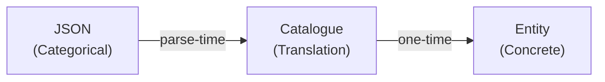
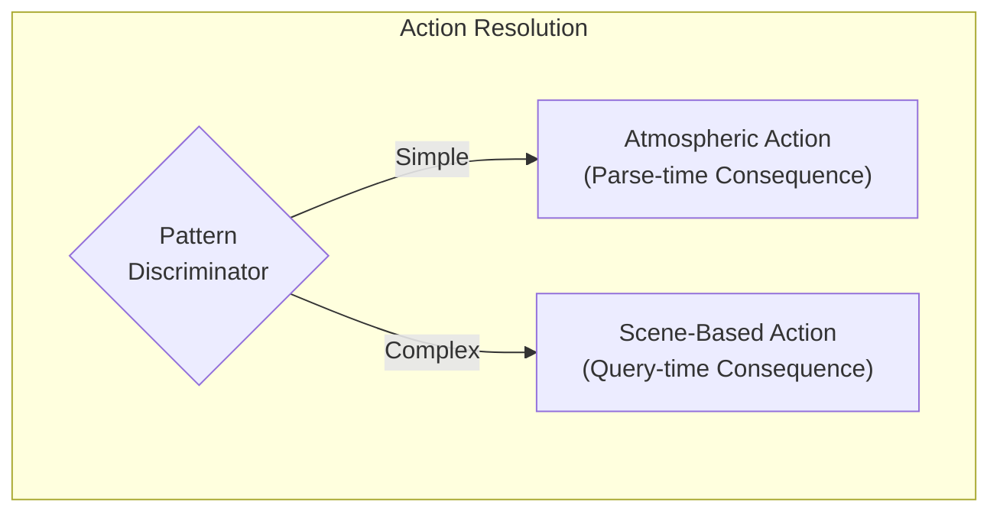
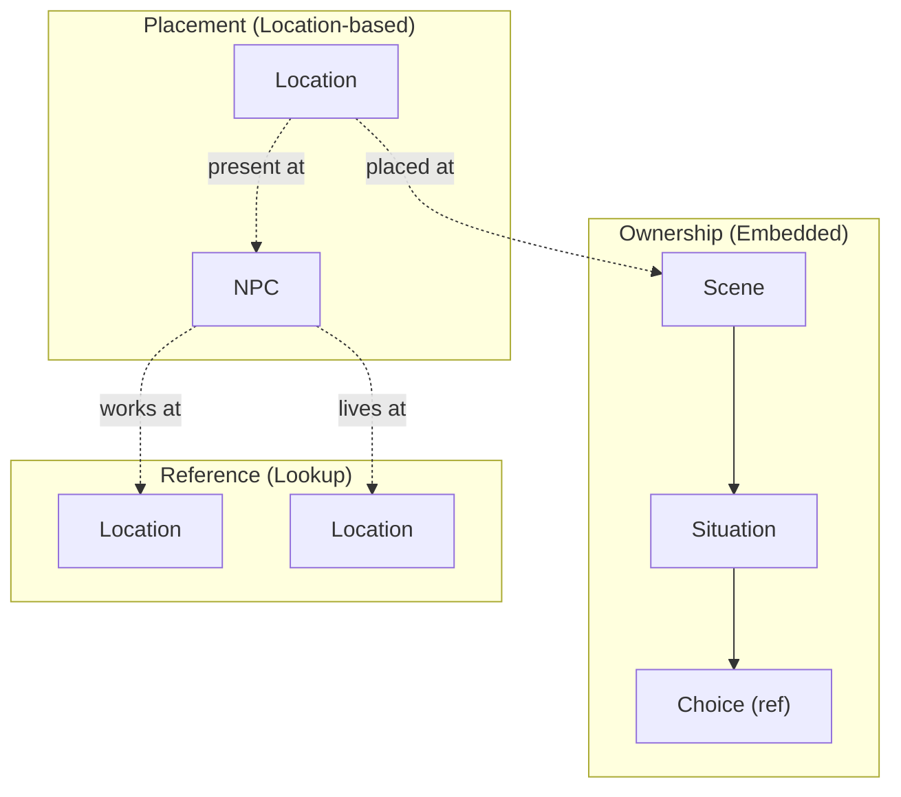

# 8. Crosscutting Concepts

This section documents patterns and practices that apply across multiple building blocks, providing conceptual integrity throughout the architecture.

---

## 8.1 HIGHLANDER Principle

**"There can be only one."**

Every piece of game state has exactly one canonical storage location. No redundant tracking, no parallel state, no caching that could desync.

| Aspect | Principle |
|--------|-----------|
| **State Location** | Single source of truth for each datum |
| **Relationships** | Direct object references, never IDs alongside objects |
| **Queries** | Always hit the canonical source |

**Consequences:**
- No "which is correct?" ambiguity when state disagrees
- Single update point for each state change
- Violations (storing both ID and object) create irreconcilable conflicts

---

## 8.2 Catalogue Pattern (Parse-Time Translation)

Content authors write categorical properties; catalogues translate to concrete mechanical values at parse-time only.



| Layer | Responsibility |
|-------|----------------|
| **Content** | Categorical descriptions (friendly, hostile, premium) |
| **Catalogue** | Translation formulas |
| **Entity** | Concrete values only (integers, no categories) |

**Consequences:**
- AI generates balanced content without knowing game math
- Single formula change rebalances all affected content
- Zero runtime overhead (translation complete at startup)

Catalogues implement DDR-007's Absolute Modifiers principle: translations always use fixed additions and subtractions, never multipliers.

**Forbidden:** Runtime catalogue lookups, string-based property matching.

---

## 8.3 Entity Identity Model

Domain entities have no instance IDs. Relationships use direct object references. Queries use categorical properties.

| Pattern | Usage |
|---------|-------|
| **Template IDs** | Allowed (immutable archetypes) |
| **Object References** | Required for relationships |
| **Categorical Filters** | Required for entity resolution |
| **Instance IDs** | Forbidden |

**Rationale:** Procedural generation requires categorical matching ("find a friendly innkeeper"), not hardcoded references. IDs create brittleness; categories enable infinite content.

---

## 8.4 Three-Tier Timing Model

Content instantiates lazily across three timing tiers. Scene and Situation creation follows a UNIFIED path for both authored and procedural content.

### Overview

| Tier | When | What Exists | What Does NOT Exist |
|------|------|-------------|---------------------|
| **Parse-time** | Game initialization | SceneTemplates, SituationTemplates | Scene instances, Situation instances |
| **Spawn-time** | Game start or choice reward | Scene instance (Deferred state) | Situation instances |
| **Activation-time** | Player enters location | Situation instances, resolved entities | N/A - fully materialized |
| **Query-time** | UI requests options | Ephemeral actions | N/A - regenerated each query |

### Scene Instantiation Pipeline (UNIFIED PATH)

**Critical principle:** There is NO difference between authored and procedural scene creation. Both use the same mechanism: SceneTemplate + Context → Scene Instance.

```
┌─────────────────────────────────────────────────────────────────────────────────┐
│                           PARSE-TIME (GameWorldInitializer)                      │
│                                                                                  │
│   JSON files ──► PackageLoader ──► SceneTemplates (with SituationTemplates)     │
│                                                                                  │
│   • SceneTemplates stored in GameWorld.SceneTemplates                           │
│   • Each template has: Id, SituationTemplates[], IsStarter, MainStorySequence   │
│   • NO Scene instances created                                                   │
│   • NO Situation instances created                                               │
└─────────────────────────────────────────────────────────────────────────────────┘
                                        │
                    ┌───────────────────┴───────────────────┐
                    ▼                                       ▼
┌───────────────────────────────────┐   ┌───────────────────────────────────────────┐
│     STARTER SCENE (Game Start)    │   │     CHAIN SCENES (Choice Rewards)         │
│                                   │   │                                           │
│  SpawnStarterScenes()             │   │  SceneSpawnReward on final choices        │
│  • Finds IsStarter=true templates │   │  • SpawnNextMainStoryScene=true           │
│  • ONE scene only (A1)            │   │  • Sequence lookup: GetNextMainStoryTemplate()
│                                   │   │  • Authored (1-10) or Procedural (11+)    │
└───────────────────────────────────┘   └───────────────────────────────────────────┘
                    │                                       │
                    └───────────────────┬───────────────────┘
                                        ▼
┌─────────────────────────────────────────────────────────────────────────────────┐
│                           SPAWN-TIME (After DI Available)                        │
│                                                                                  │
│   SceneInstantiator.CreateDeferredScene(template, context)                      │
│                                                                                  │
│   • Scene instance created with State = Deferred                                │
│   • Situations list = EMPTY (no instances yet)                                  │
│   • LocationActivationFilter stored (trigger condition)                         │
│   • Template reference stored (for later SituationTemplate access)              │
│   • Scene added to GameWorld.Scenes                                             │
└─────────────────────────────────────────────────────────────────────────────────┘
                                        │
                                        ▼
┌─────────────────────────────────────────────────────────────────────────────────┐
│                      ACTIVATION-TIME (Player Enters Location)                    │
│                                                                                  │
│   SceneInstantiator.ActivateScene(scene, context)                               │
│                                                                                  │
│   For each SituationTemplate in scene.Template.SituationTemplates:              │
│     1. Create Situation instance                                                │
│     2. Resolve Location (find-or-create from PlacementFilter)                   │
│     3. Resolve NPC (find-or-create from PlacementFilter)                        │
│     4. Resolve Route (find-only, fail-fast if not found)                        │
│     5. Add Situation to scene.Situations                                        │
│                                                                                  │
│   Scene.State transitions: Deferred → Active                                    │
└─────────────────────────────────────────────────────────────────────────────────┘
```

### A-Story Chain Mechanism

Main story scenes chain via SceneSpawnReward on the final situation's choices:

| Scene | Trigger | Next Scene Lookup |
|-------|---------|-------------------|
| **A1** (InnLodging) | SpawnStarterScenes (IsStarter=true) | N/A - first scene |
| **A2-A10** (Authored) | SceneSpawnReward on A(n-1) final choice | GetNextMainStoryTemplate(n) |
| **A11+** (Procedural) | SceneSpawnReward on A(n-1) final choice | Procedural generation fallback |

**Enrichment:** `SceneTemplateParser.EnrichMainStoryFinalChoices()` adds `SceneSpawnReward { SpawnNextMainStoryScene = true }` to every choice in the final situation of MainStory scenes at parse-time.

**Sequence lookup:** `GetNextMainStoryTemplate(currentSequence)` returns the template where `MainStorySequence == currentSequence + 1`. If none found, procedural generation creates the next template.

### Forbidden Patterns

| Pattern | Why Forbidden |
|---------|---------------|
| Scene instances in JSON | Bypasses spawn-time, creates parse-time instances |
| Situation instances at parse-time | Entities cannot be resolved before DI available |
| Multiple paths for scene creation | Violates HIGHLANDER - one mechanism for all scenes |
| Direct SceneParser calls for authored content | Must go through spawn-time pipeline |

**Consequence:** Memory contains only currently accessible content. All scenes follow the same Template → Deferred → Active lifecycle regardless of source.

---

## 8.5 Fail-Fast Philosophy

Errors surface immediately at point of failure with clear stack traces. No defensive coding that hides problems.

| Pattern | Rule |
|---------|------|
| **Initialization** | All properties have explicit initial values |
| **Access** | Direct property access without null checks |
| **Failure** | Let references crash with clear stack traces |

**Forbidden:**
- Null-coalescing operators hiding missing data
- TryGetValue patterns deferring errors
- Default return values masking lookup failures

**Rationale:** A crash with clear stack trace is debuggable. Silent null propagation creates mystery bugs discovered far from root cause.

---

## 8.6 Backend/Frontend Separation

Backend returns domain semantics (WHAT). Frontend decides presentation (HOW).

| Layer | Provides |
|-------|----------|
| **Backend** | Domain enums, plain values, state validity |
| **Frontend** | CSS classes, icons, display text, formatting |

**Forbidden in Backend:** Presentation concerns (styling, icons, display strings).

**Rationale:** Changing presentation never touches game logic. Changing mechanics never requires UI updates beyond data flow.

---

## 8.7 Idempotent Initialization

The rendering framework may execute initialization multiple times. All startup code must be idempotent.

**Pattern:** Guard initialization with a flag to prevent double-execution.

**Applies to:** Component initialization, state mutations during startup, event subscriptions, resource allocation.

---

## 8.8 Dual-Tier Action Architecture

LocationAction is a **union type** supporting two intentional patterns via pattern discrimination.



| Tier | Pattern | Consequence Creation | Characteristics |
|------|---------|---------------------|-----------------|
| **Atmospheric** | Simple, permanent | Parse-time (LocationActionCatalog) | Always available, constant costs/rewards, soft-lock prevention |
| **Scene-Based** | Complex, dynamic | Query-time (ChoiceTemplate reference) | Context-dependent, narrative-driven, OR-path requirements |

**HIGHLANDER Compliance:** Both patterns use `Consequence` for costs/rewards. The distinction is WHEN the Consequence is created, not WHAT class represents it.

**Why Both Patterns Exist:**

- **Atmospheric:** Baseline actions (work, rest, travel) that prevent soft-locks. Consequence created once at parse-time.
- **Scene-based:** Dynamic actions with contextual variation. Consequence retrieved from ChoiceTemplate at query-time.

**Critical:** Neither pattern replaces the other. Both are intentional architecture supporting different gameplay needs.

---

## 8.9 Entity Ownership Hierarchy

Entities follow strict ownership patterns determining lifecycle and responsibility.



| Relationship Type | Meaning |
|-------------------|---------|
| **Ownership** | Parent OWNS children; deleting parent deletes children |
| **Placement** | Entity placed AT location; location doesn't own entity |
| **Reference** | Entity references another; neither owns the other |

---

## 8.10 Categorical Property Architecture

Every categorical property is strongly-typed with intentional domain meaning.

Entities are selected via categorical filters, not generic strings. All categorical properties map to strongly-typed enums with specific game effects.

### Two Distinct Concepts for Entity Selection

| Concept | Purpose | Matching Logic |
|---------|---------|----------------|
| **Identity Dimensions** | Describe atmosphere, context, character | Empty = any, Non-empty = entity has ONE OF |
| **Capabilities** | Enable specific game mechanics | Entity must have ALL specified |

### Categorical Dimensions

Locations and NPCs have orthogonal dimensions that compose to create archetypes:

- **Location dimensions:** Privacy, Safety, Activity, Purpose
- **NPC dimensions:** Profession, Personality, Social Standing, Story Role

### Validation Strategy

All categorical strings are validated at parse-time via fail-fast parsing. Invalid values fail immediately at startup, not runtime.

---

## 8.11 Location Accessibility Architecture

Dual-model accessibility ensures soft-lock prevention while supporting scene-gated dependent locations.

### The Problem

Locations fall into two categories with different accessibility requirements:
- **Authored locations:** Must always be reachable (soft-lock prevention)
- **Scene-created locations:** Should only be accessible after narrative progression

### The Solution

Explicit type-safe discriminator determines accessibility rule:

| Origin Type | Accessibility Rule |
|-------------|-------------------|
| **Authored** | Always accessible |
| **Scene-Created** | Accessible when granted by active scene |

**Rationale:** Uses explicit enum instead of null-as-domain-meaning pattern. Forensic metadata (provenance) is tracked separately and NOT used for accessibility decisions.

---

## 8.12 PlacementFilter Architecture

PlacementFilter controls entity resolution for scene situations using categorical properties.

Filters specify WHERE entities should be found or created, using proximity and identity dimensions.

### Filter Components

| Component | Purpose |
|-----------|---------|
| **Proximity** | How to search relative to context (same location, same venue, adjacent, etc.) |
| **Identity Dimensions** | Categorical constraints on matching entities |

### Filter Semantics

| Filter State | Meaning |
|--------------|---------|
| **Null filter** | No entity needed for that type |
| **Empty dimension list** | Don't filter (any value matches) |
| **Non-empty list** | Entity must have ONE OF the specified values |

---

## 8.13 Template vs Instance Lifecycle

Templates are immutable archetypes. Instances are mutable game state. They exist at different times and serve different purposes.

### Template Characteristics

| Entity Type | Template | Instance |
|-------------|----------|----------|
| **Scene** | SceneTemplate | Scene |
| **Situation** | SituationTemplate | Situation |
| **Choice** | ChoiceTemplate | N/A (templates used directly) |

| Aspect | Template | Instance |
|--------|----------|----------|
| **Created** | Parse-time | Spawn-time (Scene) / Activation-time (Situation) |
| **Mutability** | Immutable | Mutable |
| **Lifecycle** | Entire game | Created, used, potentially completed/expired |
| **Entity References** | PlacementFilters (categorical) | Direct object references (resolved) |
| **Storage** | GameWorld.SceneTemplates | GameWorld.Scenes |

### Critical Rules

| Rule | Consequence |
|------|-------------|
| **NO Scene instances at parse-time** | JSON must contain `sceneTemplates`, never `scenes` |
| **NO Situation instances until activation** | Deferred scenes have `Situations = []` (empty) |
| **Templates own SituationTemplates** | SceneTemplate.SituationTemplates[] contains all situation blueprints |
| **Instances reference Templates** | Scene.Template links back to source SceneTemplate |

### State Transitions

```
SceneTemplate (immutable, parse-time)
       │
       ▼  SpawnStarterScenes() or SceneSpawnReward
Scene (Deferred) ────────────────────────────────────►  Scene (Active)
  • State = Deferred                                      • State = Active
  • Situations = [] (EMPTY)                               • Situations = [resolved instances]
  • Template = reference                                  • All entities resolved
       │                                                       │
       │                                                       ▼
       │                                               Situation (instance)
       │                                                 • Location = resolved object
       │                                                 • NPC = resolved object
       │                                                 • Route = resolved object
       ▼
  Activation trigger:
  Player enters location matching LocationActivationFilter
```

**Key Insight:** Deferred scenes have NO situation instances. Situations are only created at activation when entity references can be resolved. This prevents orphaned situations and ensures all entities exist when needed.

---

## 8.14 Entity Resolution (Find-Or-Create)

Entities are resolved at scene ACTIVATION, not parse-time. This is when categorical PlacementFilters become concrete object references.

### Resolution Timing

| Tier | Entity Resolution | Why |
|------|-------------------|-----|
| **Parse-time** | NEVER | DI not available, entities may not exist |
| **Spawn-time** | NEVER | Scene is Deferred, not yet needed |
| **Activation-time** | YES | Player is at location, entities needed NOW |

### Resolution Process (SceneInstantiator.ActivateScene)

For each SituationTemplate in scene.Template.SituationTemplates:

| Step | Entity | Strategy | If Not Found |
|------|--------|----------|--------------|
| 1 | Location | EntityResolver.FindLocation() | PackageLoader.CreateSingleLocation() |
| 2 | NPC | EntityResolver.FindNPC() | PackageLoader.CreateSingleNpc() |
| 3 | Route | EntityResolver.FindRoute() | FAIL FAST (routes must exist) |

**Find-or-Create principle:** Location and NPC can be created dynamically via procedural generation. Routes must be pre-existing (navigation graph integrity).

### PlacementFilter → Object Reference

| Before Activation | After Activation |
|-------------------|------------------|
| `situation.LocationFilter = { Purpose: Commerce }` | `situation.Location = <actual Location object>` |
| `situation.NpcFilter = { Profession: Innkeeper }` | `situation.Npc = <actual NPC object>` |
| `situation.RouteFilter = { Segment: 0 }` | `situation.Route = <actual RouteOption object>` |

**HIGHLANDER:** Each entity resolved ONCE at activation. No re-resolution, no caching, no duplicate lookups.

---

## 8.15 Separated Responsibilities (HIGHLANDER)

Entity resolution follows strict responsibility separation to prevent circular dependencies.

| Component | Responsibility | Does NOT Do |
|-----------|----------------|-------------|
| **Resolver** | FIND only | Never creates |
| **Creator** | CREATE only | Never searches |
| **Orchestrator** | Coordinate find-or-create | Never finds or creates directly |

**Consequences:**
- No circular dependencies between resolution components
- Clear audit trail for entity creation
- Single path for all entity creation
- Entity origin tracking (Authored vs Scene-Created)

---

## 8.16 Fallback Context Rules (No Soft-Lock Guarantee)

Fallback choices are the safety valve that guarantees forward progress.

Every situation MUST have a Fallback choice. This is non-negotiable per the No Soft-Locks principle.

### Fallback Semantics

| Aspect | Rule |
|--------|------|
| **Requirements** | NEVER (Fallback must always be available) |
| **Consequences** | ALLOWED (preserves scarcity) |
| **Forward Progress** | REQUIRED (must complete situation) |

### Context-Dependent Meaning

| Player State | Fallback Meaning | Consequences |
|--------------|------------------|--------------|
| **Pre-commitment** | Exit, return later | None |
| **Post-commitment** | Break commitment | Penalty |

**Design Principle:** No two situations in the same scene should have semantically identical choices. Fallback meaning and consequences scale with player commitment.

---

## 8.17 Consequence ValueObject Pattern

Unified representation of all costs and rewards using signed values.

**Design Principle:** Single property per resource type where sign indicates direction. Negative = cost, Positive = reward.

### Query Methods

The Consequence provides projection methods for perfect information display:
- Can player afford this?
- What would player state be after?
- Are there any effects at all?

**Why Methods on ValueObject:** Projection is a pure function deriving data from state. No side effects, no mutation. Separate service handles actual state changes.

---

## 8.18 Centralized Invariant Enforcement

**"Scene invariants belong in the parser, not the archetypes."**

Guarantees that must hold for ALL scenes of a category must be enforced at the system level, not in individual scene definitions.

### The Problem

Scattering invariant enforcement across scene definitions creates:
- **Omission risk:** New archetype forgets invariant
- **Inconsistency:** Different implementations across archetypes
- **Maintenance burden:** Changing invariant requires multiple updates

### The Solution

Centralize invariant enforcement at parse-time. Parser applies category-specific invariants after archetype generates base structure.

| Layer | Responsibility |
|-------|----------------|
| **Content** | Identity, categorical properties |
| **Archetype** | Base situation structure |
| **Parser** | Category invariant enforcement |

---

## 8.19 Explicit Property Principle

Use explicit strongly-typed properties for state modifications. Never route changes through string-based generic systems.

### The Problem

Generic catch-all classes with string-based type routing violate compile-time safety:
- Typos compile successfully but fail at runtime
- New types require updating switch statements everywhere
- No IDE support for valid combinations

### The Solution

Replace string routing with explicit strongly-typed properties.

| String-Based | Explicit Properties |
|--------------|---------------------|
| Runtime failure | Compile-time error |
| Silent typo bugs | Compiler catches typos |
| Manual string validation | Type system enforces validity |
| No IDE support | Full IntelliSense |

### Design Principles

| Principle | Implementation |
|-----------|----------------|
| **Nullable for Optional** | Null means "not required" |
| **Object References** | Direct references, not IDs |
| **Enums for Categories** | Strongly-typed, not strings |

---

## 8.20 Unified Resource Availability (HIGHLANDER)

ALL resource availability checks happen in ONE place: `CompoundRequirement`. This eliminates duplication and ensures consistent behavior across the codebase.

### The HIGHLANDER Principle Applied

Resource availability was previously checked in 4 different places. Now it's checked in ONE:

| Check | Single Source of Truth |
|-------|------------------------|
| Stats (Insight, Rapport, etc.) | `OrPath.IsSatisfied()` |
| Resolve (Sir Brante gate) | `OrPath.IsSatisfied()` |
| Coins, Health, Stamina, Focus | `OrPath.IsSatisfied()` |
| Hunger capacity | `OrPath.IsSatisfied()` |

### Resource Check Types

The same `OrPath` mechanism handles two patterns via different VALUES:

| Resource | Check Type | OrPath Property | Value | Logic |
|----------|------------|-----------------|-------|-------|
| **Resolve** | Gate | `ResolveRequired = 0` | 0 | `player.Resolve >= 0` |
| **Coins** | Affordability | `CoinsRequired = cost` | cost | `player.Coins >= cost` |
| **Health** | Affordability | `HealthRequired = cost` | cost | `player.Health >= cost` |
| **Stamina** | Affordability | `StaminaRequired = cost` | cost | `player.Stamina >= cost` |
| **Focus** | Affordability | `FocusRequired = cost` | cost | `player.Focus >= cost` |
| **Hunger** | Capacity | `HungerCapacityRequired = cost` | cost | `player.Hunger + cost <= MaxHunger` |

### Sir Brante Willpower Pattern

Resolve uses **gate logic** (special case):
- Requirement: `Resolve >= 0` (can you ATTEMPT?)
- Consequence: `Resolve -= N` (CAN go negative)

Other resources use **affordability logic**:
- Requirement: `Resource >= cost` (can you AFFORD?)
- Consequence: `Resource -= cost` (CANNOT go negative)

### Factory Method: CreateForConsequence

`CompoundRequirement.CreateForConsequence(Consequence)` generates ALL resource requirements:

| Consequence Property | Generated Requirement |
|---------------------|----------------------|
| `Resolve < 0` | `ResolveRequired = 0` (gate) |
| `Coins < 0` | `CoinsRequired = -Coins` (affordability) |
| `Health < 0` | `HealthRequired = -Health` (affordability) |
| `Stamina < 0` | `StaminaRequired = -Stamina` (affordability) |
| `Focus < 0` | `FocusRequired = -Focus` (affordability) |
| `Hunger > 0` | `HungerCapacityRequired = Hunger` (capacity) |

### What Was DELETED (No Longer Exists)

| Deleted | Reason |
|---------|--------|
| `Consequence.IsAffordable()` | Redundant - OrPath handles this |
| Manual checks in `SceneContent.LoadChoices()` | Redundant - RequirementFormula handles this |
| Manual checks in `SceneContent.HandleChoiceSelected()` | Redundant - RequirementFormula handles this |
| Manual checks in `SituationChoiceExecutor` | Redundant - RequirementFormula handles this |
| `ActionCardViewModel.IsAffordable` property | Redundant - `RequirementsMet` covers everything |

### Architecture

```
SINGLE check path for ALL availability:
└─ RequirementFormula.IsAnySatisfied(player, gameWorld)
    └─ OrPath.IsSatisfied()
        ├─ Stats (Insight >= N, Rapport >= N, ...)
        ├─ Resolve (Resolve >= 0)  ← Sir Brante gate
        ├─ Coins (Coins >= cost)
        ├─ Health (Health >= cost)
        ├─ Stamina (Stamina >= cost)
        ├─ Focus (Focus >= cost)
        └─ Hunger (Hunger + cost <= MaxHunger)
```

### Game Design: Why Resolve Differs

Resolve follows the "Sir Brante Willpower" pattern from The Life and Suffering of Sir Brante:

1. **Building Phase:** Player earns resolve through positive choices
2. **Spending Phase:** Player can take costly choices (depletes reserve)
3. **Locked Phase:** Negative resolve blocks costly choices until rebuilt
4. **Recovery Phase:** Player finds opportunities to restore willpower

This prevents the "abundance trivializes mechanic" trap of traditional resource pools.

---

## 8.21 Behavior-Only Testing Principle

**"Test what it DOES, not what it SAYS."**

Tests verify observable behavior, never implementation details. Specific values, string formats, and message content are implementation details that change during refactoring or content authoring.

### What Tests Verify

| Verify | Example Behavior |
|--------|------------------|
| **Boolean outcomes** | Action valid/invalid, requirement satisfied/not satisfied |
| **State transitions** | Player can/cannot proceed, resource depleted/available |
| **Existence checks** | Object exists/null, collection empty/populated |
| **Comparative relationships** | Value increased/decreased, before/after comparison |

### What Tests Never Check

| Never Check | Reason |
|-------------|--------|
| **Specific numeric values** | Balance tuning changes these |
| **String message formats** | UX improvements change these |
| **Label text content** | Localization changes these |
| **Exact error messages** | Rewording is refactoring, not regression |

### Rationale

Tests that check specific values create false negatives during legitimate refactoring:

- Content author adjusts balance → tests break
- Developer improves error message clarity → tests break
- Designer tweaks resource formula → tests break

None of these are regressions. The behavior (invalid when insufficient, valid when sufficient) remains correct.

### Application

| Instead Of | Use |
|------------|-----|
| Checking resource equals exact value | Checking resource greater/less than threshold |
| Checking error message contains text | Checking plan/result is invalid |
| Checking label equals specific string | Checking label is not null/empty |
| Checking projection has exact numbers | Checking projection reflects expected direction |

**Consequence:** Tests survive refactoring. Only actual behavioral regressions cause failures.

---

## 8.22 Unified Cost/Reward Application (HIGHLANDER)

**"There can be only ONE way to change player resources."**

ALL player resource mutations (costs AND rewards) flow through a single method: `RewardApplicationService.ApplyConsequence()`. No direct player mutations anywhere else in the codebase.

### The TWO PILLARS (HIGHLANDER Resource Classes)

Together with §8.20, these form the TWO PILLARS of resource management:

| Pillar | Class | Purpose | Single Entry Point |
|--------|-------|---------|-------------------|
| **Availability** | `CompoundRequirement` | Check if player CAN do something | `IsAnySatisfied(player, gameWorld)` |
| **Application** | `Consequence` | Apply costs/rewards | `ApplyConsequence(consequence, situation)` |

**HIGHLANDER ENFORCEMENT:** These are the ONLY classes that handle resource values. No other classes may contain resource properties (Coins, Health, Stamina, Focus, Resolve, Hunger).

| Class | Status |
|-------|--------|
| `Consequence` | ALLOWED (unified costs/rewards) |
| `CompoundRequirement.OrPath` | ALLOWED (unified prerequisites) |
| Any other class with resource properties | FORBIDDEN |

**NO EXCEPTIONS.** No individual property checks. No direct mutations. No optional parameters.

### Sign Convention

The Consequence class uses signed values to distinguish costs from rewards:

| Direction | Sign | Example |
|-----------|------|---------|
| **Cost** | Negative | `Coins = -10` (pay 10 coins) |
| **Reward** | Positive | `Health = 5` (heal 5 HP) |
| **Hunger (special)** | Positive = bad | `Hunger = 10` (increases hunger, which is bad) |

### What Is FORBIDDEN

| Forbidden Pattern | Why |
|-------------------|-----|
| `player.Coins -= 10` | Direct mutation bypasses clamping, validation |
| `player.Health -= damage` | Same - must go through Consequence |
| `ApplyCosts(player, coins: 10)` | Optional parameters hide what's being changed |
| `if (player.Coins < cost) return false` | Must use CompoundRequirement |

### What Is REQUIRED

| Correct Pattern | Usage |
|-----------------|-------|
| Build Consequence object | `new Consequence { Coins = -10, Health = -5 }` |
| Apply via service | `await _rewardService.ApplyConsequence(costs, situation)` |
| Check via requirement | `requirement.IsAnySatisfied(player, gameWorld)` |

### Where Mutations ARE Allowed

`RewardApplicationService.ApplyConsequence()` is the SINGLE location authorized to mutate player resources. This method:

- Applies costs (negative values) with appropriate clamping
- Applies rewards (positive values) with appropriate capping
- Handles special cases (FullRecovery, Hunger inversion)
- Processes non-resource consequences (bonds, achievements, items, scene spawns)

### Rationale

Without unified application:
- Clamping logic duplicated across facades
- Inconsistent floor/ceiling behavior
- Some paths forget to validate before mutation
- Bugs in one facade don't exist in another (inconsistent behavior)

With unified application:
- Single clamping implementation
- Consistent behavior everywhere
- Changes to resource logic happen in ONE place
- Guaranteed consistency across all game systems

---

## 8.23 Archetype Reusability (No Tutorial Hardcoding)

**"Archetypes are context-agnostic mechanical patterns."**

Every scene archetype must produce appropriate experiences across ALL contexts through categorical property scaling. No archetype may contain context-specific code paths.

### The Problem

Tutorial scenes and procedural scenes need different difficulty levels. A naive implementation might check story sequence:

```
if (AStorySequence == 1) { /* easy tutorial path */ }
else { /* harder standard path */ }
```

This violates reusability: the archetype becomes unusable in new contexts, tutorial behavior is buried in code, and the same archetype produces fundamentally different experiences based on hidden branching.

### The Solution

Categorical properties drive ALL variation. The archetype code is identical regardless of context.

| Categorical Property | Effect on Archetype |
|---------------------|---------------------|
| **Tier** | Base difficulty level (0-4) |
| **NPCDemeanor** | Stat requirement adjustment (Friendly -2, Hostile +2) |
| **Quality** | Cost adjustment (Basic -3, Premium +5, Luxury +10) |
| **PowerDynamic** | Threshold adjustment (Dominant -2, Submissive +2) |

### Tutorial as Context, Not Code

Tutorial scenes use the SAME archetypes as procedural scenes. The tutorial experience emerges from categorical context:

| Scene | Archetype | Context | Result |
|-------|-----------|---------|--------|
| A1 Inn | InnLodging | Tier 0, Friendly, Basic | Easy negotiation, cheap room, modest recovery |
| A50 Inn | InnLodging | Tier 3, Hostile, Premium | Hard negotiation, expensive room, excellent recovery |

Both use identical InnLodging archetype code. Categorical scaling produces different player experiences.

### Forbidden Patterns

| Pattern | Why Forbidden |
|---------|---------------|
| `if (AStorySequence == N)` | Tutorial hardcoding |
| `if (context.IsTutorial)` | Hidden branching |
| Different choice structures per context | Non-reusable archetype |
| Hardcoded reward/cost values | No categorical scaling |

### Required Patterns

| Pattern | Implementation |
|---------|----------------|
| Categorical property access | `context.NPCDemeanor`, `context.Quality`, `context.Power` |
| Scaled formulas | `baseThreshold + demeanorAdjustment + powerAdjustment` |
| Consistent structure | Same 4-choice pattern regardless of context |

### Enforcement

Archetypes are validated at parse-time. Any archetype that produces different STRUCTURES (not just values) based on context is a design error.

---

## 8.24 DDR-007: Intentional Numeric Design

**"If you can't do it in your head, the design is wrong."**

All game mechanics use integer-only arithmetic with values small enough for mental calculation. This principle governs three domains:

### The Three Principles

| Principle | Description | Forbidden |
|-----------|-------------|-----------|
| **Mental Math Design** | Values fit in working memory (range: -20 to +20) | Large numbers, complex formulas |
| **Deterministic Arithmetic** | Strategic outcomes predictable from inputs | Random in strategic layer |
| **Absolute Modifiers** | Bonuses stack additively | Multiplicative scaling, percentages |

### Numeric Type Usage

| Type | Usage | Example |
|------|-------|---------|
| **int** | All game values | Coins, stamina, thresholds, adjustments |
| **Enums** | Categorical states | TradeConfidence.High, PowerDynamic.Dominant |

| Forbidden Type | Reason |
|----------------|--------|
| **float/double** | Introduces rounding errors, violates determinism |
| **decimal** | Overkill precision, implies financial calculation |
| **Percentages** | Mental math barrier, multiplicative by nature |
| **Basis Points** | Financial jargon, opaque to players |

### Pattern Transformations

When encountering percentage-based patterns, transform to DDR-007 compliant forms:

| Before (Forbidden) | After (Compliant) |
|-------------------|-------------------|
| `price * 1.15` | `price + 3` (flat spread) |
| `value * 0.7` | `value - 3` (flat reduction) |
| `total * 0.3` | `(total + 2) / 3` (integer division) |
| `current > total * 0.75` | `total - current <= total / 4` |
| `BasisPoints / 10000` | Direct integer value |

### Enforcement Layers

DDR-007 compliance is enforced at multiple levels:

| Layer | Mechanism | Location |
|-------|-----------|----------|
| **Compile-Time** | Type system (int only) | C# compiler |
| **Test-Time** | DDR007ComplianceTests.cs | Architecture tests |
| **Pre-Commit** | Pattern detection hook | scripts/hooks/pre-commit |
| **CI** | Grep-based pattern check | .github/workflows/build-test.yml |
| **Review** | CLAUDE.md guidance | Code review |

### Exempt Patterns

| Context | Reason |
|---------|--------|
| **UI rendering** | Visual layout requires floating-point geometry |
| **Tactical layer** | Card shuffling (Pile.cs) uses Random per design |
| **Parsing layer** | External format translation may require conversion |

### Player Experience Impact

Players can perform all calculations mentally:
- Travel time: "4 hexes + 2 forest = 6 segments"
- Trade profit: "Buy for 10, sell for 18 = 8 coin profit"
- Conversation: "My Flow is 5, their Patience is 4, so I qualify"

No calculator, no percentage math, no multiplicative confusion.

**Reference:** `gdd/06_design_discipline.md` DDR-007, `compliance-audit/ddr007/00_MASTER_SUMMARY.md`

---

## 8.25 Scene Archetype Unification

**"One archetype, one implementation, infinite contexts."**

Scene archetypes are NOT divided into "service" vs "narrative" categories. ALL archetypes are reusable throughout the game for any story category (A/B/C).

### The Anti-Pattern (FORBIDDEN)

```
Service Archetypes: InnLodging, DeliveryContract, RouteTravel → Used only in tutorial
Narrative Archetypes: Investigation, Confrontation, Crisis → Used only in procedural
```

This creates two parallel systems that cannot share content. Tutorial becomes "special" instead of "first instantiation."

### The Correct Pattern (REQUIRED)

```
Universal Archetypes: InnLodging, DeliveryContract, RouteTravel, Investigation, Confrontation, Crisis
├── Tutorial uses: Any archetype with tutorial-appropriate context
└── Procedural uses: Any archetype with procedural context
```

ALL archetypes are available to ALL story categories. Context (Tier, NPCDemeanor, Quality) creates appropriate difficulty.

### Scene Archetype Categories (Functional, Not Usage-Based)

Archetypes are categorized by FUNCTION, not by where they're used:

| Category | Archetypes | Function |
|----------|-----------|----------|
| **Travel** | RouteTravel | Moving between places |
| **Service** | InnLodging, DeliveryContract | Transactional interactions |
| **Information** | Investigation, GatherTestimony, SeekAudience | Learning and discovery |
| **Social** | MeetContact, BuildRelationship | Relationships and connections |
| **Conflict** | Confrontation, UrgentDecision | Opposition and stakes |
| **Reflection** | MoralChoice, ConsequenceReflection | Processing and deciding |

Any category can appear in tutorial OR procedural content. The category describes WHAT the scene does, not WHEN it appears.

---

## 8.26 Sir Brante Rhythm Pattern

**"Building accumulates capability; Crisis tests it."**

Content rhythm controls how situations present choices to players. Rhythm is contextual - determined by current game state and story beat, enabling AI to generate appropriate content at runtime.

### Design Vision: AI-Generated Procedural Content

At runtime, AI generates scene structures procedurally for current context. SituationArchetypes are the vocabulary AI uses to compose scenes - the catalogue handles mechanics, AI handles structure.

| Layer | Responsibility | Timing |
|-------|---------------|--------|
| **AI** | Decides scene structure (which archetypes in what order) | Runtime |
| **Context** | Provides rhythm, tier, NPC demeanor, quality | Runtime |
| **Catalogue** | Generates rhythm-aware choices from archetypes | Runtime |
| **Game** | Executes choices with mechanical consistency | Runtime |

**AI says "Negotiation → Confrontation → Crisis" with Building rhythm; catalogue generates stat-granting choices.**

### Rhythm as Contextual Property

RhythmPattern flows through GenerationContext. Like other Context Injection properties (§8.28), rhythm has two sources:

| Source | How Rhythm Is Set | Use Case |
|--------|-------------------|----------|
| **Authored** | Explicit RhythmPattern in SceneTemplateDTO | Tutorial sequences, hand-crafted narrative beats |
| **Procedural** | Computed from intensity history | Infinite A-story continuation |

**Procedural Rhythm Computation (from intensity history):**
- Heavy demanding history → Building rhythm (recovery needed)
- Long since last recovery → Building rhythm (accumulation opportunity)
- Balanced history → Mixed rhythm (standard trade-offs)
- Full accumulation cycle complete → Crisis rhythm (test investments)

| Rhythm | Choice Generation | Player Experience |
|--------|-------------------|-------------------|
| **Building** | No requirements, choices GRANT different stats | Identity formation - "Who am I becoming?" |
| **Crisis** | Requirements gate avoiding penalty, fallback takes damage | Test investments - "Can I avoid harm?" |
| **Mixed** | Standard trade-offs with requirements and costs | Strategic decisions - "What do I value?" |

**Rhythm flows through the same parse-time generation as all categorical properties.**

### Orthogonal Concept: ArchetypeIntensity

Two independent systems describe procedural content: RhythmPattern (choice structure) and ArchetypeIntensity (content categorization). Named distinctly to avoid collision.

| Concept | Purpose | Values | Describes |
|---------|---------|--------|-----------|
| **RhythmPattern** | Choice generation | Building / Crisis / Mixed | HOW choices are structured |
| **ArchetypeIntensity** | Content categorization | Recovery / Standard / Demanding | Inherent challenge level of content |

**ArchetypeIntensity categorizes content challenge level:**

| Intensity | Content Focus | Typical Archetypes |
|-----------|--------------|-------------------|
| Recovery | Restoration, reflection | Peaceful archetypes (rest, study, casual) |
| Standard | Moderate trade-offs | Investigation, Social archetypes |
| Demanding | High-stakes tests | Crisis, Confrontation archetypes |

**Challenge and Consequence Philosophy:**

Player state does NOT affect situation visibility. All situations display regardless of player resource levels. Learning comes from seeing choices players cannot afford (greyed-out requirements), not from hidden situations. Fair rhythm emerges from **RhythmPattern-driven generation** (computed from intensity history), not from player state filtering.

Intensity propagates at parse-time: Archetype → SituationTemplate → Situation (copied at spawn). Runtime uses intensity only for descriptive purposes, never for filtering visibility.

### HIGHLANDER Compliance

ALL situation archetypes use ONE generation path. No routing, no special cases:

| Rhythm | All Archetypes Produce |
|--------|----------------------|
| **Building** | 4 choices with no requirements, each GRANTS a different stat |
| **Crisis** | 4 choices where stat/coin requirements gate avoiding penalty; fallback takes penalty |
| **Mixed** | 4 choices with standard trade-offs (requirements, costs, rewards) |

**Same archetype + different rhythm = different choice structures. No category routing.**

### Rhythm Anti-Patterns

| Anti-Pattern | What It Looks Like | Why It's Wrong |
|--------------|-------------------|----------------|
| **Hardcoded sequence checks** | If MainStorySequence == 3 | Violates archetype reusability |
| **Tutorial-specific branches** | If IsTutorial then... | Same scene should work anywhere |
| **Crisis spam** | Crisis → Crisis → Crisis | Player never accumulates capability |
| **Endless building** | Building × 10 | No tension, stakes feel fake |

### Resource Duality in Requirements

Requirements and consequences use the SAME resources in different roles:

| Resource | As Requirement | As Cost | As Reward |
|----------|---------------|---------|-----------|
| **Stats** | Threshold gate | Rare (crisis damage) | Stat increase |
| **Resolve** | Minimum threshold | Resolve drain | Resolve restoration |
| **Coins** | None typical | Service payment | Payment received |
| **Relationships** | NPC disposition | Relationship degradation | Relationship improvement |

A single choice may have: Stat requirement + Resolve requirement + Coin cost + Stat reward + Relationship change.

### Compound Requirement Patterns

OrPath supports multiple qualification routes:

| Path Type | Implementation |
|-----------|---------------|
| **High stat only** | Single OrPath with stat threshold |
| **Lower stat + resolve** | OrPath with reduced stat AND resolve requirement |
| **Resource alternative** | OrPath with coin cost only |
| **Relationship gate** | OrPath with NPC relationship status |
| **Multiple OR** | Multiple OrPaths, any one qualifies |

**Example:** "Negotiate" choice qualifies via: (High Diplomacy) OR (Moderate Rapport AND Resolve) OR (Coin payment)

### Two-Phase Scaling Model

Entity-derived scaling happens in two phases, enabling AI generation at parse-time while respecting runtime entity relationships:

| Phase | Timing | What Gets Scaled | Source |
|-------|--------|-----------------|--------|
| **Parse-Time** | Catalogue generation | Rhythm structure, tier-based values | GenerationContext.Tier, RhythmPattern |
| **Query-Time** | Action instantiation | Stat requirements, costs | RuntimeScalingContext from current entities |

**Why Two Phases?**
- Parse-time: Entities don't exist yet (procedural generation)
- Query-time: Entities are resolved, relationships known
- Player sees AND receives adjusted requirements reflecting current NPC relationship

**Perfect Information Compliance**

Scaling MUST affect both display AND execution. The player sees adjusted costs, and execution applies those same adjusted costs.

| Principle | Requirement |
|-----------|------------|
| **Display = Execution** | ScaledRequirement used for both UI display and requirement checking |
| **No Hidden Mechanics** | Player can calculate exact costs before selecting action |
| **Relationship Matters** | Friendly NPC visibly AND mechanically reduces difficulty |

**Forbidden:** Display showing scaled values while execution uses original values. This violates Perfect Information.

**RuntimeScalingContext Adjustments (Query-Time)**

| Property | Source | Effect |
|----------|--------|--------|
| **StatRequirementAdjustment** | NPC demeanor | Hostile increases difficulty, Friendly reduces |
| **CoinCostAdjustment** | Location quality | Basic reduces costs, Luxury increases |
| **ResolveCostAdjustment** | Power dynamic | Dominant reduces cost, Submissive increases |

**Flow:**
1. AI generates scene structure with rhythm (parse-time)
2. Catalogue generates choices with tier-based values (parse-time)
3. Scene activates, entities resolved (activation-time)
4. SceneFacade derives RuntimeScalingContext from entities (query-time)
5. SceneFacade creates ScaledRequirement and ScaledConsequence
6. UI displays scaled values (display-time)
7. Executor uses scaled values for requirement checking and cost application (execution-time)

**HIGHLANDER Compliance:** Original templates immutable. Scaling creates new instances used for both display AND execution.

---

## 8.27 Two-Phase Entity Creation

**"Create mechanics first; finalize narrative after mechanical context is complete."**

Procedural entities are created in two distinct phases. Names and descriptions persist to end of game.

### Two-Phase Creation Model

| Phase | Trigger | Output | Persistence |
|-------|---------|--------|-------------|
| **1. Mechanical** | Entity needed | Structure, references, categorical properties | Permanent |
| **2. Narrative** | All references set | Names, descriptions, flavor text | Permanent |

### Why Two Phases

| Concern | Phase 1 (Mechanical) | Phase 2 (Narrative) |
|---------|---------------------|---------------------|
| **Object references** | Being established | All complete |
| **Relationship context** | Partial | Full graph available |
| **Naming coherence** | Impossible | Can name consistently across scope |
| **When executed** | On generation | Once, after mechanical complete |

**Principle:** Narrative finalization happens ONCE after mechanical creation, generating PERSISTENT names displayed consistently throughout the game.

### Phase 1: Mechanical Creation (Complete)

ProceduralAStoryService creates structure with generic identifiers:
- ArchetypeCategory (categorical property for Catalogue resolution)
- Tier (difficulty scaling)
- RhythmPattern (choice generation pattern)
- PlacementFilter (categorical entity resolution)
- Object references (NPC, Location, Venue assignments)
- Generic identifiers until Phase 2 completes

### Phase 2: Narrative Finalization (Future Feature)

After all object references are established, AI examines:
- Complete mechanical structure with all relationships
- Categorical properties of each entity
- Game state (player resources, time, active scenes)
- Event history (completed scenes, NPC interactions)
- Relationship web (bonds, reputation, standing)

Generates PERSISTENT names stored on entity properties. Names display consistently in UI for remainder of game.

**Forbidden:**
- Narrative generation during mechanical creation (context incomplete)
- Per-entity naming without relationship awareness
- Display-time regeneration (names must persist)
- Placeholder syntax in templates (AI generates complete text)

---

## 8.28 Context Injection (HIGHLANDER Scene Generation)

**"RhythmPattern drives selection. Location difficulty drives scaling. Never mixed."**

### Two Distinct Systems

| System | Input | When Applied | Controls |
|--------|-------|--------------|----------|
| **Scene Selection** | RhythmPattern + anti-repetition | Scene spawn trigger hit | Which archetype category |
| **Choice Scaling** | Location difficulty (hex distance) | Situation created | Requirement/reward values |

These systems are ORTHOGONAL. Selection doesn't know about scaling. Scaling doesn't influence selection.

### Scene Selection: RhythmPattern Only

Scene archetype selection uses ONLY:

| Input | Source | Purpose |
|-------|--------|---------|
| **RhythmPattern** | Computed from intensity history | Building → building archetypes; Crisis → crisis archetypes |
| **Anti-Repetition** | Recent categories/archetypes | Avoid immediate repetition |

**No other inputs influence selection.** Location context, player stats, tier—all REMOVED from selection.

### Choice Scaling: Location Difficulty

When a situation is instantiated from template, choices receive scaling from location:

| Input | Source | Effect |
|-------|--------|--------|
| **Location Difficulty** | Hex distance from world center / 5 | Modifies stat requirements and reward magnitudes |
| **Net Challenge** | Location difficulty - player strength | Applied via ApplyStatAdjustment() |

Scaling happens at instantiation—AFTER selection is complete.

### Context Flow

```
SceneSpawnReward → RhythmPattern → SelectArchetypeCategory → SceneTemplate
                                                                    ↓
                         Location.Difficulty → Choice Instantiation
```

SceneSpawnReward is THE source of RhythmPattern context. Choice scaling reads from current Location.

### HIGHLANDER Compliance

| Principle | How It's Upheld |
|-----------|-----------------|
| **Same selection logic** | RhythmPattern processed identically for authored/procedural |
| **Same scaling logic** | Location difficulty applied identically to all choices |
| **No source detection** | Selection doesn't know if context was authored |

### Forbidden Patterns

| Pattern | Why It's Wrong |
|---------|----------------|
| LocationSafety/Purpose in selection | Legacy properties—DELETED |
| Tier in selection | Legacy property—DELETED |
| Player stats influencing selection | Game doesn't cushion poor play |
| Merging authored with game state | Context is all-or-nothing |
| Context derivation at parse time | Context set by SceneSpawnReward only |
| `HasAuthoredContext` checks | Removed—all scenes have RhythmPattern |

**Cross-References:**
- §8.1 HIGHLANDER: One code path for all scene generation
- §8.26 Sir Brante Rhythm: RhythmPattern computation from intensity history
- §8.30 Net Challenge: Location difficulty scaling system

---

## 8.29 Domain Collection Principle (No Key-Value Patterns)

**"Explicit properties, not generic key-value pairs."**

Dictionary and KeyValuePair patterns are forbidden at ALL layers - JSON content, DTOs, parsers, and domain entities. Use `List<T>` with strongly-typed entry classes throughout.

### Why Key-Value Patterns Are Forbidden

| Problem | Impact |
|---------|--------|
| **Hidden semantics** | `kvp.Key` and `kvp.Value` reveal nothing about domain meaning |
| **Parser complexity** | Dictionary-to-List conversion adds unnecessary translation layer |
| **Inconsistent patterns** | JSON uses objects, DTOs use Dictionary, entities use List - confusion |
| **LINQ impedance** | Dictionary iteration differs from List iteration |

### The Principle: Arrays of Objects Everywhere

| Layer | Pattern |
|-------|---------|
| **JSON** | Arrays of objects with explicit properties |
| **DTO** | `List<EntryDTO>` with explicit properties |
| **Parser** | Direct mapping (no conversion needed) |
| **Entity** | `List<Entry>` with explicit properties |

### Transformation Example

**Before (Forbidden):**

JSON: `{ "statRequirements": { "Insight": 5, "Rapport": 3 } }`

DTO: `public Dictionary<string, int> StatRequirements { get; set; }`

Parser: `foreach (KeyValuePair<string, int> kvp in dto.StatRequirements)`

**After (Required):**

JSON: `{ "statRequirements": [ { "stat": "Insight", "value": 5 }, { "stat": "Rapport", "value": 3 } ] }`

DTO: `public List<StatRequirementDTO> StatRequirements { get; set; }`

Parser: `dto.StatRequirements.Select(r => new StatRequirementEntry { ... })`

### Benefits

| Benefit | How Achieved |
|---------|--------------|
| **Semantic clarity** | Property names describe meaning (`entry.Stat` not `kvp.Key`) |
| **No conversion** | Same structure flows JSON → DTO → Entity |
| **Uniform LINQ** | All layers use identical `.Where()`, `.Select()`, `.FirstOrDefault()` |
| **IDE support** | Autocomplete on all property names |
| **Validation** | Parse-time type checking on entry class properties |

### Acceptable Exception

Dictionary acceptable ONLY for:
- Blazor framework parameters (framework requirement)
- External API response caching (ephemeral, not domain state)

**Never acceptable for:** Game content, DTOs, domain entities, or any persistent state.

### Enforcement

| Mechanism | What It Catches |
|-----------|-----------------|
| **Pre-commit hook** | `Dictionary<` pattern in domain code |
| **CI tests** | Architecture tests verify no Dictionary in GameState/ |
| **Code review** | CLAUDE.md guidance on JSON structure |

**Cross-References:**
- CLAUDE.md: DOMAIN COLLECTION PRINCIPLE (user-facing rule)
- §8.3: Entity Identity Model (no instance IDs - related principle)
- §8.19: Explicit Property Principle (strongly-typed over generic)

---

## 8.30 Entity Reference vs Categorical Description

**"Conditions reference existing; Templates describe creation."**

Two distinct patterns for entity relationships based on timing:

| Context | Entity State | Pattern | Example |
|---------|--------------|---------|---------|
| **SpawnConditions** | Must exist | Object reference | `Location Location` |
| **SituationTemplate** | May not exist | Categorical filter | `LocationPurpose.Commerce` |

### SpawnConditions: Object References Only

SpawnConditions gate WHEN content spawns based on game state. They reference EXISTING entities:

| Property | Type | NOT |
|----------|------|-----|
| Location visits | `Location Location` | `string LocationId` |
| NPC relationships | `NPC Npc` | `string NpcId` |
| Route familiarity | `RouteOption Route` | `string RouteId` |

**Rationale:** At spawn-condition evaluation time, referenced entities MUST exist. Missing entity = malformed content (fail-fast at parse-time).

### SituationTemplates: Categorical Descriptions

SituationTemplates within scenes may describe entities to be CREATED or RESOLVED:

| Pattern | Usage |
|---------|-------|
| Categorical filter | `LocationPurpose.Commerce, Proximity.SameVenue` |
| Deferred resolution | Entity resolved at scene activation via EntityResolver |

**Rationale:** Templates define WHAT to create. Categorical properties enable procedural generation without hardcoded references.

### Forbidden Patterns

| Pattern | Why Forbidden |
|---------|---------------|
| String IDs in SpawnConditions | Violates §8.3 Entity Identity Model |
| Object refs in creation templates | Entity may not exist yet |
| Mixing both in same structure | Unclear timing semantics |

**Cross-References:**
- §8.3 Entity Identity Model (no instance IDs)
- §8.14 Entity Resolution (find-or-create at activation)
- §8.12 PlacementFilter Architecture (categorical entity resolution)

---

## Related Documentation

- [04_solution_strategy.md](04_solution_strategy.md) — Strategies these concepts implement
- [09_architecture_decisions.md](09_architecture_decisions.md) — ADRs documenting why these patterns were chosen
- [02_constraints.md](02_constraints.md) — Constraints driving these concepts
