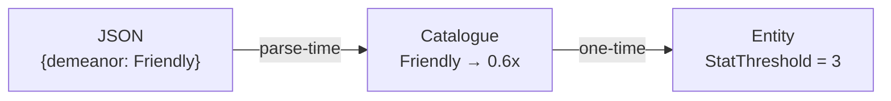
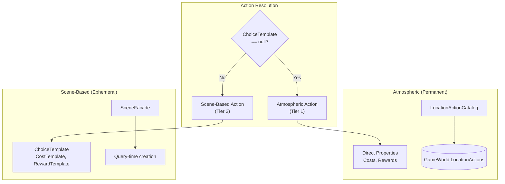
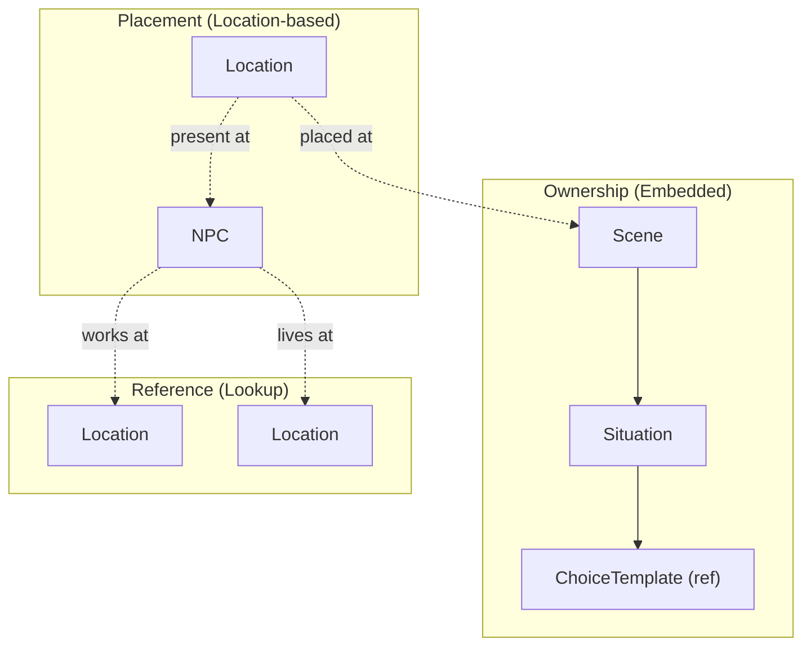
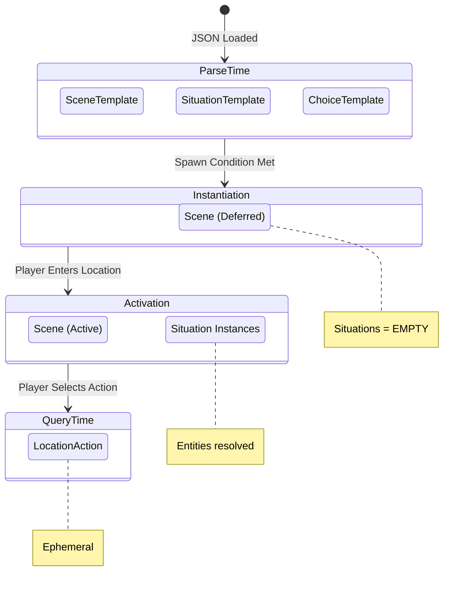
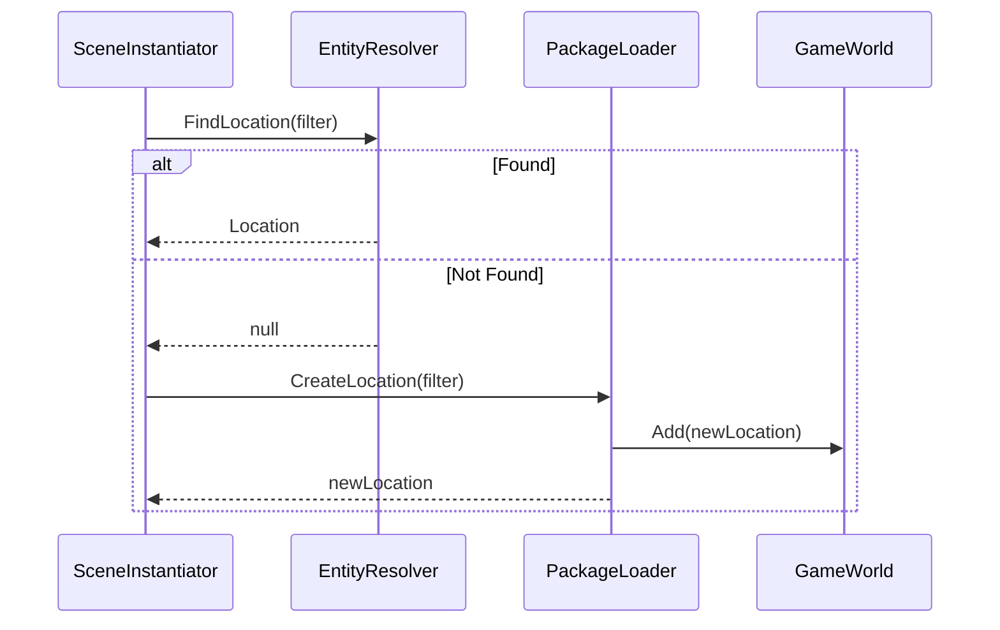

# 8. Crosscutting Concepts

This section documents patterns and practices that apply across multiple building blocks, providing conceptual integrity throughout the architecture.

---

## 8.1 HIGHLANDER Principle

**"There can be only one."**

Every piece of game state has exactly one canonical storage location. No redundant tracking, no parallel state, no caching that could desync.

**Implementation:**
- Player location stored only in `Player.CurrentPosition` (hex coordinates)
- Scene's current situation stored only in `Scene.CurrentSituation` (object reference)
- Entity relationships use direct object references, never ID strings alongside objects

**Consequences:**
- No "which is correct?" ambiguity when state disagrees
- Single update point for each state change
- Queries always hit source of truth

**Violation Example:** Storing both `CurrentLocationId` string and `CurrentLocation` object creates two representations. When they disagree, the system has no way to determine correctness.

---

## 8.2 Catalogue Pattern (Parse-Time Translation)

Content authors write categorical properties; catalogues translate to concrete mechanical values at parse-time only.



| Component | Responsibility |
|-----------|----------------|
| **JSON** | Categorical descriptions (Friendly, Premium, Hostile) |
| **Catalogue** | Translation formulas (multipliers, base values) |
| **Entity** | Concrete values only (integers, no categories) |

**Consequences:**
- AI generates balanced content without knowing game math
- Single formula change rebalances all affected content
- Zero runtime overhead (translation complete at startup)

**Forbidden:** Runtime catalogue lookups, string matching on property names, Dictionary<string, int> for costs.

---

## 8.3 Entity Identity Model

Domain entities have no instance IDs. Relationships use direct object references. Queries use categorical properties.

**Allowed:**
- Template IDs (SceneTemplate.Id) — immutable archetypes
- Object references (NPC.Location) — direct relationships
- Categorical filters (find Location where Purpose=Lodging)

**Forbidden:**
- Entity instance IDs (Scene.Id, NPC.Id, Location.Id)
- ID strings alongside object references
- ID parsing for routing logic

**Why:** Procedural generation requires categorical matching ("find a Friendly innkeeper"), not hardcoded references ("find NPC elena_001"). IDs create brittleness; categories enable infinite content.

---

## 8.4 Three-Tier Timing Model

Content instantiates lazily across three timing tiers to minimize memory usage.

| Tier | When | What | Mutability |
|------|------|------|------------|
| **Templates** | Parse-time | SceneTemplate, ChoiceTemplate | Immutable |
| **Instances** | Spawn-time | Scene, Situation | Mutable |
| **Actions** | Query-time | LocationAction, NPCAction | Ephemeral |

**Flow:**
1. Templates created once at startup, stored permanently
2. Instances spawn when triggered (obligation activates, procedural generation fires)
3. Actions materialize when player enters relevant context, deleted after execution

**Consequence:** Memory contains only currently accessible content. Scene with 5 situations × 3 choices = 15 potential actions, but only 3 exist at any moment.

---

## 8.5 Fail-Fast Philosophy

Errors surface immediately at point of failure with clear stack traces. No defensive coding that hides problems.

**Required:**
- Initialize all entity properties inline (empty List, empty string)
- Access properties directly without null checks
- Let null references crash with clear stack traces

**Forbidden:**
- Null-coalescing operators (??) hiding missing data
- TryGetValue patterns deferring errors
- Default return values masking lookup failures

**Rationale:** A crash with clear stack trace is debuggable. Silent null propagation creates mystery bugs discovered far from root cause.

---

## 8.6 Backend/Frontend Separation

Backend returns domain semantics (WHAT). Frontend decides presentation (HOW).

**Backend provides:**
- Domain enums (ActionType, ResourceType, ConnectionState)
- Plain values (integers, booleans, strings)
- State validity (is action available, does player meet requirements)

**Frontend decides:**
- CSS classes and styling
- Icon selection
- Display text generation
- Visual formatting

**Forbidden in Backend:**
- CssClass properties in ViewModels
- IconName properties in ViewModels
- Display string generation in services

**Rationale:** Changing presentation never touches game logic. Changing mechanics never requires UI updates beyond data flow.

---

## 8.7 Idempotent Initialization

Blazor ServerPrerendered mode executes initialization twice. All startup code must be idempotent.

**Pattern:**
```csharp
if (!_initialized)
{
    // Perform initialization
    _initialized = true;
}
```

**Applies to:**
- Component OnInitializedAsync
- State mutations during startup
- Event subscriptions
- Resource allocation

**Consequence:** Double-execution is safe; state mutations guarded by flags.

---

## 8.8 Dual-Tier Action Architecture (CRITICAL)

**LocationAction is a UNION TYPE supporting two intentional patterns via pattern discrimination.**

This architecture prevents soft-locks by ensuring atmospheric actions always exist as a baseline, while scene-based actions layer dynamic narrative content on top.



| Tier | Pattern | Source | Storage | Properties Used |
|------|---------|--------|---------|-----------------|
| **Tier 1: Atmospheric** | ChoiceTemplate == null | LocationActionCatalog at parse-time | GameWorld.LocationActions (permanent) | `Costs`, `Rewards` directly |
| **Tier 2: Scene-Based** | ChoiceTemplate != null | SceneFacade at query-time | Not stored (ephemeral) | `ChoiceTemplate.CostTemplate`, `RewardTemplate` |

**Why Both Patterns Exist:**

*Atmospheric actions are simple and permanent:*
- Work always costs time, always gives coins
- Rest always recovers health/stamina
- Travel always opens route selection
- ChoiceTemplate would be overkill for constants

*Scene-based actions are complex and dynamic:*
- Costs vary by context (NPC personality, location tier)
- Requirements use OR paths (need stat X OR stat Y)
- Rewards spawn scenes, modify relationships
- Direct properties would be insufficient

**Pattern Discrimination:**
```csharp
if (action.ChoiceTemplate == null)
{
    // Atmospheric: use action.Costs, action.Rewards
    return ValidateAtmosphericAction(action, player);
}
else
{
    // Scene-based: use action.ChoiceTemplate
    return ValidateChoiceTemplate(action.ChoiceTemplate, player);
}
```

**Critical Warning:** Do NOT delete `Costs`/`Rewards` properties from LocationAction. They are REQUIRED for atmospheric actions. This is not legacy code—both patterns are intentional architecture.

---

## 8.9 Entity Ownership Hierarchy

Entities follow strict ownership patterns determining lifecycle and responsibility.



| Relationship | Type | Meaning |
|--------------|------|---------|
| Scene → Situation | **Ownership** | Scene OWNS situations; deleting scene deletes situations |
| Scene → Location | **Placement** | Scene placed AT location; location doesn't own scene |
| NPC → Location | **Reference** | NPC references location; neither owns the other |

**Key Principle:** Situations are EMBEDDED in Scenes (no separate collection). This prevents orphaned situations and simplifies scene lifecycle.

---

## 8.10 Categorical Property Architecture

**Every categorical property is strongly-typed with intentional domain meaning.**

Entities are selected via categorical filters, not generic strings. All categorical properties map to strongly-typed enums with specific game effects.

### Two Distinct Concepts for Entity Selection

**Identity Dimensions (What the entity IS):**
- Describe atmosphere, context, and character
- Multiple orthogonal dimensions compose to create archetypes
- Empty list = don't filter (any value matches)
- Non-empty list = entity must have ONE OF the specified values

**Capabilities (What the entity CAN DO):**
- Enable specific game mechanics
- Flags enum with bitwise operations
- Entity must have ALL specified capabilities to match

### Location Categorical Dimensions

| Dimension | Enum | Values | Domain Meaning |
|-----------|------|--------|----------------|
| **Privacy** | `LocationPrivacy` | Public, SemiPublic, Private | Social exposure and witness presence |
| **Safety** | `LocationSafety` | Dangerous, Neutral, Safe | Physical threat level |
| **Activity** | `LocationActivity` | Quiet, Moderate, Busy | Population density |
| **Purpose** | `LocationPurpose` | Transit, Dwelling, Commerce, Civic, Defense, Governance, Worship, Learning, Entertainment, Generic | Primary functional role |

### Location Capabilities (Flags Enum)

| Capability | Game Mechanic Effect |
|------------|---------------------|
| `Crossroads` | Enables Travel action (route selection UI) |
| `Commercial` | Enables Work action (earn coins) |
| `SleepingSpace` | Enables Rest action (restore health/stamina) |
| `Restful` | Enhanced restoration quality |
| `Indoor`/`Outdoor` | Environmental context (weather affects gameplay) |
| `Market` | Pricing modifier (1.1x) |
| `LodgingProvider` | Accommodation services available |

### NPC Categorical Dimensions

| Dimension | Enum | Purpose |
|-----------|------|---------|
| **Professions** | `Professions` | Occupational role (Innkeeper, Merchant, Guard) |
| **PersonalityTypes** | `PersonalityType` | Behavioral archetype (Innocent, Cunning, Authoritative) |
| **SocialStandings** | `NPCSocialStanding` | Influence tier (Notable, Authority) |
| **StoryRoles** | `NPCStoryRole` | Narrative function (Obstacle, Facilitator) |
| **KnowledgeLevels** | `NPCKnowledgeLevel` | Information access (Informed, Expert) |

### Parser Validation (Fail-Fast)

All categorical strings are validated at parse-time:

```csharp
if (Enum.TryParse<LocationCapability>(capabilityString, true, out LocationCapability capability))
    capabilities |= capability;
else
    throw new InvalidDataException($"Invalid LocationCapability: '{capabilityString}'");
```

**Consequences:**
- Invalid enum values fail immediately at startup, not runtime
- No generic strings pass through unvalidated
- Content authors must use exact enum value names
- Typos and invalid values are impossible to deploy

### JSON to Entity Mapping

| JSON Field | DTO Property | Entity Property | Type |
|------------|--------------|-----------------|------|
| `privacyLevels` | `List<string>` | `List<LocationPrivacy>` | Parsed enum list |
| `capabilities` | `List<string>` | `LocationCapability` | Parsed flags enum |
| `professions` | `List<string>` | `List<Professions>` | Parsed enum list |

**Key Files:**
- `src/GameState/LocationPrivacy.cs` — Privacy enum with XML doc
- `src/GameState/LocationCapability.cs` — Capabilities flags enum
- `src/GameState/PlacementFilter.cs` — Filter entity with all dimensions
- `src/Content/Parsers/SceneTemplateParser.cs:264-499` — Enum parsing with validation

---

## 8.11 Location Accessibility Architecture

**Dual-model accessibility ensures TIER 1 No Soft-Locks while supporting scene-gated dependent locations.**

See [ADR-012](09_architecture_decisions.md#adr-012-dual-model-location-accessibility) for decision rationale.

### The Problem

Locations fall into two categories with different accessibility requirements:
- **Authored locations:** Defined in base game JSON (inns, taverns, checkpoints)—must always be reachable
- **Scene-created locations:** Created dynamically by scenes during gameplay (private rooms, meeting chambers)—should only be accessible after narrative progression

A naive implementation (scene-grants-access for ALL locations) blocked authored locations when no scene was active at them—violating TIER 1.

### The Solution: Explicit LocationOrigin Enum

`Location.Origin` enum provides explicit, type-safe discriminator:

```csharp
public enum LocationOrigin
{
    Authored,      // Base game content - always accessible
    SceneCreated   // Created by scene - requires scene access
}
```

| Origin Value | Location Type | Accessibility Rule |
|--------------|---------------|-------------------|
| `Authored` | Base game content | **ALWAYS accessible** (No Soft-Locks) |
| `SceneCreated` | Scene-generated | Accessible when active scene's current situation is at location |

**Clean Architecture:** Uses explicit enum instead of null-as-domain-meaning pattern. The separate `Provenance` property provides forensic metadata (which scene, when) but is NOT used for accessibility decisions.

### Implementation

**LocationAccessibilityService.IsLocationAccessible():**
```csharp
// AUTHORED: Always accessible per TIER 1
if (location.Origin == LocationOrigin.Authored)
    return true;

// SCENE-CREATED: Accessible when situation is at location
return _gameWorld.Scenes
    .Where(scene => scene.State == SceneState.Active)
    .Any(scene => scene.CurrentSituation?.Location == location);
```

### Service Interaction

```
MovementValidator.ValidateMovement()
    └─ IsSpotAccessible(targetLocation)
        └─ LocationAccessibilityService.IsLocationAccessible(location)
            ├─ Origin == Authored → return true
            └─ Origin == SceneCreated → CheckSceneGrantsAccess()
```

### Example: Inn Lodging Scene

1. **Scene activates** at Common Room (authored location—always accessible)
2. **Situation 1** (Negotiate): Player talks to innkeeper at Common Room
3. **Player completes situation 1** by selecting a choice
4. **Scene advances**: `CurrentSituationIndex` moves to Situation 2
5. **Situation 2** (Rest): Location = Private Room (scene-created)
6. **Private Room becomes accessible**: Active scene's current situation is now at Private Room
7. **Player moves** to Private Room (accessibility check passes)
8. **Scene displays** Situation 2 choices

### Key Files

| File | Purpose |
|------|---------|
| `src/GameState/LocationOrigin.cs` | Explicit discriminator enum |
| `src/Subsystems/Location/LocationAccessibilityService.cs` | Dual-model accessibility logic |
| `src/Subsystems/Location/MovementValidator.cs` | Delegates accessibility checks |
| `src/Content/Location.cs` | `Origin` and `Provenance` property definitions |
| `src/GameState/SceneProvenance.cs` | Forensic tracking structure (not used for accessibility) |

---

## 8.12 PlacementFilter Architecture

**PlacementFilter controls entity resolution for scene situations using categorical properties.**

Filters specify WHERE entities should be found or created, using proximity and identity dimensions.

### Filter Properties

| Property | Required | Purpose |
|----------|----------|---------|
| **Proximity** | Yes | How to search relative to context |
| **Privacy** | No | Location privacy dimension |
| **Safety** | No | Location safety dimension |
| **Activity** | No | Location activity dimension |
| **Purpose** | No | Location purpose dimension |
| **Profession** | No | NPC profession (for NPC filters) |

At least one identity dimension is required alongside Proximity.

### PlacementProximity Values

| Value | Meaning |
|-------|---------|
| `SameLocation` | Use context location directly |
| `SameVenue` | Search within venue's locations |
| `AdjacentLocation` | Search hex neighbors |
| `SameDistrict` | Search district's venues |
| `SameRegion` | Search region's districts |
| `Anywhere` | Unrestricted search |
| `RouteDestination` | Use route's destination location (resolved from prior RouteFilter in same scene) |

**Note:** `RouteDestination` is a special proximity value used in multi-situation scenes (e.g., RouteSegmentTravel). It requires a route to be resolved in an earlier situation within the same scene. The SceneInstantiator tracks the route across situation iterations and resolves RouteDestination to `sceneRoute.DestinationLocation`.

### Filter Semantics

- **Null filter:** No entity needed for that type
- **Empty list on dimension:** Don't filter (any value matches)
- **Non-empty list:** Entity must have ONE OF the specified values

**Example:** `LocationFilter { Proximity: SameVenue, Purpose: [Lodging, Commerce] }` finds locations in current venue that are either Lodging OR Commerce.

---

## 8.13 Template vs Instance Lifecycle

**Content instantiates lazily across three phases to separate immutable patterns from mutable state.**



| Phase | What Exists | Entity References | Mutability |
|-------|-------------|-------------------|------------|
| **Parse Time** | Templates only | N/A (no instances) | Immutable |
| **Instantiation (Deferred)** | Scene Instance, Situations = EMPTY | N/A | Scene mutable |
| **Activation (Active)** | Scene + Situation Instances | Resolved (find-or-create) | All mutable |
| **Query Time** | LocationAction (ephemeral) | Inherited from Situation | Deleted after use |

**Key Insight:** Deferred scenes have NO Situation Instances. Situations are only created at activation when entities can be resolved. This prevents orphaned situations and simplifies memory management.

---

## 8.14 Entity Resolution (Find-Or-Create)

**Entities are resolved at scene ACTIVATION, not parse-time or instantiation.**

### Resolution Process

1. Scene transitions from Deferred to Active
2. For each SituationTemplate in SceneTemplate:
   - Create Situation Instance
   - Resolve Location via LocationFilter (find-or-create)
   - Resolve NPC via NpcFilter if present (find-or-create)
   - Resolve Route via RouteFilter if present (find-or-create)
   - Add Situation Instance to Scene.Situations

### Parse-Time vs Activation Behavior

| Context | Caller | If Entity Not Found |
|---------|--------|---------------------|
| **Parse-time** | Parsers | Fail fast (content error) |
| **Activation** | SceneInstantiator | Create via PackageLoader |

**Parse-time principle:** Referenced entities must already exist. Missing entity = malformed content.

**Activation principle:** Scene may require entities that don't exist yet. Missing entity = create dynamically.

### Situation Entity Types

Each Situation Instance references up to three dependent entities:

| Filter | Entity | Constraint |
|--------|--------|------------|
| LocationFilter | Location | One per situation, **mandatory** |
| NpcFilter | NPC | One per situation, null = solo situation |
| RouteFilter | Route | One per situation, null = non-travel |

---

## 8.15 Separated Responsibilities (HIGHLANDER)

**Entity resolution follows strict responsibility separation to prevent circular dependencies.**

| Class | Responsibility | What It Does NOT Do |
|-------|----------------|---------------------|
| **EntityResolver** | FIND only | Never creates entities |
| **PackageLoader** | CREATE only | Never searches for existing |
| **SceneInstantiator** | Orchestrate find-or-create | Never finds or creates directly |

### Resolution Flow



**Why This Matters:**
- No circular dependencies between resolution components
- Clear audit trail for entity creation
- Single path for all entity creation (through PackageLoader)
- Entity origin tracking (Authored vs SceneCreated)

---

## 8.16 Fallback Context Rules (No Soft-Lock Guarantee)

**Fallback choices are the TIER 1 safety valve that guarantees forward progress.**

Every situation MUST have a Fallback choice. This is non-negotiable per the No Soft-Locks principle. However, what Fallback MEANS depends on the player's commitment context.

### Fallback Definition

| Aspect | Rule |
|--------|------|
| **Requirements** | NEVER. Fallback must always be available regardless of player state. |
| **Consequences** | ALLOWED. Fallback can have costs/penalties to preserve scarcity. |
| **Forward Progress** | REQUIRED. Fallback must complete the situation and allow continuation. |

### Context-Dependent Semantics

Fallback means different things based on whether the player has made a commitment:

| Context | Player State | Fallback Meaning | Consequences |
|---------|-------------|------------------|--------------|
| **Pre-commitment** | No obligation | "Exit, return later" | None |
| **Post-commitment** | Obligated | "Break commitment" | Yes (penalty) |

### Example: DeliveryContract Scene

```
Situation 1: "Delivery Opportunity" (Pre-commitment)
├─ Accept the opportunity (proceed)
└─ Not right now (Fallback - no consequences)
    └─ Player can return later to accept

Situation 2: "Contract Terms" (Post-commitment - player ACCEPTED)
├─ Leverage your rapport (best deal)
├─ Pay upfront (standard deal)
├─ Negotiate terms (challenge)
└─ Back out of the deal (Fallback - PENALTY: -1 Rapport)
    └─ Breaking commitment has cost, but player can still progress
```

The two Fallbacks are semantically DIFFERENT:
- Situation 1 Fallback: "I'm not interested" (no obligation, no cost)
- Situation 2 Fallback: "I can't fulfill this" (broken obligation, HAS cost)

### Why This Matters

**Without this rule:**
- Player accepts contract but can't afford any option → SOFT-LOCK
- Or: Duplicate "decline" choices across situations → confusing, redundant

**With this rule:**
- Fallback always exists → No soft-lock possible
- Fallback consequences scale with commitment → Scarcity preserved
- Distinct Fallback semantics per situation → Clear player communication

### Design Principle

> **No two situations in the same scene should have semantically identical choices.**

When a situation transitions from pre-commitment to post-commitment, the Fallback choice MUST change its meaning and consequences to reflect the new context.

---

## 8.17 Consequence ValueObject Pattern

**Unified representation of all costs and rewards using signed values.**

The Consequence ValueObject consolidates separate cost/reward structures into a single object where **sign indicates direction**: negative values are costs, positive values are rewards.

### Design Principle

```
Single property per resource type: Coins = -50 means PAY, Coins = 10 means EARN
```

| Old Pattern | New Pattern | Meaning |
|-------------|-------------|---------|
| `CostTemplate.Coins = 50` | `Consequence.Coins = -50` | Pay 50 coins |
| `RewardTemplate.Coins = 10` | `Consequence.Coins = 10` | Earn 10 coins |
| `CostTemplate.Resolve = 2` | `Consequence.Resolve = -2` | Spend 2 resolve |
| `RewardTemplate.Health = 5` | `Consequence.Health = 5` | Heal 5 health |

**Exception:** `TimeSegments` is always positive because time only moves forward. `Hunger` increase is positive (bad for player).

### Query Methods (Perfect Information Pattern)

The Consequence class provides projection methods for UI display:

```csharp
public bool HasAnyCosts()     // Negative resource changes exist?
public bool HasAnyRewards()   // Positive changes or progression exist?
public bool HasAnyEffect()    // Replaces 15+ field sprawl in UI code
public bool IsAffordable(Player player)  // Can player pay all costs?
public PlayerStateProjection GetProjectedState(Player player)  // What IF?
```

**Why Methods on ValueObject:** Projection is a pure function deriving data from state. No side effects, no mutation. The `ConsequenceApplicationService` handles actual state changes.

### Applicability

| Action Type | Consequence Pattern | Notes |
|-------------|-------------------|-------|
| **Scene-based** (ChoiceTemplate) | `Consequence`, `OnSuccessConsequence`, `OnFailureConsequence` | Full unified pattern |
| **Atmospheric** (LocationAction) | `ActionCosts`, `ActionRewards` (ChoiceCost/ChoiceReward) | Legacy pattern per Dual-Tier Architecture |

Atmospheric actions retain separate cost/reward types because their simplicity doesn't benefit from the unified pattern. Scene-based actions use Consequence because their complexity (OR requirements, conditional outcomes, scene spawning) benefits from unified projection.

### Key Files

- `src/GameState/Consequence.cs` — ValueObject with query methods
- `src/GameState/PlayerStateProjection.cs` — Read-only projection for "what if" display
- `src/GameState/RequirementProjection.cs` — Projection for requirement satisfaction status
- `src/Content/DTOs/ConsequenceDTO.cs` — DTO for JSON parsing

---

## Related Documentation

- [04_solution_strategy.md](04_solution_strategy.md) — Strategies these concepts implement
- [09_architecture_decisions.md](09_architecture_decisions.md) — ADRs documenting why these patterns were chosen
- [02_constraints.md](02_constraints.md) — Constraints driving these concepts
