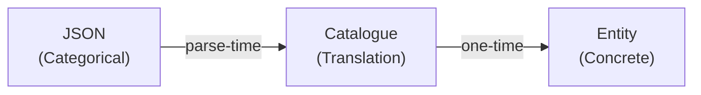
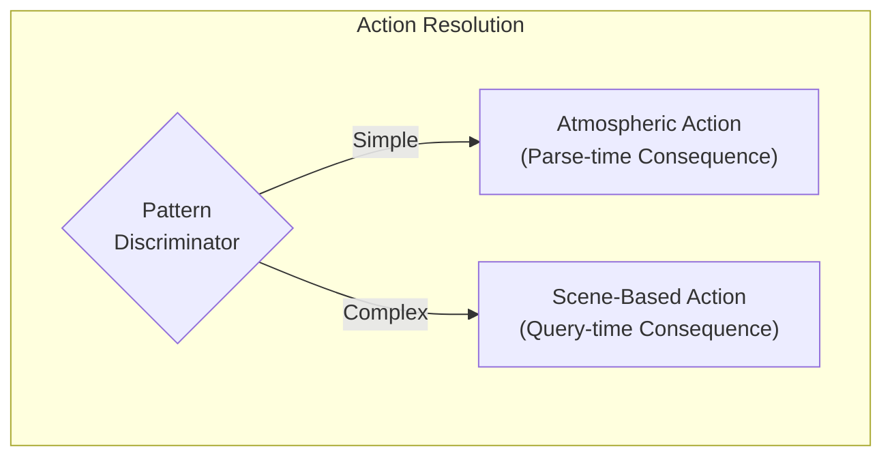
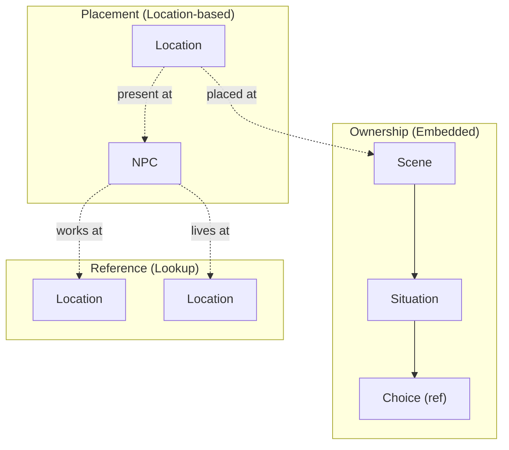

# 8. Crosscutting Concepts

This section documents patterns and practices that apply across multiple building blocks, providing conceptual integrity throughout the architecture.

---

## 8.0 Core Architectural Constraints

Two foundational principles govern ALL design decisions. These are TIER 1 non-negotiables (see `gdd/01_vision.md`).

| Principle | Definition | Consequence |
|-----------|------------|-------------|
| **Perfect Information** | Display = Execution. All costs, requirements, and outcomes visible before selection. | No hidden gotchas. Players can calculate and plan. Strategy replaces surprise. |
| **No Soft-Locks** | A-story ALWAYS has fallback choice. Forward progress guaranteed regardless of player state. | Player can never become stuck. Fallback may have consequences, but exists. |

### Why These Are TIER 1

| Tier | Principles | Rule |
|------|------------|------|
| **TIER 1** | No Soft-Locks, HIGHLANDER | Never compromise |
| **TIER 2** | Perfect Information, Playability | Compromise only for TIER 1 |
| **TIER 3** | Elegance, Verisimilitude | Compromise for TIER 1 or 2 |

When principles conflict, higher tier wins. See `gdd/01_vision.md §1.6` for resolution examples.

**Cross-References:**
- §8.15 Fallback Context Rules (No Soft-Lock implementation)
- §8.25 Context Injection (Perfect Information in choice display)

---

## 8.1 HIGHLANDER Principle

**"There can be only one."**

Every piece of game state has exactly one canonical storage location. No redundant tracking, no parallel state, no caching that could desync.

| Aspect | Principle |
|--------|-----------|
| **State Location** | Single source of truth for each datum |
| **Relationships** | Direct object references, never IDs alongside objects |
| **Queries** | Always hit the canonical source |

**Consequences:**
- No "which is correct?" ambiguity when state disagrees
- Single update point for each state change
- Violations (storing both ID and object) create irreconcilable conflicts

---

## 8.2 Catalogue Pattern (Parse-Time Translation)

Content authors write categorical properties; catalogues translate to concrete mechanical values at parse-time only.



| Layer | Responsibility |
|-------|----------------|
| **Content** | Categorical descriptions (friendly, hostile, premium) |
| **Catalogue** | Translation formulas |
| **Entity** | Concrete values only (integers, no categories) |

**Consequences:**
- AI generates balanced content without knowing game math
- Single formula change rebalances all affected content
- Zero runtime overhead (translation complete at startup)

Catalogues implement DDR-007's Absolute Modifiers principle: translations always use fixed additions and subtractions, never multipliers.

**Forbidden:** Runtime catalogue lookups, string-based property matching.

---

## 8.3 Entity Identity Model

Domain entities have no instance IDs. Relationships use direct object references. Queries use categorical properties.

| Pattern | Usage |
|---------|-------|
| **Template IDs** | Allowed (immutable archetypes) |
| **Object References** | Required for relationships |
| **Categorical Filters** | Required for entity resolution |
| **Instance IDs** | Forbidden |

**Rationale:** Procedural generation requires categorical matching ("find a friendly innkeeper"), not hardcoded references. IDs create brittleness; categories enable infinite content.

---

## 8.4 Four-Tier Timing Model

Content instantiates lazily across timing tiers. Scene creation follows a UNIFIED path for both authored and procedural content.

### Overview

| Tier | When | What Happens |
|------|------|--------------|
| **Parse-time** | Game initialization | Templates loaded (no instances) |
| **Spawn-time** | Choice reward executes | Scene instance created (Deferred state) |
| **Activation-time** | Player enters location | Situations resolved, entities materialized |
| **Query-time** | UI requests options | Ephemeral actions regenerated |

### Scene Creation (UNIFIED MECHANISM)

**ALL scenes are created via ONE mechanism:** SceneTemplate + Context → SceneSpawnResult → Scene Instance

| Content Type | Context Source | Mechanism |
|--------------|----------------|-----------|
| **Authored (A1-A10)** | Extracted from current SceneTemplate | SceneSpawnResult from final choice |
| **Procedural (A11+)** | Computed from rhythm + GameWorld state | SceneSpawnResult from final choice |

**There is NO DIFFERENCE in HOW scenes are created.** The only difference is WHERE context comes from.

### The ONE Exception: First Starter Scene

The VERY FIRST scene cannot be created from SceneSpawnResult (no prior scene exists).

| Requirement | Why |
|-------------|-----|
| GameWorld complete | All SceneTemplates loaded |
| DI registration complete | Services available |
| Created as DEFERRED | Not activated until player enters location |

### The Chain Mechanism

```
GAME START: First starter scene spawned (deferred)
     │
     ▼
A1 activates ──► final choice has SceneSpawnResult ──► A2 (deferred)
                                                          │
A2 activates ──► final choice has SceneSpawnResult ──► A3 (deferred)
                                                          │
... continues for ALL scenes (authored and procedural use SAME mechanism)
```

### Template vs Instance

Templates are immutable archetypes. Instances are mutable game state.

| Aspect | Template | Instance |
|--------|----------|----------|
| **Created** | Parse-time | Spawn-time (Scene) / Activation-time (Situation) |
| **Mutability** | Immutable | Mutable |
| **Entity References** | PlacementFilters (categorical) | Direct object references (resolved) |

| Rule | Why |
|------|-----|
| **NO Scene instances at parse-time** | Templates only until game starts |
| **NO Situation instances until activation** | Deferred scenes have empty situations |
| **Instances reference templates** | Traceability back to source |

### Forbidden Patterns

| Pattern | Why Forbidden |
|---------|---------------|
| Scene instances in JSON | Bypasses spawn-time pipeline |
| Multiple creation paths | Violates HIGHLANDER |
| Special authored vs procedural logic | Same mechanism for both |

**Consequence:** All scenes follow Template → Deferred → Active lifecycle regardless of source.

---

## 8.5 Fail-Fast Philosophy

Errors surface immediately at point of failure with clear stack traces. No defensive coding that hides problems.

| Pattern | Rule |
|---------|------|
| **Initialization** | All properties have explicit initial values |
| **Access** | Direct property access without null checks |
| **Failure** | Let references crash with clear stack traces |

**Forbidden:**
- Null-coalescing operators hiding missing data
- TryGetValue patterns deferring errors
- Default return values masking lookup failures

**Rationale:** A crash with clear stack trace is debuggable. Silent null propagation creates mystery bugs discovered far from root cause.

---

## 8.6 Backend/Frontend Separation

Backend returns domain semantics (WHAT). Frontend decides presentation (HOW).

| Layer | Provides |
|-------|----------|
| **Backend** | Domain enums, plain values, state validity |
| **Frontend** | CSS classes, icons, display text, formatting |

**Forbidden in Backend:** Presentation concerns (styling, icons, display strings).

**Rationale:** Changing presentation never touches game logic. Changing mechanics never requires UI updates beyond data flow.

---

## 8.7 Idempotent Initialization

The rendering framework may execute initialization multiple times. All startup code must be idempotent.

**Pattern:** Guard initialization with a flag to prevent double-execution.

**Applies to:** Component initialization, state mutations during startup, event subscriptions, resource allocation.

---

## 8.8 Dual-Tier Action Architecture

LocationAction is a **union type** supporting two intentional patterns via pattern discrimination.



| Tier | Pattern | Consequence Creation | Characteristics |
|------|---------|---------------------|-----------------|
| **Atmospheric** | Simple, permanent | Parse-time (LocationActionCatalog) | Always available, constant costs/rewards, soft-lock prevention |
| **Scene-Based** | Complex, dynamic | Query-time (ChoiceTemplate reference) | Context-dependent, narrative-driven, OR-path requirements |

**HIGHLANDER Compliance:** Both patterns use `Consequence` for costs/rewards. The distinction is WHEN the Consequence is created, not WHAT class represents it.

**Why Both Patterns Exist:**

- **Atmospheric:** Baseline actions (work, rest, travel) that prevent soft-locks. Consequence created once at parse-time.
- **Scene-based:** Dynamic actions with contextual variation. Consequence retrieved from ChoiceTemplate at query-time.

**Critical:** Neither pattern replaces the other. Both are intentional architecture supporting different gameplay needs.

---

## 8.9 Entity Ownership Hierarchy

Entities follow strict ownership patterns determining lifecycle and responsibility.



| Relationship Type | Meaning |
|-------------------|---------|
| **Ownership** | Parent OWNS children; deleting parent deletes children |
| **Placement** | Entity placed AT location; location doesn't own entity |
| **Reference** | Entity references another; neither owns the other |

---

## 8.10 Categorical Property Architecture

Every categorical property is strongly-typed with intentional domain meaning.

Entities are selected via categorical filters, not generic strings. All categorical properties map to strongly-typed enums with specific game effects.

### Two Distinct Concepts for Entity Selection

| Concept | Purpose | Matching Logic |
|---------|---------|----------------|
| **Identity Dimensions** | Describe atmosphere, context, character | Empty = any, Non-empty = entity has ONE OF |
| **Capabilities** | Enable specific game mechanics | Entity must have ALL specified |

### Categorical Dimensions

Locations and NPCs have orthogonal dimensions that compose to create archetypes:

- **Location dimensions:** Privacy, Safety, Activity, Purpose
- **NPC dimensions:** Profession, Personality, Social Standing, Story Role

### Validation Strategy

All categorical strings are validated at parse-time via fail-fast parsing. Invalid values fail immediately at startup, not runtime.

---

## 8.11 Location Accessibility Architecture

Dual-model accessibility ensures soft-lock prevention while supporting scene-gated dependent locations.

### The Problem

Locations fall into two categories with different accessibility requirements:
- **Authored locations:** Must always be reachable (soft-lock prevention)
- **Scene-created locations:** Should only be accessible after narrative progression

### The Solution

Explicit type-safe discriminator determines accessibility rule:

| Origin Type | Accessibility Rule |
|-------------|-------------------|
| **Authored** | Always accessible |
| **Scene-Created** | Accessible when granted by active scene |

**Rationale:** Uses explicit enum instead of null-as-domain-meaning pattern. Forensic metadata (provenance) is tracked separately and NOT used for accessibility decisions.

---

## 8.12 PlacementFilter Architecture

PlacementFilter controls entity resolution for scene situations using categorical properties.

Filters specify WHERE entities should be found or created, using proximity and identity dimensions.

### Filter Components

| Component | Purpose |
|-----------|---------|
| **Proximity** | How to search relative to context (same location, same venue, adjacent, etc.) |
| **Identity Dimensions** | Categorical constraints on matching entities |

### Filter Semantics

| Filter State | Meaning |
|--------------|---------|
| **Null filter** | No entity needed for that type |
| **Empty dimension list** | Don't filter (any value matches) |
| **Non-empty list** | Entity must have ONE OF the specified values |

---

## 8.13 Entity Resolution (Find-Or-Create)

Entities are resolved at scene ACTIVATION, not parse-time. Categorical filters become concrete object references.

### Resolution Timing

| Tier | Entity Resolution | Why |
|------|-------------------|-----|
| **Parse-time** | NEVER | Entities may not exist |
| **Spawn-time** | NEVER | Scene is Deferred |
| **Activation-time** | YES | Player at location, entities needed |

### Resolution Strategy

| Entity | If Not Found |
|--------|--------------|
| **Location** | Create dynamically (procedural generation) |
| **NPC** | Create dynamically (procedural generation) |
| **Route** | FAIL FAST (navigation graph must be complete) |

### Filter to Reference Transformation

At activation, categorical filters resolve to concrete objects:
- Filter: "find Commerce location" → Reference: actual Location object
- Filter: "find Innkeeper NPC" → Reference: actual NPC object

**HIGHLANDER:** Each entity resolved ONCE at activation. No re-resolution, no caching.

---

## 8.14 Separated Responsibilities (HIGHLANDER)

Entity resolution follows strict responsibility separation to prevent circular dependencies.

| Component | Responsibility | Does NOT Do |
|-----------|----------------|-------------|
| **Resolver** | FIND only | Never creates |
| **Creator** | CREATE only | Never searches |
| **Orchestrator** | Coordinate find-or-create | Never finds or creates directly |

**Consequences:**
- No circular dependencies between resolution components
- Clear audit trail for entity creation
- Single path for all entity creation
- Entity origin tracking (Authored vs Scene-Created)

---

## 8.15 Fallback Context Rules (No Soft-Lock Guarantee)

Fallback choices are the safety valve that guarantees forward progress.

Every situation MUST have a Fallback choice. This is non-negotiable per the No Soft-Locks principle.

### Fallback Semantics

| Aspect | Rule |
|--------|------|
| **Requirements** | NEVER (Fallback must always be available) |
| **Consequences** | ALLOWED (preserves scarcity) |
| **Forward Progress** | REQUIRED (must complete situation) |

### Context-Dependent Meaning

| Player State | Fallback Meaning | Consequences |
|--------------|------------------|--------------|
| **Pre-commitment** | Exit, return later | None |
| **Post-commitment** | Break commitment | Penalty |

**Design Principle:** No two situations in the same scene should have semantically identical choices. Fallback meaning and consequences scale with player commitment.

---

## 8.16 Consequence ValueObject Pattern

Unified representation of all costs and rewards using signed values.

**Design Principle:** Single property per resource type where sign indicates direction. Negative = cost, Positive = reward.

### Query Methods

The Consequence provides projection methods for perfect information display:
- Can player afford this?
- What would player state be after?
- Are there any effects at all?

**Why Methods on ValueObject:** Projection is a pure function deriving data from state. No side effects, no mutation. Separate service handles actual state changes.

---

## 8.17 Centralized Invariant Enforcement

**"Scene invariants belong in the parser, not the archetypes."**

Guarantees that must hold for ALL scenes of a category must be enforced at the system level, not in individual scene definitions.

### The Problem

Scattering invariant enforcement across scene definitions creates:
- **Omission risk:** New archetype forgets invariant
- **Inconsistency:** Different implementations across archetypes
- **Maintenance burden:** Changing invariant requires multiple updates

### The Solution

Centralize invariant enforcement at parse-time. Parser applies category-specific invariants after archetype generates base structure.

| Layer | Responsibility |
|-------|----------------|
| **Content** | Identity, categorical properties |
| **Archetype** | Base situation structure |
| **Parser** | Category invariant enforcement |

---

## 8.18 Explicit Property Principle

Use explicit strongly-typed properties for state modifications. Never route changes through string-based generic systems.

### The Problem

Generic catch-all classes with string-based type routing violate compile-time safety:
- Typos compile successfully but fail at runtime
- New types require updating switch statements everywhere
- No IDE support for valid combinations

### The Solution

Replace string routing with explicit strongly-typed properties.

| String-Based | Explicit Properties |
|--------------|---------------------|
| Runtime failure | Compile-time error |
| Silent typo bugs | Compiler catches typos |
| Manual string validation | Type system enforces validity |
| No IDE support | Full IntelliSense |

### Design Principles

| Principle | Implementation |
|-----------|----------------|
| **Nullable for Optional** | Null means "not required" |
| **Object References** | Direct references, not IDs |
| **Enums for Categories** | Strongly-typed, not strings |

---

## 8.19 Unified Resource Availability (HIGHLANDER)

**"One place to check if player can do something."**

ALL resource availability checks use ONE mechanism. This eliminates duplication and ensures consistent behavior.

### The Principle

| Aspect | Rule |
|--------|------|
| **Single check location** | One class handles all availability checks |
| **Two check patterns** | Gate logic (can attempt?) vs Affordability logic (can afford?) |
| **No scattered checks** | No manual checks in executors, services, or UI |

### Two Check Patterns

| Pattern | Question | Can Go Negative? |
|---------|----------|------------------|
| **Gate** | "Can you ATTEMPT this?" | Yes (Resolve) |
| **Affordability** | "Can you AFFORD this?" | No (all other resources) |

### Sir Brante Willpower Pattern

Resolve uses gate logic (inspired by The Life and Suffering of Sir Brante):

| Phase | Player State | Resolve Effect |
|-------|--------------|----------------|
| **Building** | Earning through choices | Accumulates |
| **Spending** | Taking costly choices | Depletes (can go negative) |
| **Locked** | Negative resolve | Blocks costly choices |
| **Recovery** | Finding restoration | Rebuilds to positive |

This prevents "abundance trivializes mechanic" - players must manage willpower strategically.

### Forbidden Patterns

| Pattern | Why Forbidden |
|---------|---------------|
| Multiple affordability check locations | Violates HIGHLANDER |
| Manual checks in executors | Bypasses unified system |
| Affordability methods on domain objects | Separates check from requirement |

---

## 8.20 Behavior-Only Testing Principle

**"Test what it DOES, not what it SAYS."**

Tests verify observable behavior, never implementation details. Specific values, string formats, and message content are implementation details that change during refactoring or content authoring.

### What Tests Verify

| Verify | Example Behavior |
|--------|------------------|
| **Boolean outcomes** | Action valid/invalid, requirement satisfied/not satisfied |
| **State transitions** | Player can/cannot proceed, resource depleted/available |
| **Existence checks** | Object exists/null, collection empty/populated |
| **Comparative relationships** | Value increased/decreased, before/after comparison |

### What Tests Never Check

| Never Check | Reason |
|-------------|--------|
| **Specific numeric values** | Balance tuning changes these |
| **String message formats** | UX improvements change these |
| **Label text content** | Localization changes these |
| **Exact error messages** | Rewording is refactoring, not regression |

### Rationale

Tests that check specific values create false negatives during legitimate refactoring:

- Content author adjusts balance → tests break
- Developer improves error message clarity → tests break
- Designer tweaks resource formula → tests break

None of these are regressions. The behavior (invalid when insufficient, valid when sufficient) remains correct.

### Application

| Instead Of | Use |
|------------|-----|
| Checking resource equals exact value | Checking resource greater/less than threshold |
| Checking error message contains text | Checking plan/result is invalid |
| Checking label equals specific string | Checking label is not null/empty |
| Checking projection has exact numbers | Checking projection reflects expected direction |

**Consequence:** Tests survive refactoring. Only actual behavioral regressions cause failures.

---

## 8.21 Unified Cost/Reward Application (HIGHLANDER)

**"One place to change player resources."**

ALL player resource mutations (costs AND rewards) flow through ONE location. No direct player mutations anywhere else.

### The Two Pillars

Together with §8.19, these form the TWO PILLARS of resource management:

| Pillar | Purpose |
|--------|---------|
| **Availability** (§8.19) | Check if player CAN do something |
| **Application** (this section) | Apply costs/rewards |

### Sign Convention

Signed values distinguish costs from rewards:

| Direction | Sign | Effect |
|-----------|------|--------|
| **Cost** | Negative | Player loses resource |
| **Reward** | Positive | Player gains resource |
| **Hunger** | Positive = bad | Hunger increases (harmful) |

### Forbidden Patterns

| Pattern | Why Forbidden |
|---------|---------------|
| Direct player mutations | Bypasses clamping, validation |
| Scattered mutation logic | Violates HIGHLANDER |
| Optional parameter mutations | Hides what's being changed |
| Manual availability checks | Must use unified availability (§8.19) |

### Rationale

Without unified application:
- Clamping logic duplicated
- Inconsistent floor/ceiling behavior
- Changes require multiple updates

With unified application:
- Single mutation implementation
- Consistent behavior everywhere
- Changes happen in ONE place

---

## 8.22 Archetype Reusability (No Tutorial Hardcoding)

**"Archetypes are context-agnostic mechanical patterns."**

Every scene archetype must produce appropriate experiences across ALL contexts through categorical property scaling. No archetype may contain context-specific code paths.

### The Problem

Tutorial scenes and procedural scenes need different difficulty levels. A naive implementation might check story sequence. This violates reusability: the archetype becomes unusable in new contexts, tutorial behavior is buried in code, and the same archetype produces fundamentally different experiences based on hidden branching.

### The Solution

Categorical properties drive ALL variation. The archetype code is identical regardless of context.

| Scaling Source | Effect |
|----------------|--------|
| **Location difficulty** | Base challenge level (distance from world center) |
| **NPC demeanor** | Stat requirement adjustment |
| **Quality** | Cost adjustment |
| **Power dynamic** | Threshold adjustment |

### Tutorial as Context, Not Code

Tutorial scenes use the SAME archetypes as procedural scenes. The tutorial experience emerges from categorical context (safe location, friendly NPC, basic quality), not from special tutorial code paths.

Same archetype + different context = different player experience. The archetype code doesn't know whether it's tutorial or procedural.

### Forbidden Patterns

| Pattern | Why Forbidden |
|---------|---------------|
| Story sequence checks | Tutorial hardcoding |
| Tutorial-specific branches | Hidden branching |
| Different choice structures per context | Non-reusable archetype |
| Hardcoded reward/cost values | No categorical scaling |

### Required Patterns

- All scaling via categorical properties
- Consistent structure regardless of context
- Context-agnostic archetype code

### Archetype Categories (Functional, Not Usage-Based)

Archetypes are categorized by FUNCTION, not by when they appear:

| Category | Function |
|----------|----------|
| **Travel** | Moving between places |
| **Service** | Transactional interactions |
| **Information** | Learning and discovery |
| **Social** | Relationships and connections |
| **Conflict** | Opposition and stakes |
| **Reflection** | Processing and deciding |

Any category can appear in tutorial OR procedural content. ALL archetypes are available to ALL story categories (A/B/C). Tutorial is "first instantiation," not "special archetypes."

---

## 8.23 DDR-007: Intentional Numeric Design

**"If you can't do it in your head, the design is wrong."**

All game mechanics use integer-only arithmetic with values small enough for mental calculation. This principle governs three domains:

### The Three Principles

| Principle | Description | Forbidden |
|-----------|-------------|-----------|
| **Mental Math Design** | Values fit in working memory (range: -20 to +20) | Large numbers, complex formulas |
| **Deterministic Arithmetic** | Strategic outcomes predictable from inputs | Random, seeds, or hash-based selection in strategic layer |
| **Absolute Modifiers** | Bonuses stack additively | Multiplicative scaling, percentages |

### Numeric Type Usage

| Type | Usage | Example |
|------|-------|---------|
| **int** | All game values | Coins, stamina, thresholds, adjustments |
| **Enums** | Categorical states | TradeConfidence.High, PowerDynamic.Dominant |

| Forbidden Type | Reason |
|----------------|--------|
| **float/double** | Introduces rounding errors, violates determinism |
| **decimal** | Overkill precision, implies financial calculation |
| **Percentages** | Mental math barrier, multiplicative by nature |
| **Basis Points** | Financial jargon, opaque to players |

### Pattern Transformations

When encountering percentage-based patterns, transform to DDR-007 compliant forms:

| Before (Forbidden) | After (Compliant) |
|-------------------|-------------------|
| `price * 1.15` | `price + 3` (flat spread) |
| `value * 0.7` | `value - 3` (flat reduction) |
| `total * 0.3` | `(total + 2) / 3` (integer division) |
| `current > total * 0.75` | `total - current <= total / 4` |
| `BasisPoints / 10000` | Direct integer value |

### Enforcement Layers

DDR-007 compliance is enforced at multiple levels:

| Layer | Mechanism |
|-------|-----------|
| **Compile-Time** | Type system (int only) |
| **Test-Time** | Architecture tests |
| **Pre-Commit** | Pattern detection hook |
| **CI** | Pattern check |
| **Review** | Documentation guidance |

### Exempt Patterns

| Context | Reason |
|---------|--------|
| **UI rendering** | Visual layout requires floating-point geometry |
| **Tactical layer** | Card shuffling uses Random per design |
| **Parsing layer** | External format translation |

### Player Experience Impact

Players can perform all calculations mentally. No calculator, no percentage math, no multiplicative confusion.

---

## 8.24 Two-Phase Entity Creation

**"Create mechanics first; finalize narrative after mechanical context is complete."**

Procedural entities are created in two distinct phases. Names and descriptions persist to end of game.

### Two-Phase Creation Model

| Phase | Trigger | Output | Persistence |
|-------|---------|--------|-------------|
| **1. Mechanical** | Entity needed | Structure, references, categorical properties | Permanent |
| **2. Narrative** | All references set | Names, descriptions, flavor text | Permanent |

### Why Two Phases

| Concern | Phase 1 (Mechanical) | Phase 2 (Narrative) |
|---------|---------------------|---------------------|
| **Object references** | Being established | All complete |
| **Relationship context** | Partial | Full graph available |
| **Naming coherence** | Impossible | Can name consistently across scope |
| **When executed** | On generation | Once, after mechanical complete |

**Principle:** Narrative finalization happens ONCE after mechanical creation, generating PERSISTENT names displayed consistently throughout the game.

### Phase 1: Mechanical Creation

Creates structure with categorical properties:
- Archetype category
- Location difficulty context
- Rhythm pattern
- Placement filters for entity resolution
- Object references

### Phase 2: Narrative Finalization

After all references established, generates PERSISTENT names stored on entity properties.

**Forbidden:**
- Narrative generation during mechanical creation (context incomplete)
- Per-entity naming without relationship awareness
- Display-time regeneration (names must persist)

---

## 8.25 Context Injection (HIGHLANDER Scene Generation)

**"RhythmPattern drives selection. Location difficulty drives scaling. Never mixed."**

### RhythmPattern Definitions

Content rhythm controls how situations present choices to players:

| Rhythm | Choice Structure | Player Experience |
|--------|------------------|-------------------|
| **Building** | All positive—choose which stat to gain | Identity formation |
| **Crisis** | All negative—choose which loss to minimize | Test investments |
| **Mixed** | Trade-offs—sacrifice for gain | Strategic decisions |

**Rhythm emerges from intensity history, not player state.** Player resources do NOT affect which rhythm is selected—the rhythm comes from PAST scenes, not CURRENT state.

### Two Distinct Systems

| System | Input | When Applied | Controls |
|--------|-------|--------------|----------|
| **Scene Selection** | RhythmPattern + anti-repetition | Scene spawn trigger hit | Which archetype category |
| **Choice Scaling** | Location difficulty (hex distance) | Situation created | Requirement/reward values |

These systems are ORTHOGONAL. Selection doesn't know about scaling. Scaling doesn't influence selection.

### Scene Selection: RhythmPattern Only

Scene archetype selection uses ONLY:

| Input | Source | Purpose |
|-------|--------|---------|
| **RhythmPattern** | Computed from intensity history | Building → building archetypes; Crisis → crisis archetypes |
| **Anti-Repetition** | Recent categories/archetypes | Avoid immediate repetition |

**No other inputs influence selection.** Location context, player stats, tier—all REMOVED from selection.

### Choice Scaling: Location Difficulty

When a situation is instantiated, choices receive scaling from location:

| Input | Effect |
|-------|--------|
| **Location Difficulty** | Modifies stat requirements and reward magnitudes |
| **Player Strength Offset** | Adjusts for player capability |

Scaling happens at instantiation—AFTER selection is complete.

### Context Flow

```
SceneSpawnResult → RhythmPattern → Select Category → SceneTemplate
                                                          ↓
                              Location Difficulty → Choice Scaling
```

### HIGHLANDER Compliance

| Principle | How It's Upheld |
|-----------|-----------------|
| **Same selection logic** | RhythmPattern processed identically for authored/procedural |
| **Same scaling logic** | Location difficulty applied identically to all choices |
| **No source detection** | Selection doesn't know if context was authored or procedural |

### Forbidden Patterns

| Pattern | Why It's Wrong |
|---------|----------------|
| Location properties in selection | Selection uses rhythm only |
| Player stats influencing selection | Game doesn't cushion poor play |
| Different paths for authored vs procedural | Same mechanism for both |

**Cross-References:**
- §8.4 Three-Tier Timing: Unified scene creation mechanism

---

## 8.26 Domain Collection Principle (No Key-Value Patterns)

**"Explicit properties, not generic key-value pairs."**

Dictionary and KeyValuePair patterns are forbidden at ALL layers. Use arrays of objects with explicit properties throughout.

### Why Key-Value Patterns Are Forbidden

| Problem | Impact |
|---------|--------|
| **Hidden semantics** | Generic accessors reveal nothing about domain meaning |
| **Parser complexity** | Dictionary-to-List conversion adds translation layer |
| **Inconsistent patterns** | Different structures at different layers |
| **LINQ impedance** | Dictionary iteration differs from List iteration |

### The Principle

| Layer | Pattern |
|-------|---------|
| **JSON** | Arrays of objects with explicit properties |
| **DTO** | Lists with explicit properties |
| **Parser** | Direct mapping (no conversion) |
| **Entity** | Lists with explicit properties |

### Benefits

| Benefit | How Achieved |
|---------|--------------|
| **Semantic clarity** | Property names describe domain meaning |
| **No conversion** | Same structure flows through all layers |
| **Uniform queries** | All layers use identical patterns |
| **IDE support** | Autocomplete on all property names |

### Exception

Dictionary acceptable ONLY for Blazor framework parameters (framework requirement).

**Never acceptable for:** Game content, DTOs, domain entities, or persistent state.

**Cross-References:**
- §8.3 Entity Identity Model (related principle)
- §8.18 Explicit Property Principle

---

## 8.27 Entity Reference vs Categorical Description

**"Conditions reference existing; Templates describe creation."**

Two distinct patterns for entity relationships based on timing:

| Context | Entity State | Pattern | Example |
|---------|--------------|---------|---------|
| **SpawnConditions** | Must exist | Object reference | `Location Location` |
| **SituationTemplate** | May not exist | Categorical filter | `LocationPurpose.Commerce` |

### SpawnConditions: Object References Only

SpawnConditions gate WHEN content spawns based on game state. They reference EXISTING entities:

| Property | Type | NOT |
|----------|------|-----|
| Location visits | `Location Location` | `string LocationId` |
| NPC relationships | `NPC Npc` | `string NpcId` |
| Route familiarity | `RouteOption Route` | `string RouteId` |

**Rationale:** At spawn-condition evaluation time, referenced entities MUST exist. Missing entity = malformed content (fail-fast at parse-time).

### SituationTemplates: Categorical Descriptions

SituationTemplates within scenes may describe entities to be CREATED or RESOLVED:

| Pattern | Usage |
|---------|-------|
| Categorical filter | `LocationPurpose.Commerce, Proximity.SameVenue` |
| Deferred resolution | Entity resolved at scene activation via EntityResolver |

**Rationale:** Templates define WHAT to create. Categorical properties enable procedural generation without hardcoded references.

### Forbidden Patterns

| Pattern | Why Forbidden |
|---------|---------------|
| String IDs in SpawnConditions | Violates §8.3 Entity Identity Model |
| Object refs in creation templates | Entity may not exist yet |
| Mixing both in same structure | Unclear timing semantics |

**Cross-References:**
- §8.3 Entity Identity Model (no instance IDs)
- §8.13 Entity Resolution (find-or-create at activation)
- §8.12 PlacementFilter Architecture (categorical entity resolution)

---

## 8.28 Two-Pass Procedural Generation

**"Mechanics first, narrative second. Never hand-author content."**

All game content flows through a two-pass generation pipeline. Hand-authored narrative text is architecturally forbidden.

### The Two-Pass Architecture

| Pass | Purpose | Timing | Output |
|------|---------|--------|--------|
| **Pass 1: Mechanical** | Generate situations, choices from archetypes | Scene spawn | SituationTemplates + ChoiceTemplates |
| **Pass 2: AI Narrative** | Generate flavor text from CURRENT context | Situation entry (lazy) | Regenerated each visit |

### Pass 1: Mechanical Generation

Categorical properties flow through archetypes to produce concrete mechanical content:

| Input | Processor | Output |
|-------|-----------|--------|
| SceneArchetypeType + GenerationContext | SceneArchetypeCatalog | SituationTemplates with choices |
| RhythmPattern | SituationArchetypeCatalog | Choice STRUCTURE (Building/Crisis/Mixed) |
| PowerDynamic, NPCDemeanor, Quality | GenerationContext scaling | Value ADJUSTMENTS (thresholds, costs) |

**Key Principle:** Archetypes are reusable across all contexts. Tutorial and late-game use identical archetype code; categorical properties create appropriate difficulty.

### Pass 2: Lazy AI Narrative Enrichment

**Key Design Principle: Persistent vs Dynamic Narratives**

| Entity Type | Narrative Behavior | Rationale |
|-------------|-------------------|-----------|
| **Locations, NPCs** | PERSISTENT - generated once, never changes | Names, descriptions are stable identity |
| **Situations** | DYNAMIC - regenerated on each entry | Reflects CURRENT game state for authenticity |

AI narrative generation is LAZY - deferred until the player actually enters a situation:

| When | What Happens |
|------|--------------|
| Scene Spawn | Situations + Choices created mechanically. Choices have SCALED costs/consequences. No AI calls. |
| Player Enters Situation | AI generates Situation.Description + Choice.Label with CURRENT context |
| Player Re-enters Situation | AI REGENERATES all narrative text (mechanical values unchanged) |

**Critical Distinction:**
- **Mechanical values** (costs, requirements, consequences): Created at SCENE SPAWN, never change
- **Narrative text** (descriptions, labels): Created at SITUATION ENTRY, regenerated on re-entry

**Timing:** Pass 2 runs during `SituationFacade.ActivateSituationAsync()`, when player enters a situation.

| Input | Processor | Output |
|-------|-----------|--------|
| Situation + ScenePromptContext | SceneNarrativeService | Situation.Description |
| Choice + ScenePromptContext | SceneNarrativeService | Choice.Label (updates existing choice) |
| NarrativeHints (tone, theme, style) | AI provider | Contextual flavor |

| Component | Responsibility |
|-----------|----------------|
| **SituationFacade.ActivateSituationAsync** | Orchestrate lazy generation on situation entry |
| **ScenePromptBuilder** | Build AI prompt from ScenePromptContext (NPC, Location, time, weather, narrative hints) |
| **SceneNarrativeService** | Execute AI calls with timeout, fallback to template-based generation |
| **OllamaClient** | Execute AI inference with streaming response |

**Benefits of Lazy + Dynamic:**
- Faster scene spawning (no AI blocking)
- AI calls only for situations player actually visits
- Choice labels reflect CURRENT player stats, relationships, time
- Re-entering situation shows updated context (e.g., improved relationship)

**Graceful Degradation:**

| Condition | Behavior |
|-----------|----------|
| AI available | Generate rich contextual narrative |
| AI timeout | Use fallback template-based generation |
| AI unavailable | Use fallback immediately |

**ScenePromptContext Contents:**
- Entity references: NPC, Location, Player, Route (complete objects, not IDs)
- Narrative hints: Tone, Theme, Context, Style (from SituationTemplate)
- World state: TimeBlock, Weather, Day (CURRENT values, not spawn-time)
- Mechanical context: Archetype type, choice labels, domain

**Fallback Generation:**
When AI unavailable, `GenerateFallbackSituationNarrative()` produces contextual text from entity properties:
- Time/weather atmospheric sentence
- NPC personality-driven greeting
- Theme-based contextual hint

### Fixing Content Problems

| Symptom | Wrong Approach | Correct Approach |
|---------|----------------|------------------|
| Generic choice labels | Write narrative in JSON | Enable/debug AI Pass 2 |
| Wrong costs/rewards | Edit JSON values | Fix archetype formula |
| Inverted economics | Flip sign in JSON | Use correct archetype type |
| Missing choice options | Add choice to JSON | Modify archetype generator |

### Forbidden Patterns

| Pattern | Why Forbidden |
|---------|---------------|
| Hand-written narrative in JSON | Bypasses AI enrichment, not scalable |
| Direct JSON value fixes | Bypasses archetype formulas |
| Tutorial-specific branches | Violates archetype reusability |
| Hardcoded choice structures | Prevents categorical scaling |

**Consequences:**
- Content authors specify WHAT (categorical properties)
- Archetypes determine HOW (mechanical structure)
- AI generates WHY (narrative meaning)
- Changes propagate through proper channel, not ad-hoc fixes

**Cross-References:**
- §8.2 Catalogue Pattern (parse-time translation)
- §8.23 Archetype Reusability (no tutorial hardcoding)
- §8.25 Context Injection (HIGHLANDER for content paths)

---

## 8.29 AI Narrative Additive Principle

**"AI narrative enriches mechanical context without contradiction."**

AI-generated narrative text must be ADDITIVE to mechanical entities, never CONFLICTING. Both AI narrative AND mechanical entities display to players in UI simultaneously—inconsistency breaks immersion.

### The Additive Rule

| Scenario | Result | Why |
|----------|--------|-----|
| AI writes pure atmosphere without names | **VALID** | Additive (adds mood, no conflict) |
| AI uses EXACT names from context | **VALID** | Consistent with displayed entities |
| AI invents different names | **INVALID** | Contradicts visible mechanical data |

**The key insight:** AI narrative does NOT need to always reference entities by name. A description like "The firelight dances across worn floorboards" is perfectly valid even when NPC "Martha Holloway" is mechanically present. But if the narrative DOES reference an entity, it MUST use the correct name.

### Why This Matters

Players see mechanical entities in UI (NPC panel shows "Martha Holloway", location header shows "The Weary Traveler Inn"). If AI narrative calls her "Sarah" or the inn "The Dusty Traveler", players lose trust in the game world's consistency.

| Layer | What Player Sees |
|-------|------------------|
| **Mechanical UI** | "Martha Holloway - Innkeeper" |
| **Narrative Text** | "The innkeeper offers a tired smile." |
| **Combined** | Coherent world (generic description matches visible NPC) |

| Layer | What Player Sees |
|-------|------------------|
| **Mechanical UI** | "Martha Holloway - Innkeeper" |
| **Narrative Text** | "Sarah gestures to the empty rooms upstairs." |
| **Combined** | **BROKEN** (who is Sarah? contradicts visible data) |

### Validation Philosophy

| Concern | Approach |
|---------|----------|
| **Context awareness** | Threshold-based atmospheric markers (N of M must appear) |
| **Entity name correctness** | Prompt guidance + human review (hard to automate) |
| **Length constraints** | UI-driven limits with enforcement |
| **Tone matching** | Documented in fixtures for human review |

**Automated validation** confirms AI is aware of context (atmospheric markers prove it read the input).

**Human/AI review** catches fabricated names and tone mismatches (subjective qualities requiring judgment).

### Prompt Guidance Strategy

ScenePromptBuilder includes explicit rules:

| Rule | Purpose |
|------|---------|
| Entity names provided in prompt | AI knows what names exist |
| "Use EXACT names or generic terms" | Prevents invention |
| "NEVER invent names" | Explicit prohibition |
| Examples of wrong vs right | Concrete guidance |

### Cross-References

- §8.28 Two-Pass Procedural Generation (mechanical pass + narrative pass)
- §8.24 Two-Phase Entity Creation (names persist after generation)
- [SOP-01: AI Narrative Optimization](../sop/01_ai_narrative_optimization.md) — Practical testing and prompt optimization workflow

---

## Related Documentation

- [04_solution_strategy.md](04_solution_strategy.md) — Strategies these concepts implement
- [09_architecture_decisions.md](09_architecture_decisions.md) — ADRs documenting why these patterns were chosen
- [02_constraints.md](02_constraints.md) — Constraints driving these concepts
