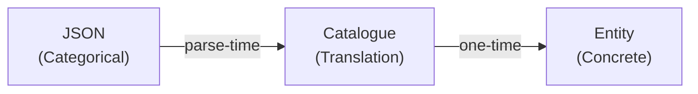
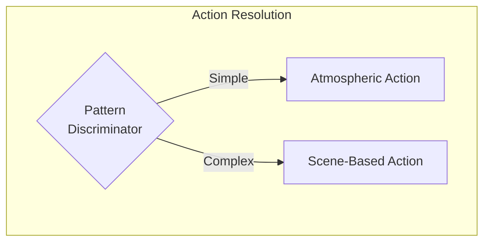
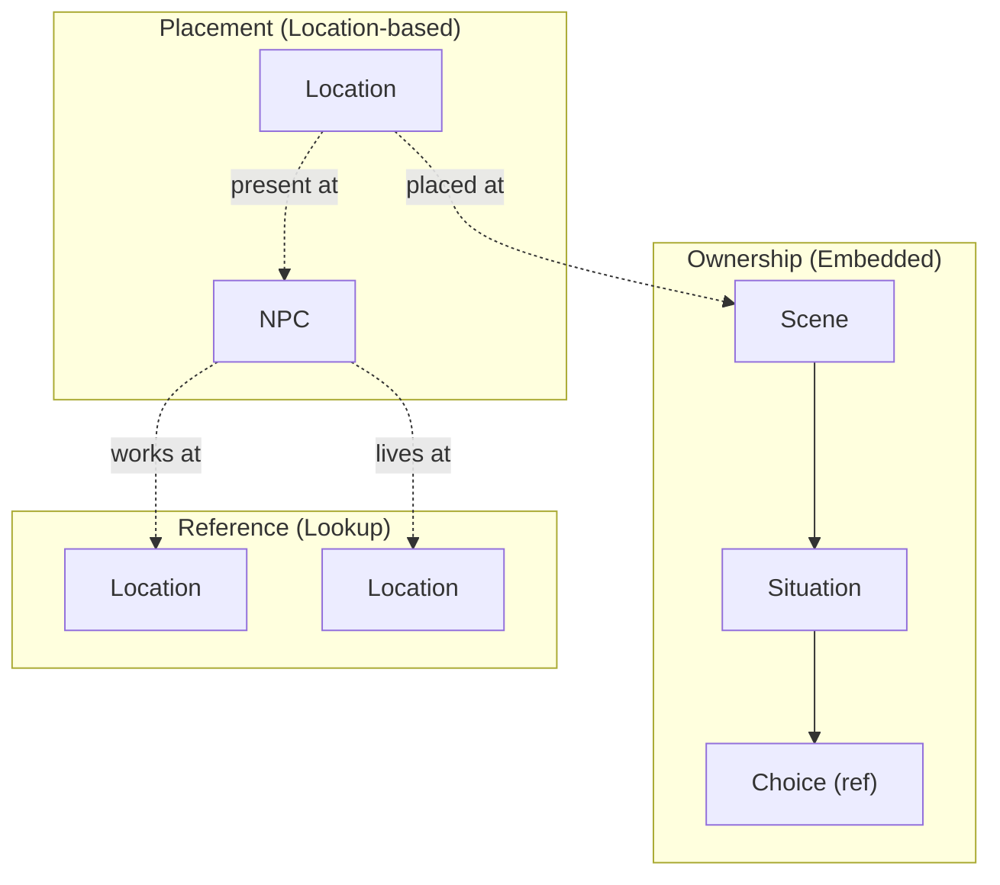
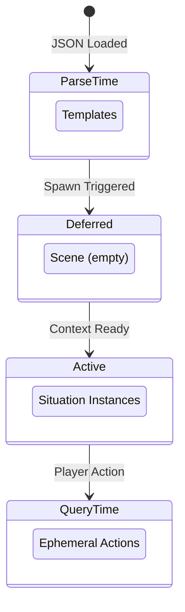

# 8. Crosscutting Concepts

This section documents patterns and practices that apply across multiple building blocks, providing conceptual integrity throughout the architecture.

---

## 8.1 HIGHLANDER Principle

**"There can be only one."**

Every piece of game state has exactly one canonical storage location. No redundant tracking, no parallel state, no caching that could desync.

| Aspect | Principle |
|--------|-----------|
| **State Location** | Single source of truth for each datum |
| **Relationships** | Direct object references, never IDs alongside objects |
| **Queries** | Always hit the canonical source |

**Consequences:**
- No "which is correct?" ambiguity when state disagrees
- Single update point for each state change
- Violations (storing both ID and object) create irreconcilable conflicts

---

## 8.2 Catalogue Pattern (Parse-Time Translation)

Content authors write categorical properties; catalogues translate to concrete mechanical values at parse-time only.



| Layer | Responsibility |
|-------|----------------|
| **Content** | Categorical descriptions (friendly, hostile, premium) |
| **Catalogue** | Translation formulas |
| **Entity** | Concrete values only (integers, no categories) |

**Consequences:**
- AI generates balanced content without knowing game math
- Single formula change rebalances all affected content
- Zero runtime overhead (translation complete at startup)

Catalogues implement DDR-007's Absolute Modifiers principle: translations always use fixed additions and subtractions, never multipliers.

**Forbidden:** Runtime catalogue lookups, string-based property matching.

---

## 8.3 Entity Identity Model

Domain entities have no instance IDs. Relationships use direct object references. Queries use categorical properties.

| Pattern | Usage |
|---------|-------|
| **Template IDs** | Allowed (immutable archetypes) |
| **Object References** | Required for relationships |
| **Categorical Filters** | Required for entity resolution |
| **Instance IDs** | Forbidden |

**Rationale:** Procedural generation requires categorical matching ("find a friendly innkeeper"), not hardcoded references. IDs create brittleness; categories enable infinite content.

---

## 8.4 Three-Tier Timing Model

Content instantiates lazily across three timing tiers to minimize memory usage.

| Tier | When | Content Type | Mutability |
|------|------|--------------|------------|
| **Templates** | Parse-time | Archetypes and patterns | Immutable |
| **Instances** | Spawn-time | Active game entities | Mutable |
| **Actions** | Query-time | Player options | Ephemeral |

**Consequence:** Memory contains only currently accessible content. Actions materialize when needed and disappear after execution.

---

## 8.5 Fail-Fast Philosophy

Errors surface immediately at point of failure with clear stack traces. No defensive coding that hides problems.

| Pattern | Rule |
|---------|------|
| **Initialization** | All properties have explicit initial values |
| **Access** | Direct property access without null checks |
| **Failure** | Let references crash with clear stack traces |

**Forbidden:**
- Null-coalescing operators hiding missing data
- TryGetValue patterns deferring errors
- Default return values masking lookup failures

**Rationale:** A crash with clear stack trace is debuggable. Silent null propagation creates mystery bugs discovered far from root cause.

---

## 8.6 Backend/Frontend Separation

Backend returns domain semantics (WHAT). Frontend decides presentation (HOW).

| Layer | Provides |
|-------|----------|
| **Backend** | Domain enums, plain values, state validity |
| **Frontend** | CSS classes, icons, display text, formatting |

**Forbidden in Backend:** Presentation concerns (styling, icons, display strings).

**Rationale:** Changing presentation never touches game logic. Changing mechanics never requires UI updates beyond data flow.

---

## 8.7 Idempotent Initialization

The rendering framework may execute initialization multiple times. All startup code must be idempotent.

**Pattern:** Guard initialization with a flag to prevent double-execution.

**Applies to:** Component initialization, state mutations during startup, event subscriptions, resource allocation.

---

## 8.8 Dual-Tier Action Architecture

LocationAction is a **union type** supporting two intentional patterns via pattern discrimination.



| Tier | Pattern | Characteristics |
|------|---------|-----------------|
| **Atmospheric** | Simple, permanent | Always available, constant costs/rewards, soft-lock prevention |
| **Scene-Based** | Complex, dynamic | Context-dependent, narrative-driven, OR-path requirements |

**Why Both Patterns Exist:**

- **Atmospheric:** Baseline actions (work, rest, travel) that prevent soft-locks. Simple enough that complexity is unjustified.
- **Scene-based:** Dynamic actions with contextual variation and complex requirements. Simplicity would be insufficient.

**Critical:** Neither pattern replaces the other. Both are intentional architecture supporting different gameplay needs.

---

## 8.9 Entity Ownership Hierarchy

Entities follow strict ownership patterns determining lifecycle and responsibility.



| Relationship Type | Meaning |
|-------------------|---------|
| **Ownership** | Parent OWNS children; deleting parent deletes children |
| **Placement** | Entity placed AT location; location doesn't own entity |
| **Reference** | Entity references another; neither owns the other |

---

## 8.10 Categorical Property Architecture

Every categorical property is strongly-typed with intentional domain meaning.

Entities are selected via categorical filters, not generic strings. All categorical properties map to strongly-typed enums with specific game effects.

### Two Distinct Concepts for Entity Selection

| Concept | Purpose | Matching Logic |
|---------|---------|----------------|
| **Identity Dimensions** | Describe atmosphere, context, character | Empty = any, Non-empty = entity has ONE OF |
| **Capabilities** | Enable specific game mechanics | Entity must have ALL specified |

### Categorical Dimensions

Locations and NPCs have orthogonal dimensions that compose to create archetypes:

- **Location dimensions:** Privacy, Safety, Activity, Purpose
- **NPC dimensions:** Profession, Personality, Social Standing, Story Role

### Validation Strategy

All categorical strings are validated at parse-time via fail-fast parsing. Invalid values fail immediately at startup, not runtime.

---

## 8.11 Location Accessibility Architecture

Dual-model accessibility ensures soft-lock prevention while supporting scene-gated dependent locations.

### The Problem

Locations fall into two categories with different accessibility requirements:
- **Authored locations:** Must always be reachable (soft-lock prevention)
- **Scene-created locations:** Should only be accessible after narrative progression

### The Solution

Explicit type-safe discriminator determines accessibility rule:

| Origin Type | Accessibility Rule |
|-------------|-------------------|
| **Authored** | Always accessible |
| **Scene-Created** | Accessible when granted by active scene |

**Rationale:** Uses explicit enum instead of null-as-domain-meaning pattern. Forensic metadata (provenance) is tracked separately and NOT used for accessibility decisions.

---

## 8.12 PlacementFilter Architecture

PlacementFilter controls entity resolution for scene situations using categorical properties.

Filters specify WHERE entities should be found or created, using proximity and identity dimensions.

### Filter Components

| Component | Purpose |
|-----------|---------|
| **Proximity** | How to search relative to context (same location, same venue, adjacent, etc.) |
| **Identity Dimensions** | Categorical constraints on matching entities |

### Filter Semantics

| Filter State | Meaning |
|--------------|---------|
| **Null filter** | No entity needed for that type |
| **Empty dimension list** | Don't filter (any value matches) |
| **Non-empty list** | Entity must have ONE OF the specified values |

---

## 8.13 Template vs Instance Lifecycle

Content instantiates lazily across phases to separate immutable patterns from mutable state.



**Key Insight:** Deferred scenes have NO situation instances. Situations are only created at activation when entity references can be resolved. This prevents orphaned situations and simplifies memory management.

---

## 8.14 Entity Resolution (Find-Or-Create)

Entities are resolved at scene ACTIVATION, not parse-time or instantiation.

### Resolution Strategy

| Context | If Entity Not Found |
|---------|---------------------|
| **Parse-time** | Fail fast (content error) |
| **Activation** | Create dynamically |

**Parse-time principle:** Referenced entities must already exist. Missing entity = malformed content.

**Activation principle:** Scene may require entities that don't exist yet. Missing entity = create via procedural generation.

---

## 8.15 Separated Responsibilities (HIGHLANDER)

Entity resolution follows strict responsibility separation to prevent circular dependencies.

| Component | Responsibility | Does NOT Do |
|-----------|----------------|-------------|
| **Resolver** | FIND only | Never creates |
| **Creator** | CREATE only | Never searches |
| **Orchestrator** | Coordinate find-or-create | Never finds or creates directly |

**Consequences:**
- No circular dependencies between resolution components
- Clear audit trail for entity creation
- Single path for all entity creation
- Entity origin tracking (Authored vs Scene-Created)

---

## 8.16 Fallback Context Rules (No Soft-Lock Guarantee)

Fallback choices are the safety valve that guarantees forward progress.

Every situation MUST have a Fallback choice. This is non-negotiable per the No Soft-Locks principle.

### Fallback Semantics

| Aspect | Rule |
|--------|------|
| **Requirements** | NEVER (Fallback must always be available) |
| **Consequences** | ALLOWED (preserves scarcity) |
| **Forward Progress** | REQUIRED (must complete situation) |

### Context-Dependent Meaning

| Player State | Fallback Meaning | Consequences |
|--------------|------------------|--------------|
| **Pre-commitment** | Exit, return later | None |
| **Post-commitment** | Break commitment | Penalty |

**Design Principle:** No two situations in the same scene should have semantically identical choices. Fallback meaning and consequences scale with player commitment.

---

## 8.17 Consequence ValueObject Pattern

Unified representation of all costs and rewards using signed values.

**Design Principle:** Single property per resource type where sign indicates direction. Negative = cost, Positive = reward.

### Query Methods

The Consequence provides projection methods for perfect information display:
- Can player afford this?
- What would player state be after?
- Are there any effects at all?

**Why Methods on ValueObject:** Projection is a pure function deriving data from state. No side effects, no mutation. Separate service handles actual state changes.

---

## 8.18 Centralized Invariant Enforcement

**"Scene invariants belong in the parser, not the archetypes."**

Guarantees that must hold for ALL scenes of a category must be enforced at the system level, not in individual scene definitions.

### The Problem

Scattering invariant enforcement across scene definitions creates:
- **Omission risk:** New archetype forgets invariant
- **Inconsistency:** Different implementations across archetypes
- **Maintenance burden:** Changing invariant requires multiple updates

### The Solution

Centralize invariant enforcement at parse-time. Parser applies category-specific invariants after archetype generates base structure.

| Layer | Responsibility |
|-------|----------------|
| **Content** | Identity, categorical properties |
| **Archetype** | Base situation structure |
| **Parser** | Category invariant enforcement |

---

## 8.19 Explicit Property Principle

Use explicit strongly-typed properties for state modifications. Never route changes through string-based generic systems.

### The Problem

Generic catch-all classes with string-based type routing violate compile-time safety:
- Typos compile successfully but fail at runtime
- New types require updating switch statements everywhere
- No IDE support for valid combinations

### The Solution

Replace string routing with explicit strongly-typed properties.

| String-Based | Explicit Properties |
|--------------|---------------------|
| Runtime failure | Compile-time error |
| Silent typo bugs | Compiler catches typos |
| Manual string validation | Type system enforces validity |
| No IDE support | Full IntelliSense |

### Design Principles

| Principle | Implementation |
|-----------|----------------|
| **Nullable for Optional** | Null means "not required" |
| **Object References** | Direct references, not IDs |
| **Enums for Categories** | Strongly-typed, not strings |

---

## 8.20 Unified Resource Availability (HIGHLANDER)

ALL resource availability checks happen in ONE place: `CompoundRequirement`. This eliminates duplication and ensures consistent behavior across the codebase.

### The HIGHLANDER Principle Applied

Resource availability was previously checked in 4 different places. Now it's checked in ONE:

| Check | Single Source of Truth |
|-------|------------------------|
| Stats (Insight, Rapport, etc.) | `OrPath.IsSatisfied()` |
| Resolve (Sir Brante gate) | `OrPath.IsSatisfied()` |
| Coins, Health, Stamina, Focus | `OrPath.IsSatisfied()` |
| Hunger capacity | `OrPath.IsSatisfied()` |

### Resource Check Types

The same `OrPath` mechanism handles two patterns via different VALUES:

| Resource | Check Type | OrPath Property | Value | Logic |
|----------|------------|-----------------|-------|-------|
| **Resolve** | Gate | `ResolveRequired = 0` | 0 | `player.Resolve >= 0` |
| **Coins** | Affordability | `CoinsRequired = cost` | cost | `player.Coins >= cost` |
| **Health** | Affordability | `HealthRequired = cost` | cost | `player.Health >= cost` |
| **Stamina** | Affordability | `StaminaRequired = cost` | cost | `player.Stamina >= cost` |
| **Focus** | Affordability | `FocusRequired = cost` | cost | `player.Focus >= cost` |
| **Hunger** | Capacity | `HungerCapacityRequired = cost` | cost | `player.Hunger + cost <= MaxHunger` |

### Sir Brante Willpower Pattern

Resolve uses **gate logic** (special case):
- Requirement: `Resolve >= 0` (can you ATTEMPT?)
- Consequence: `Resolve -= N` (CAN go negative)

Other resources use **affordability logic**:
- Requirement: `Resource >= cost` (can you AFFORD?)
- Consequence: `Resource -= cost` (CANNOT go negative)

### Factory Method: CreateForConsequence

`CompoundRequirement.CreateForConsequence(Consequence)` generates ALL resource requirements:

| Consequence Property | Generated Requirement |
|---------------------|----------------------|
| `Resolve < 0` | `ResolveRequired = 0` (gate) |
| `Coins < 0` | `CoinsRequired = -Coins` (affordability) |
| `Health < 0` | `HealthRequired = -Health` (affordability) |
| `Stamina < 0` | `StaminaRequired = -Stamina` (affordability) |
| `Focus < 0` | `FocusRequired = -Focus` (affordability) |
| `Hunger > 0` | `HungerCapacityRequired = Hunger` (capacity) |

### What Was DELETED (No Longer Exists)

| Deleted | Reason |
|---------|--------|
| `Consequence.IsAffordable()` | Redundant - OrPath handles this |
| Manual checks in `SceneContent.LoadChoices()` | Redundant - RequirementFormula handles this |
| Manual checks in `SceneContent.HandleChoiceSelected()` | Redundant - RequirementFormula handles this |
| Manual checks in `SituationChoiceExecutor` | Redundant - RequirementFormula handles this |
| `ActionCardViewModel.IsAffordable` property | Redundant - `RequirementsMet` covers everything |

### Architecture

```
SINGLE check path for ALL availability:
└─ RequirementFormula.IsAnySatisfied(player, gameWorld)
    └─ OrPath.IsSatisfied()
        ├─ Stats (Insight >= N, Rapport >= N, ...)
        ├─ Resolve (Resolve >= 0)  ← Sir Brante gate
        ├─ Coins (Coins >= cost)
        ├─ Health (Health >= cost)
        ├─ Stamina (Stamina >= cost)
        ├─ Focus (Focus >= cost)
        └─ Hunger (Hunger + cost <= MaxHunger)
```

### Game Design: Why Resolve Differs

Resolve follows the "Sir Brante Willpower" pattern from The Life and Suffering of Sir Brante:

1. **Building Phase:** Player earns resolve through positive choices
2. **Spending Phase:** Player can take costly choices (depletes reserve)
3. **Locked Phase:** Negative resolve blocks costly choices until rebuilt
4. **Recovery Phase:** Player finds opportunities to restore willpower

This prevents the "abundance trivializes mechanic" trap of traditional resource pools.

---

## 8.21 Behavior-Only Testing Principle

**"Test what it DOES, not what it SAYS."**

Tests verify observable behavior, never implementation details. Specific values, string formats, and message content are implementation details that change during refactoring or content authoring.

### What Tests Verify

| Verify | Example Behavior |
|--------|------------------|
| **Boolean outcomes** | Action valid/invalid, requirement satisfied/not satisfied |
| **State transitions** | Player can/cannot proceed, resource depleted/available |
| **Existence checks** | Object exists/null, collection empty/populated |
| **Comparative relationships** | Value increased/decreased, before/after comparison |

### What Tests Never Check

| Never Check | Reason |
|-------------|--------|
| **Specific numeric values** | Balance tuning changes these |
| **String message formats** | UX improvements change these |
| **Label text content** | Localization changes these |
| **Exact error messages** | Rewording is refactoring, not regression |

### Rationale

Tests that check specific values create false negatives during legitimate refactoring:

- Content author adjusts balance → tests break
- Developer improves error message clarity → tests break
- Designer tweaks resource formula → tests break

None of these are regressions. The behavior (invalid when insufficient, valid when sufficient) remains correct.

### Application

| Instead Of | Use |
|------------|-----|
| Checking resource equals exact value | Checking resource greater/less than threshold |
| Checking error message contains text | Checking plan/result is invalid |
| Checking label equals specific string | Checking label is not null/empty |
| Checking projection has exact numbers | Checking projection reflects expected direction |

**Consequence:** Tests survive refactoring. Only actual behavioral regressions cause failures.

---

## Related Documentation

- [04_solution_strategy.md](04_solution_strategy.md) — Strategies these concepts implement
- [09_architecture_decisions.md](09_architecture_decisions.md) — ADRs documenting why these patterns were chosen
- [02_constraints.md](02_constraints.md) — Constraints driving these concepts
