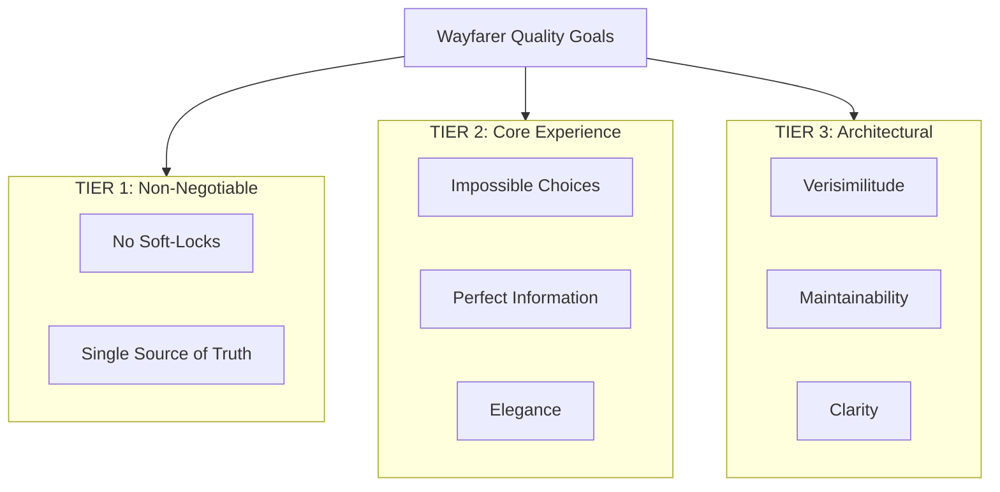

# 10. Quality Requirements

This section defines testable quality scenarios for each quality goal.

---

## 10.1 Quality Tree

| Tier | Priority | Compromise Policy |
|------|----------|-------------------|
| TIER 1 | Non-negotiable | Violations are bugs; never acceptable |
| TIER 2 | Core experience | May compromise TIER 3 to achieve |
| TIER 3 | Architectural | May compromise for TIER 1/2 requirements |

---

## 10.2 Quality Scenarios

### QS-001: No Soft-Locks Ever

**Quality Goal:** Player must ALWAYS have at least one viable path forward.

#### Scenario 1.1: Zero-Resource Progression

| Aspect | Description |
|--------|-------------|
| **Context** | Player at A-story scene with zero coins, stamina, focus; all stats below thresholds |
| **Stimulus** | Player needs to advance story |
| **Response** | System presents at least one choice with zero requirements that advances to next scene |
| **Metric** | 100% of A-story situations have ≥1 zero-requirement choice |
| **Validation** | Automated test verifies all A-story JSON |

#### Scenario 1.2: Challenge Failure Progression

| Aspect | Description |
|--------|-------------|
| **Context** | Player in A-story challenge fails tactical layer |
| **Stimulus** | Challenge ends with failure outcome |
| **Response** | OnFailureReward applied; scene advances (different state, but progresses) |
| **Metric** | 100% of A-story challenges have OnFailureReward that advances |
| **Validation** | Parser rejects challenges without OnFailureReward |

#### Scenario 1.3: Atmospheric Action Availability

| Aspect | Description |
|--------|-------------|
| **Context** | Player at location with no active scenes |
| **Stimulus** | Player needs something to do |
| **Response** | Atmospheric actions (Work, Rest, Travel) always available based on location capabilities |
| **Metric** | Every location has ≥1 atmospheric action |
| **Validation** | LocationActionCatalog generates actions for all locations |

---

### QS-002: Single Source of Truth

**Quality Goal:** Every piece of state has exactly one canonical storage location.

#### Scenario 2.1: Player Location

| Aspect | Description |
|--------|-------------|
| **Context** | Player navigates to new location |
| **Stimulus** | Multiple systems need player location |
| **Response** | All systems query `GameWorld.Player.CurrentPosition`; no cached copies |
| **Metric** | Zero properties named "CurrentLocationId" in codebase |
| **Validation** | Code search confirms object references only |

#### Scenario 2.2: Scene State

| Aspect | Description |
|--------|-------------|
| **Context** | Scene has multiple situations; player advances |
| **Stimulus** | Situation state changes |
| **Response** | `Scene.CurrentSituation` updated via single method; no parallel tracking |
| **Metric** | Zero duplicate situation tracking outside Scene |
| **Validation** | No "ActiveSituationId" properties in services |

---

### QS-003: Perfect Information (Strategic Layer)

**Quality Goal:** Player sees exact costs/rewards before committing.

#### Scenario 3.1: Choice Cost Visibility

| Aspect | Description |
|--------|-------------|
| **Context** | Player viewing available choices |
| **Stimulus** | UI displays choices |
| **Response** | All costs shown: "Pay 15 coins", "Stamina -3", "Requires Rapport 6 (you have 4)" |
| **Metric** | 100% of strategic choices show exact costs |
| **Validation** | UI review checklist |

#### Scenario 3.2: Challenge Entry Transparency

| Aspect | Description |
|--------|-------------|
| **Context** | Player considering challenge choice |
| **Stimulus** | UI displays challenge option |
| **Response** | Entry cost, OnSuccess rewards, OnFailure consequences all visible |
| **Metric** | 100% of challenges show both outcomes |
| **Validation** | UI review checklist |

---

### QS-004: Maintainability Over Performance

**Quality Goal:** Code optimizes for reading/debugging, not execution speed.

#### Scenario 4.1: Collection Choice

| Aspect | Description |
|--------|-------------|
| **Context** | Developer stores domain entities |
| **Stimulus** | Choose data structure |
| **Response** | Use `List<T>` with LINQ; never Dictionary for entities |
| **Metric** | Zero Dictionary usage for domain collections |
| **Validation** | Code search for `Dictionary<string, NPC>` returns zero |

#### Scenario 4.2: Debugging Efficiency

| Aspect | Description |
|--------|-------------|
| **Context** | Bug reported: "NPC not at expected location" |
| **Stimulus** | Developer sets breakpoint, inspects GameWorld |
| **Response** | List view shows entity properties immediately; no expansion needed |
| **Metric** | Debug session finds root cause without KeyValuePair expansion |
| **Validation** | Developer productivity tracking |

---

## 10.3 Quality Metrics Summary

| Quality Goal | Metric | Target | Enforcement |
|--------------|--------|--------|-------------|
| No Soft-Locks | Zero-req choices in A-story | 100% | Parser validation |
| Single Source | Duplicate state properties | 0 | Code review |
| Perfect Info | Costs/rewards visible | 100% | UI review |
| Maintainability | Dictionary for entities | 0 | Code search |
| Clarity | LINQ for queries | 100% | Code review |

---

## Related Documentation

- [01_introduction_and_goals.md](01_introduction_and_goals.md) — Quality goals
- [09_architecture_decisions.md](09_architecture_decisions.md) — ADR-006 (Priority Hierarchy)
