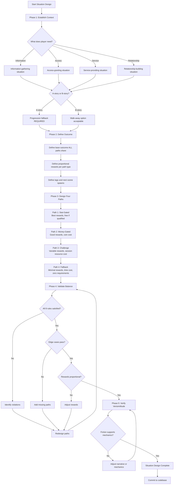
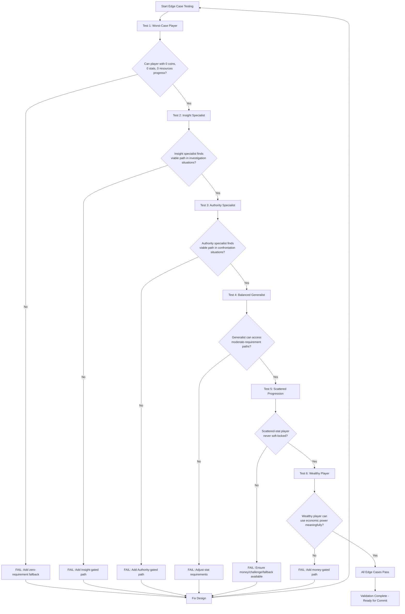

# Wayfarer Situation Design Guide: Practical Methodology

## Purpose

This guide provides step-by-step methodology for designing balanced situations. It extracts practical workflows from the comprehensive balance philosophy documentation.

**Use this guide when:**
- Designing new A-story or B-story situations
- Validating existing situation balance
- Determining stat requirements for progression level
- Calculating appropriate coin costs and session resource costs
- Testing edge cases across player build types

**Cross-reference:** This guide distills methodology from [08_balance_philosophy.md](08_balance_philosophy.md). Read full philosophy document for rationale and examples.

---

## Quick Reference: The 8 Balance Rules

Every situation MUST satisfy these rules. Use as pre-commit checklist.

**Rule 1: Minimum 2 Choices**
- A-story situations: 4-6 choices typical
- B-story situations: 2-4 choices acceptable
- Never single-choice situations

**Rule 2: Resource Juggling**
- Every choice costs OR rewards something measurable
- No narrative-only choices
- Progression is outcome, not standalone value

**Rule 3: Requirements Justify Rewards**
- Higher cost = Better rewards
- Stat-gated path = Best rewards
- Money-gated path = Good rewards
- Challenge path = Variable rewards (success > money, failure < money)
- Fallback path = Minimal rewards

**Rule 4: Intra-Situation Balance**
- Compare choices ONLY within same situation
- Cross-situation variance acceptable
- No references to other situations' costs/rewards

**Rule 5: Crisis Situations**
- All choices involve losses (damage control)
- Balance through asymmetric costs, not equal rewards
- Rare (5-10% of A-story situations)

**Rule 6: Multi-Stat Trade-Offs**
- Gain in one stat, lose in another (asymmetric)
- Or gain in multiple stats with reduced individual values (symmetric)
- Optional but enhances balance

**Rule 7: Verisimilitude in Costs**
- Costs reflect actual opportunity costs
- Time spent here cannot be spent elsewhere
- Coins spent here cannot be spent elsewhere
- Stats required were earned through XP investment

**Rule 8: Coins as Alternative**
- Coin path exists as alternative to stat path
- Coin cost valued appropriately (see scaling tables)
- Coins function like willpower (meaningful choice to spend)

---

## The 5-Phase Design Process

### Phase 1: Establish Context

**Answer these questions:**

1. **What does the player need to accomplish?**
   - Information (learn destination, clues, secrets)
   - Access (enter location, bypass obstacle)
   - Service (lodging, healing, equipment)
   - Relationship (build NPC trust, alliance)

2. **What is the narrative context?**
   - Who: NPC personality, demeanor, power dynamic
   - Where: Location type, atmosphere, quality
   - Stakes: Urgent vs casual, high vs low importance

3. **What entry state does player bring?**
   - Tags from previous choices
   - Expected resource levels for progression
   - Build specialization expectations

4. **Is this A-story or B-story?**
   - A-story: Progression fallback REQUIRED
   - B-story: Can allow "walk away" option

**Output:** Clear context statement
- Example: "A-story information-gathering at friendly inn, mid-game (A9), player needs destination for next travel"

### Phase 2: Define Outcome

**Answer these questions:**

1. **What is the BASE outcome ALL choices share?**
   - Same fundamental result regardless of path
   - Difference is in HOW, not WHETHER

2. **What are PROPORTIONAL REWARDS for harder paths?**
   - Stat-gated: Best rewards (relationship +2, bonuses, detailed info)
   - Money-gated: Good rewards (relationship +1, complete info)
   - Challenge success: Excellent rewards (relationship +2, stat gains)
   - Challenge failure: Adequate rewards (relationship +0, basic info)
   - Fallback: Minimal rewards (relationship +1, basic info)

3. **What tags should be applied?**
   - Entry state for next scene
   - Relationship changes
   - World state alterations

4. **What scenes spawn next?**
   - A-story: ALL paths spawn same next scene (different entry states)
   - B-story: Paths may spawn different follow-ups OR none

**Output:** Outcome specification for each choice type

### Phase 3: Design Four Paths

#### Path 1: Stat-Gated (Optimal Specialization)

**Design checklist:**
- [ ] Which stat makes narrative sense?
- [ ] What threshold for current progression? (See scaling table)
- [ ] Best rewards defined? (Highest relationship, bonuses, detailed info)
- [ ] Why is this FREE? (Validates XP investment)

**Template:**
```
Choice: [Narrative description using stat]
Requirement: [Stat] ≥ [Threshold]
Cost: Free
Outcome: [Best rewards - relationship +2, bonuses, detailed information]
Tag: [Positive relationship tag]
Verisimilitude: [Why high stat enables this approach]
```

#### Path 2: Money-Gated (Reliable Economic)

**Design checklist:**
- [ ] Coin cost substantial but affordable? (See scaling table)
- [ ] Cost is 20-40% of typical reserve for progression?
- [ ] Good rewards defined? (Not as good as stat, better than fallback)
- [ ] Reliable outcome (instant, no variance)

**Template:**
```
Choice: [Narrative description of payment/bribe/purchase]
Requirement: None
Cost: [Coins] coins
Outcome: [Good rewards - relationship +1, complete information]
Tag: [Transactional tag]
Verisimilitude: [Why money enables this approach]
```

#### Path 3: Challenge (Risky Skill Expression)

**Design checklist:**
- [ ] Which challenge type? (Social/Mental/Physical)
- [ ] Session resource cost appropriate? (See scaling table)
- [ ] Success rewards excellent? (Better than money path)
- [ ] Failure rewards adequate? (Worse than money, better than fallback)
- [ ] Both outcomes advance progression?

**Template:**
```
Choice: [Narrative description of challenge approach]
Requirement: None
Cost: [Amount] Resolve/Stamina/Focus
Challenge: [Type] challenge session
Success: [Excellent rewards - relationship +2, stat gains, detailed info]
Success Tag: [Positive tag]
Failure: [Adequate rewards - relationship +0, basic info]
Failure Tag: [Neutral/negative tag]
Verisimilitude: [Why this approach risky]
```

#### Path 4: Fallback (Guaranteed Progression)

**Design checklist (NON-NEGOTIABLE for A-story):**
- [ ] Zero requirements (always visible, always selectable)
- [ ] Cannot fail (Instant action or guaranteed outcome)
- [ ] Spawns next scene (progression guaranteed)
- [ ] Meaningful time cost? (3-5 blocks typical)
- [ ] Minimal rewards (base outcome only)

**Template:**
```
Choice: [Narrative description of patient/alternative approach]
Requirement: None
Cost: [3-5] time blocks
Outcome: [Minimal rewards - relationship +1, basic information]
Tag: [Earned-trust tag]
Cannot Fail: Instant action
Progresses: Spawns [Next Scene ID]
Verisimilitude: [Why patience/alternative works]
```

### Phase 4: Validate Balance

**Run through validation checklist:**

1. **Structural validation:**
   - [ ] 2+ choices (4 for A-story)
   - [ ] Orthogonal resource costs (each choice costs DIFFERENT resource)
   - [ ] Progression guarantee (A-story has zero-requirement fallback)

2. **Rule compliance:**
   - [ ] All 8 balance rules satisfied (see Quick Reference above)

3. **Edge case testing:**
   - [ ] Worst-case player (0 coins, min stats, depleted resources) can progress?
   - [ ] Insight specialist finds viable path?
   - [ ] Authority specialist finds viable path?
   - [ ] Wealthy player can use economic power?
   - [ ] Skilled player can demonstrate ability?

4. **Reward proportionality:**
   - [ ] Create comparison matrix (see example below)
   - [ ] Verify higher costs = better rewards

**Comparison Matrix Template:**

| Path | Cost | Relationship | Info Quality | Bonus | Total Value |
|------|------|--------------|--------------|-------|-------------|
| Stat-gated | [Stat X] | +2 | Detailed | [Item/coins] | Highest |
| Money-gated | [Y] coins | +1 | Complete | None | Good |
| Challenge (success) | [Z] Resolve | +2 | Detailed | +1 [Stat] | Excellent |
| Challenge (failure) | [Z] Resolve | +0 | Basic | None | Minimal |
| Fallback | [W] time | +1 | Complete | None | Minimal |

5. **Progression level validation:**
   - [ ] Stat requirements match progression (see scaling table)
   - [ ] Coin costs match progression (see scaling table)
   - [ ] Session resource costs match progression (see scaling table)

### Phase 5: Verify Verisimilitude

**Fiction justification checklist:**

- [ ] Does narrative context support all four paths?
- [ ] Do requirements make sense in fiction?
- [ ] Do rewards match effort in narrative terms?
- [ ] Any logical contradictions between paths?
- [ ] Can player understand WHY each requirement exists?

**Verisimilitude test questions:**
1. Would this NPC actually respond this way?
2. Does the cost reflect real-world (in-fiction) effort?
3. Do the rewards make narrative sense?
4. Is the fiction supporting the mechanics, or are mechanics arbitrary?

---

## Scaling Reference Tables

### Stat Requirement Scaling by Progression

| Progression Phase | Scene Range | Stat Requirement | Player Expected State |
|-------------------|-------------|------------------|----------------------|
| Identity Building | A1-A3 | 0 (no requirements) | 0-1 in all stats |
| Early Specialization | A4-A6 | 2-3 | 1 stat at 2-3, others at 0-1 |
| Moderate Specialization | A7-A12 | 4-5 | 1-2 stats at 4-5, others at 1-2 |
| Deep Specialization | A13-A20 | 6-7 | 1-2 stats at 6-7, 1 at 3-4 |
| Mastery | A21+ | 7-8+ | 1-2 stats at 7-8, 1-2 at 4-5 |

**Usage:**
1. Identify current scene number (e.g., A9)
2. Find progression phase (A7-A12 = Moderate Specialization)
3. Use stat requirement range (4-5 for A9)

**Multiple stat paths:**
- Offer 2-3 different stat paths at same threshold
- Validates different specializations
- Example A9: Insight 5 OR Authority 5 OR Cunning 4

### Coin Cost Scaling by Progression

| Progression Phase | Scene Range | Money-Gated Path Cost | B-Story Earnings | % of Reserve |
|-------------------|-------------|----------------------|------------------|--------------|
| Early Game | A4-A6 | 10-15 coins | 5-10 coins | 30-40% of 30-50 coin reserve |
| Mid Game | A7-A12 | 20-30 coins | 15-25 coins | 30-40% of 60-80 coin reserve |
| Late Game | A13-A20 | 35-50 coins | 30-50 coins | 30-40% of 100-150 coin reserve |
| Very Late Game | A21+ | 60-100 coins | 50-80 coins | 30-40% of 150-250 coin reserve |

**Usage:**
1. Identify current scene number
2. Use coin cost range for money-gated path
3. Verify cost is 1-2 B-story completions worth
4. Ensure cost feels substantial (30-40% of expected reserve)

**Verisimilitude check:**
- Does this cost make narrative sense?
- Is this bribe/payment/purchase realistically valued?
- Does cost reflect NPC demeanor (Friendly = lower, Hostile = higher)?

### Session Resource Cost Scaling by Progression

| Progression Phase | Scene Range | Resolve/Stamina/Focus Cost |
|-------------------|-------------|---------------------------|
| Early Game | A4-A6 | 2-3 |
| Mid Game | A7-A12 | 3-4 |
| Late Game | A13-A20 | 4-5 |
| Very Late Game | A21+ | 5-6 |

**Usage:**
1. Identify current scene number
2. Use session resource cost for challenge path
3. Ensure cost feels meaningful (20-40% of session resource pool)

**Session resource pool sizes:**
- Resolve: 8-12 typical
- Stamina: 15-20 typical
- Focus: 10-15 typical

**Cost should be:**
- Substantial enough that player must choose (can't do everything)
- Not so high that player never attempts (1-2 challenges affordable per pool)

### Time Cost Scaling (Fallback Paths)

| Progression Phase | Time Block Cost | Opportunity Cost |
|-------------------|----------------|------------------|
| All Phases | 3-5 time blocks | 1-2 B-stories worth, or advancement of alternative A-story scene |

**Rationale:**
- Time cost is universal (doesn't scale with progression)
- Meaningful because player could do other things with time
- 3-5 blocks = approximately 1-3 hours in-game time
- Feels like "spending afternoon/evening" helping NPC

---

## Multi-Stat Trade-Off Formulas

### Symmetric Multi-Stat Gains (Breadth Over Depth)

**Two-stat gain:**
```
Standard single-stat: +2 to one stat
Multi-stat equivalent: +1 to each of two stats (total +2 distributed)
Example: "+1 Insight, +1 Cunning" (analytical + strategic)
```

**Three-stat gain (rare):**
```
Standard single-stat: +2 to one stat
Multi-stat equivalent: +1 to each of three stats (total +3, diluted)
Example: "+1 Insight, +1 Rapport, +1 Diplomacy" (holistic growth)
Use sparingly: Encourages generalist builds, dilutes specialization
```

**When to use:**
- Representing holistic learning
- Validating balanced builds
- Offering breadth as alternative to depth
- Frequency: 10-15% of stat-granting choices

### Asymmetric Multi-Stat Trades (Gain vs Loss)

**2-for-1 trade:**
```
+2 in one stat, -1 in another stat
Net gain: +1 total (same as pure +1 single stat)
Example: "+2 Authority, -1 Rapport" (command presence alienates)
Use when: Philosophical shift, character transformation
```

**3-for-1 trade:**
```
+3 in one stat, -1 in another stat
Net gain: +2 total (standard gain amount)
Example: "+3 Authority, -1 Cunning" (direct confrontation, abandon subtlety)
Use when: Dramatic choice, major character moment
```

**Even trade:**
```
+2 in one stat, -2 in another stat
Net gain: 0 total
Example: "+2 Insight, -2 Health" (intensive study causes exhaustion)
Use when: Sacrifice, cost of obsession, no power gain but character shift
```

**When to use:**
- Philosophical shift or character transformation
- Costs of specialization or obsession
- Dramatic moments with consequences
- Frequency: 5-10% of stat-affecting choices

### Multi-Stat Requirements (Compound Gates)

**Two-stat requirement:**
```
Single requirement: Stat ≥ 5 (total 5 points)
Multi-requirement: Both stats ≥ 3 (total 6 points required)
Example: "Diplomacy ≥ 3 AND Rapport ≥ 3" (empathetic negotiation)
Rewards: Better than single-stat path (justifies higher total investment)
```

**Asymmetric two-stat requirement:**
```
Single requirement: Stat ≥ 5 (total 5 points)
Multi-requirement: Primary ≥ 5, Secondary ≥ 2 (total 7 points)
Example: "Insight ≥ 5 AND Cunning ≥ 2" (strategic investigation)
Specialist with secondary competence
```

**When to use:**
- Genuinely complex challenges requiring multiple capabilities
- Validating balanced builds
- Representing sophisticated capability
- Always provide single-stat alternatives
- Frequency: 10-15% of stat-gated choices

---

## Crisis Situation Design Pattern

**Definition:**
- All choices involve LOSSES or damage
- No purely positive outcomes
- Player chooses WHICH harm to accept
- Balance through asymmetric costs, not equal rewards

**When to use:**
- Narrative justification required (ambush, disaster, betrayal)
- Rare (5-10% of A-story situations)
- Never back-to-back (follow with recovery opportunities)
- Progression-appropriate stakes (higher stakes later)

**Four-Path Crisis Template:**

**Path 1: Stat-Gated (Minimize Loss)**
```
Requirement: [Stat] ≥ [Threshold]
Outcome: Smallest loss (still negative)
Example: "Fight back (Authority 5) → Lose 4 Health, keep coins, +1 Authority"
Purpose: Specialization reduces damage
```

**Path 2: Money-Gated (Economic Damage)**
```
Requirement: None
Cost: Substantial coins (larger than normal situations)
Outcome: Preserve other resources at economic cost
Example: "Pay bandits (25 coins) → Lose 25 coins, keep Health"
Purpose: Wealth as damage mitigation
```

**Path 3: Challenge (Risk Management)**
```
Requirement: None
Cost: Session resource
Success: Moderate loss
Failure: Severe loss
Both outcomes negative, variance in severity
Example: "Physical challenge → Success: Lose 3 Health, keep 20 coins | Failure: Lose 6 Health, lose 15 coins"
```

**Path 4: Fallback (Maximum Loss)**
```
Requirement: None
Outcome: Catastrophic loss (worst outcome)
Cannot fail: Always succeeds (survives)
Progresses: Guaranteed advancement
Example: "Surrender everything → Lose ALL coins, lose 2 Health, lose 1 Rapport"
Purpose: Progression even in disaster
```

---

## Edge Case Testing Procedures

### Test Player Archetypes

**1. Worst-Case Player**
- Stats: All at 0-1 (no specialization)
- Coins: 0 (depleted economy)
- Session Resources: Depleted (0 Resolve/Stamina/Focus)

**Test:**
- Can they progress? (MUST be YES for A-story)
- Which path is available? (MUST be fallback with zero requirements)

**2. Insight Specialist**
- Stats: Insight 7, Cunning 5, others at 1-2
- Coins: Moderate (40-60)
- Session Resources: Full

**Test:**
- Can they find viable path? (MUST be YES)
- Is their Insight specialization rewarded? (Insight-gated path unlocked in investigation situations)
- Do they struggle in Authority situations? (Authority-gated path locked, must use money/challenge/fallback)

**3. Authority Specialist**
- Stats: Authority 7, Diplomacy 4, others at 1-2
- Coins: Moderate (40-60)
- Session Resources: Full

**Test:**
- Can they find viable path? (MUST be YES)
- Is their Authority specialization rewarded? (Authority-gated path unlocked in confrontation situations)
- Do they struggle in Insight situations? (Insight-gated path locked, must use alternatives)

**4. Balanced Generalist**
- Stats: All at 4-5 (no deep specialization)
- Coins: Moderate (40-60)
- Session Resources: Full

**Test:**
- Can they find viable path? (MUST be YES)
- Do they unlock SOME stat-gated paths? (Moderate requirements accessible)
- Do they miss HIGH stat-gated paths? (7+ requirements locked)
- Are multi-stat requirement paths accessible? (Balanced build advantage)

**5. Scattered Progression Player**
- Stats: Random distribution (e.g., Rapport 3, Cunning 2, Authority 6, others at 1)
- Coins: Low (10-20)
- Session Resources: Partial

**Test:**
- Can they find viable path? (MUST be YES)
- Does at least ONE stat-gated path unlock occasionally? (Authority 6 should help sometimes)
- Are money/challenge/fallback paths always available? (MUST be YES)

**6. Wealthy Economic Player**
- Stats: Moderate (3-4 in most stats)
- Coins: High (100+)
- Session Resources: Full

**Test:**
- Can they use economic power? (Money-gated path always available)
- Does cost feel meaningful? (Should be 20-40% of reserve, so 40-80 coins late-game)
- Can they "buy their way through"? (YES, this is valid playstyle)

### Edge Case Checklist

Run EVERY situation through these tests before committing:

- [ ] Worst-case player can progress (zero requirements fallback exists)
- [ ] Insight specialist rewarded in investigation situations
- [ ] Authority specialist rewarded in confrontation situations
- [ ] Rapport specialist rewarded in social connection situations
- [ ] Balanced generalist has multiple viable paths
- [ ] Scattered progression player never soft-locked
- [ ] Wealthy player can use coins meaningfully
- [ ] Skill-focused player can attempt challenges

**If ANY test fails: Redesign situation until all tests pass.**

### Scattered Stat Progression: Deep Analysis and Handling

**Definition:** Players who invest XP in non-optimal or random patterns, creating builds that don't follow typical specialization paths.

**Why This Matters:** Scattered progression is a valid player choice (experimentation, role-play, aesthetic preference). Game MUST NOT punish players for non-optimal builds. Situations must remain completable even with "wrong" stat distributions.

#### Scattered Progression Patterns

**Pattern 1: Random Distribution**
- Example: Rapport 3, Cunning 2, Authority 6, Insight 1, Diplomacy 2 (14 points total)
- Cause: Player trying different approaches, no consistent focus
- Problem: Only Authority 6 unlocks occasional stat-gated paths (when Authority applies)
- Solution: Money/challenge/fallback paths MUST be viable alternatives

**Pattern 2: Premature Generalist**
- Example at A15: All stats at 4 (20 points total, spread evenly)
- Cause: Player avoids specialization, wants flexibility
- Problem: A15 requires stat 6-7 for stat-gated paths, player locked out of ALL
- Solution: Money-gated paths must be achievable, challenge paths accessible, fallback always available

**Pattern 3: Wrong Stat Focus**
- Example: Insight 8, others at 1-2 (investigator build in combat-heavy phase)
- Cause: Player specialized but game presents situations requiring different stats
- Problem: No Insight-gated paths available when Authority/Rapport needed
- Solution: Every situation type must appear regularly (investigation, social, confrontation mix)

**Pattern 4: Investment in Obsolete Stats**
- Example: High Diplomacy early, but later content rarely uses Diplomacy gates
- Cause: Content generation doesn't balance stat gate distribution
- Problem: Player's investment becomes worthless
- Solution: Situation archetypes must use all five stats proportionally

**Pattern 5: Salvage Attempt**
- Example at A20: Rapport 3, Authority 3, Insight 8, Cunning 5, Diplomacy 2 (21 points)
- Cause: Player realized Rapport/Authority too low, started investing in Insight/Cunning late
- Problem: Early stats wasted, current stats adequate but not optimal
- Solution: Multi-stat compound requirements can validate this (Insight 6 AND Cunning 4)

#### Design Strategies for Scattered Progression

**Strategy 1: Multiple Stat Path Options**

```
GOOD DESIGN (Validates Multiple Stats):
A12 situation "Gain entry to archives":
- Choice 1: Insight 5 → Best outcome (investigator approach)
- Choice 2: Authority 5 → Best outcome (command approach)
- Choice 3: Rapport 5 → Best outcome (social connection approach)
- Choice 4: 30 coins → Good outcome (economic approach)
- Choice 5: Mental challenge → Variable outcome
- Choice 6: 4 time blocks → Minimal outcome

Result: Scattered player with Authority 6 hits Choice 2. OR player with Rapport 5 hits Choice 3. At least ONE stat likely usable.
```

```
BAD DESIGN (Only Validates One Stat):
A12 situation "Gain entry to archives":
- Choice 1: Insight 5 → Best outcome (ONLY specialist path)
- Choice 2: 30 coins → Worse outcome
- Choice 3: Mental challenge → Worse outcome
- Choice 4: 4 time blocks → Minimal outcome

Result: Scattered player with Authority 6 gets NO benefit from specialization. Authority is useless here. Feels bad.
```

**Strategy 2: Moderate Stat Thresholds**

```
GOOD DESIGN (Accessible Thresholds):
A14 situation with expected state (1-2 stats at 6-7):
- Primary path: Stat 6 (most specialists hit this)
- Secondary path: Stat 4-5 (generalists or scattered builds can hit this)
- Fallback options (money, challenge, time)

Result: Even scattered build likely has ONE stat at 4-5, unlocks secondary path
```

```
BAD DESIGN (Only Extreme Thresholds):
A14 situation:
- Only stat path: Stat 8+ (only min-max specialists hit this)
- All other paths: Expensive, risky, or slow

Result: Scattered player with highest stat at 6 locked out, forced to expensive alternatives every time. Punished for non-optimal build.
```

**Strategy 3: Multi-Stat Compound Requirements**

```
GOOD DESIGN (Validates Balanced Builds):
A16 situation "Complex negotiation":
- Path 1: Diplomacy 7 → Excellent (deep specialist)
- Path 2: Diplomacy 5 AND Rapport 4 → Excellent (balanced build)
- Path 3: Authority 6 → Good (alternative specialist)
- Path 4: 45 coins → Good
- Path 5: Fallback

Result: Scattered player with Diplomacy 5 + Rapport 4 (9 total points) gets EXCELLENT outcome via compound requirement. Balanced build rewarded.
```

**Strategy 4: Proportional Difficulty Distribution**

Ensure content uses all five stats proportionally:

| Stat | Target % of Stat-Gated Paths | Example in 20 situations |
|------|----------------------------|------------------------|
| Insight | 20% | 4 situations require Insight |
| Rapport | 20% | 4 situations require Rapport |
| Authority | 20% | 4 situations require Authority |
| Diplomacy | 20% | 4 situations require Diplomacy |
| Cunning | 20% | 4 situations require Cunning |

**Validation:** If player invested heavily in Insight (even if "wrong" time), approximately 20% of situations will reward that investment. No stat becomes obsolete.

**Strategy 5: Economic Viability for Non-Specialists**

```
CALCULATION:
If scattered player never hits stat-gated paths, can they afford money-gated paths?

Money-gated path cost: 30 coins (Tier 2)
B-story earnings: 20 coins
Required B-stories per A-situation: 2 (1.5× ratio)

Playthrough length: 20 A-situations in tier
Total B-stories needed: 20 × 2 = 40 B-stories
Play time ratio: 40 B-stories / 20 A-situations = 2:1 ratio

VALID if: Player willing to do 2 B-stories per 1 A-situation to fund money-gated paths.
```

**Validation Question:** Does 2:1 B-to-A ratio feel punishing or acceptable?
- Acceptable: Player is grinding but progressing steadily
- Punishing: Player must grind 5:1 or higher (redesign economy)

**Current Baseline:** 1-2 B-stories per A-path is intentional design. Scattered player can complete game via economic path.

#### Validation Procedures for Scattered Builds

**Procedure 1: The Generalist Test**

Create test player with evenly distributed stats:

```
A15 (Deep Specialization tier, expects 6-7):
Test Player: All stats at 4 (20 points, no specialization)

Run through 10 consecutive A-situations:
- How many stat-gated paths unlocked? (Expected: 0-2, since 4 < 6-7)
- How many money-gated paths affordable? (Expected: 8-10, via B-story earnings)
- How many challenge paths attempted? (Expected: 5-8, mixing success/failure)
- How many fallback paths used? (Expected: 0-2, as last resort)

VALID if:
- Player progresses through all 10 situations
- Player does NOT use fallback more than 20% of time (not forced into worst path constantly)
- Player can afford money-gated paths via reasonable B-story ratio (2:1 or better)
```

**Procedure 2: The Random Distribution Test**

Create test player with scattered stats:

```
A18 (Deep Specialization tier):
Test Player: Rapport 3, Cunning 2, Authority 7, Insight 2, Diplomacy 3 (17 points random)

Run through 20 consecutive A-situations with balanced stat distribution:
- 4 Insight-gated (player cannot access)
- 4 Rapport-gated (player cannot access)
- 4 Authority-gated (player CAN access, Authority 7 > typical 6-7 requirement)
- 4 Diplomacy-gated (player cannot access)
- 4 Cunning-gated (player cannot access)

Expected result:
- 4 situations: Authority path unlocked (20%, player's specialization rewarded)
- 16 situations: Money/challenge/fallback paths used

VALID if:
- Player progresses through all 20 situations
- Player's Authority 7 investment rewarded 20% of time (matches stat distribution)
- Money-gated paths affordable via B-story earnings
- Challenge paths accessible
- Player never soft-locked
```

**Procedure 3: The Investment Obsolescence Test**

Create test player who invested in "wrong" stat:

```
A10-A20 sequence (10 situations):
Test Player: Cunning 8, others at 1-2 (deep specialist in Cunning)

Generate 10 A-situations with realistic stat distribution:
- If distribution is balanced: ~2 situations use Cunning gates (20%)
- If distribution is imbalanced: 0-1 situations use Cunning gates (10% or worse)

INVALID if:
- 0 situations use Cunning gates (player's investment completely wasted)
- Player forced to use money/fallback every single time
- Specialization never rewarded across 10 situations

FIX:
- Ensure every 5-10 situation sequence includes at least 1 situation for each stat
- Procedural generation must balance stat gate distribution
- Content review checks stat usage proportions
```

**Procedure 4: The Salvage Build Test**

Create test player with mixed investment:

```
A18 (Deep Specialization tier):
Test Player: Rapport 3, Authority 3, Insight 7, Cunning 5, Diplomacy 2 (20 points)

Interpretation: Player spread points early (Rapport/Authority 3 each), realized mistake, invested heavily in Insight/Cunning late.

Run through 10 A-situations:
- Situations with Insight 6-7 gates: Unlocked (primary current specialization)
- Situations with Cunning 4-5 gates: Unlocked (secondary current capability)
- Situations with compound Insight+Cunning gates: Unlocked (validates mixed investment)
- Situations with Rapport/Authority/Diplomacy gates: Locked (early investments insufficient)

VALID if:
- Player unlocks 40-60% of stat-gated paths (Insight + Cunning situations)
- Early investments (Rapport 3, Authority 3) occasionally useful for lower-tier gates
- Multi-stat compound requirements validate the Insight 7 + Cunning 5 combination
- Money/challenge/fallback available for 40-60% where stats don't apply

FIX if player unlocks < 20% of stat-gated paths:
- Stat thresholds too high (exceeding even salvage build capability)
- Insufficient variety in stat requirements (only using 1-2 stats)
```

#### Common Scattered Progression Problems and Fixes

**Problem 1: All Stat Gates Too High**

```
SYMPTOM: Generalist with all stats 4-5 never unlocks stat-gated paths in Tier 3

DIAGNOSIS: All stat gates set to 7-8 (deep specialist only)

FIX: Add secondary stat gates at 4-5 threshold
- Primary path: Stat 7 → Excellent outcome
- Secondary path: Stat 5 → Good outcome
- Money path: 45 coins → Good outcome
- Fallback: Time cost → Minimal outcome

Result: Generalist unlocks secondary path, specialists unlock primary path
```

**Problem 2: Single-Stat Situations**

```
SYMPTOM: Every situation only gates on ONE stat

EXAMPLE: A12 only has Insight 5 gate
- Insight specialists: Optimal
- All other builds: Must use money/challenge/fallback every time

FIX: Offer multiple stat path options
- Choice 1: Insight 5 → Best outcome
- Choice 2: Cunning 4 → Best outcome (alternative)
- Choice 3: Rapport 5 → Best outcome (alternative)
- Remaining choices: Money, challenge, fallback

Result: Three different specializations validated, scattered builds likely hit ONE
```

**Problem 3: Stat Distribution Imbalance**

```
SYMPTOM: Across A10-A20, 80% of stat gates use Insight/Authority, only 20% use Rapport/Diplomacy/Cunning

RESULT: Players who invested in Rapport/Diplomacy/Cunning feel punished

FIX: Audit stat gate distribution across content
- Target: 20% of situations use each stat (balanced distribution)
- Minimum: 10% of situations use each stat (no stat obsolete)
- Review: Check every 10-situation sequence for balance

Implementation: Procedural generation tracks stat usage, ensures distribution
```

**Problem 4: Money Path Too Expensive for Non-Specialists**

```
SYMPTOM: Scattered player using money-gated paths 80% of time, cannot afford costs

CALCULATION:
- Money path cost: 50 coins (Tier 3)
- B-story earnings: 35 coins
- Required ratio: 1.4 B-stories per A-situation
- Across 10 A-situations: 14 B-stories needed

If player uses money path 80% of time (8 of 10 situations):
- Cost: 8 × 50 = 400 coins
- Required B-stories: 400 / 35 = 11.4 B-stories
- Ratio: 11.4 B-stories for 10 A-situations = 1.14:1

VALID: 1.14:1 ratio is reasonable (slightly more B than A)

BUT if money path costs 80 coins (too expensive):
- Cost: 8 × 80 = 640 coins
- Required B-stories: 640 / 35 = 18.3 B-stories
- Ratio: 18.3 B-stories for 10 A-situations = 1.83:1

INVALID: Nearly 2:1 ratio becomes grindy

FIX: Reduce money-gated path costs to maintain 1-1.5:1 B-to-A ratio
```

**Problem 5: Challenge Paths Require Specialization**

```
SYMPTOM: Mental challenges impossible without high Insight

EXAMPLE: Mental challenge target threshold = 12
- Insight 7 specialist: Reachable with good card play
- Insight 2 scattered: Impossible even with perfect play

FIX: Challenge difficulty scales with player capability
- Entry stat check: Player has Insight 2
- Challenge target: 8 (lower threshold for low-stat player)
- Entry stat check: Player has Insight 7
- Challenge target: 12 (higher threshold for specialist)

Result: All players can attempt challenges at appropriate difficulty
```

#### Scattered Progression Validation Checklist

Run these tests for every 10-situation content sequence:

- [ ] Generalist player (all stats 4-5) can progress through all 10 situations
- [ ] Generalist never forced to use fallback more than 20% of time
- [ ] Random distribution player (one stat 6-7, others 1-3) can progress
- [ ] Random player's primary stat rewarded at least 20% of time
- [ ] All five stats used across 10 situations (20% each ±10%)
- [ ] Money-gated paths affordable via 1-1.5:1 B-story ratio
- [ ] Challenge paths accessible to non-specialists
- [ ] Multi-stat compound requirements appear occasionally (10-15%)
- [ ] No stat becomes obsolete across sequence

**If ANY test fails: Rebalance stat requirements or increase path variety.**

---

## Common Patterns and Anti-Patterns

### Patterns (DO THIS)

**✓ Orthogonal Resource Costs**
```
Choice 1: Stat requirement (permanent investment)
Choice 2: Coin cost (consumable resource)
Choice 3: Session resource (depletable per-session)
Choice 4: Time cost (opportunity cost)
Result: All four viable in different contexts
```

**✓ Proportional Rewards**
```
Highest cost/requirement = Best rewards
Moderate cost/requirement = Good rewards
Low cost/free with risk = Variable rewards
Zero cost with time = Minimal rewards
Result: Players understand value proposition
```

**✓ Multiple Stat Path Options**
```
A9 investigation situation:
Choice 1: Insight 5 → Best outcome (analytical specialists)
Choice 2: Cunning 4 → Best outcome (strategic specialists)
Choice 3: 25 coins → Good outcome (economic path)
Choice 4: Mental challenge → Variable outcome
Choice 5: 4 time blocks → Minimal outcome
Result: Validates different specializations
```

**✓ Crisis Asymmetry**
```
Crisis situation (all negative):
Choice 1: Lose 4 Health (stat-gated minimizes damage)
Choice 2: Lose 25 coins (economic damage)
Choice 3: Lose 3-6 Health + 0-15 coins (variable)
Choice 4: Lose everything (catastrophic but survives)
Result: Different players value different resources, all choices viable
```

### Anti-Patterns (NEVER DO THIS)

**✗ Same Resource, Different Amounts**
```
FORBIDDEN:
Choice 1: Pay 5 coins → +1 Insight
Choice 2: Pay 10 coins → +1 Insight
Choice 3: Pay 15 coins → +1 Insight
Problem: Choice 1 strictly dominates (same reward, lowest cost)
```

**Fix:**
```
Choice 1: Pay 5 coins → +1 Insight (baseline)
Choice 2: Pay 15 coins → +2 Insight (better reward for higher cost)
Choice 3: Insight 3 → +2 Insight (stat alternative)
Result: Different costs have proportional rewards
```

**✗ Narrative-Only Choice**
```
FORBIDDEN:
Choice 1: "Listen to innkeeper's story"
Outcome: Narrative text only, no mechanical effect
Problem: Violates Rule 2 (resource juggling)
```

**Fix:**
```
Choice 1: "Listen to innkeeper's story" (2 time blocks)
Outcome: Narrative text + relationship +1 + Understanding +1
Result: Costs time, grants mechanical benefit
```

**✗ Dominant Strategy**
```
FORBIDDEN:
Choice 1: Authority 5 → Best outcome, free
Choice 2: Pay 20 coins → Worse outcome, expensive
Choice 3: Social challenge → Worse outcome, risky
Choice 4: 4 time blocks → Worse outcome, slow
Problem: Choice 1 always best IF qualified (dominates)
```

**Fix:**
```
Choice 1: Authority 5 → Best outcome for confrontation, free
Choice 2: Pay 20 coins → Good outcome, builds different relationship
Choice 3: Social challenge → Variable outcome, skill expression
Choice 4: 4 time blocks → Minimal outcome, guaranteed
Result: Choice 1 best IF specialized in Authority, otherwise alternatives viable
```

**✗ Soft-Lock Possibility**
```
FORBIDDEN A-story:
All choices require either stats OR coins OR session resources
No zero-requirement fallback
Problem: Player with depleted everything cannot progress
```

**Fix:**
```
Add Path 4: Zero requirements, time cost, minimal rewards, guaranteed progression
Result: Player with nothing can still advance (slowly, inefficiently, but reliably)
```

**✗ Arbitrary Cost**
```
FORBIDDEN:
Choice 1: "Persuade innkeeper" → Costs 7 coins
Why 7? No fiction justification, feels arbitrary
```

**Fix:**
```
Choice 1: "Offer generous tip to innkeeper" → Costs 15 coins
Why 15? Approximately one day's comfortable lodging and food, substantial but affordable
Fiction: Innkeeper values generosity, this demonstrates seriousness
Result: Cost makes narrative sense
```

---

## Decision Trees and Flowcharts

### Decision Tree: Which Stat Should Gate This Path?

```
START: What is the situation's core challenge?

Is it about UNDERSTANDING/ANALYSIS?
├─ Yes → Use Insight
│   Examples: Investigation, deduction, pattern recognition
│
└─ No → Is it about EMOTIONAL CONNECTION?
    ├─ Yes → Use Rapport
    │   Examples: Empathy, building trust, emotional reading
    │
    └─ No → Is it about COMMAND/DIRECTION?
        ├─ Yes → Use Authority
        │   Examples: Giving orders, intimidation, leadership
        │
        └─ No → Is it about BALANCED NEGOTIATION?
            ├─ Yes → Use Diplomacy
            │   Examples: Compromise, measured approach, patience
            │
            └─ No → Use Cunning
                Examples: Subtlety, strategy, manipulation, risk management
```

### Decision Tree: What Should This Cost?

```
START: What progression phase is this? (Check scene number)

A1-A3 (Identity Building)
└─ No stat requirements, offer stat gains
   Result: Player builds identity through choices

A4-A6 (Early Specialization)
├─ Stat-gated path: Requirement 2-3
├─ Money-gated path: 10-15 coins
├─ Challenge path: 2-3 session resource
└─ Fallback path: 3-5 time blocks

A7-A12 (Moderate Specialization)
├─ Stat-gated path: Requirement 4-5
├─ Money-gated path: 20-30 coins
├─ Challenge path: 3-4 session resource
└─ Fallback path: 3-5 time blocks

A13-A20 (Deep Specialization)
├─ Stat-gated path: Requirement 6-7
├─ Money-gated path: 35-50 coins
├─ Challenge path: 4-5 session resource
└─ Fallback path: 3-5 time blocks

A21+ (Mastery)
├─ Stat-gated path: Requirement 7-8+
├─ Money-gated path: 60-100 coins
├─ Challenge path: 5-6 session resource
└─ Fallback path: 3-5 time blocks
```

### Flowchart: 5-Phase Design Process



### Flowchart: Edge Case Validation



---

## Pre-Commit Validation Checklist

**For the complete authoritative checklist, see:**
**[VALIDATION_CHECKLIST.md](VALIDATION_CHECKLIST.md) - Canonical Pre-Commit Validation Checklist**

The canonical version is the single source of truth with detailed explanations for every checkpoint. Use it before committing ANY situation design.

**Quick reference summary:**

### Structural Validation
- Minimum 2 choices (4-6 for A-story)
- Orthogonal resource costs (each choice different resource type)
- A-story progression guarantee (zero-requirement fallback)

### Rule Compliance (8 Balance Rules)
- Minimum 2 choices, resource juggling, requirements justify rewards
- Intra-situation balance only (no cross-situation comparisons)
- Crisis vs normal situations, verisimilitude in costs
- Coins as alternative to stats

### Scaling Validation
- Stat requirements by tier: 2-3 (A4-A6) → 7-8+ (A21+)
- Coin costs by tier: 10-15 (A4-A6) → 60-100 (A21+)
- Session resources by tier: 2-3 → 5-6
- Time costs: 3-5 blocks (universal, no scaling)

### Edge Case Validation
- Worst-case player can progress (0 coins, 0 stats, 0 resources)
- All specialists find viable paths (Insight, Authority, Rapport, Diplomacy, Cunning)
- Generalist and scattered progression viable
- Wealthy and skilled players can use advantages

### Verisimilitude Validation
- Narrative context supports all paths
- Requirements justified by fiction
- Rewards match effort narratively
- No arbitrary gates or contradictions

### Reward Proportionality
Create comparison matrix:
- Stat-gated (best) > Money-gated (good) > Challenge success (excellent) > Challenge failure (adequate) > Fallback (minimal)

### Final Questions
- Impossible choice? (Strategic tension)
- Would I play this? (Fair, interesting, appropriate)
- Can I justify this? (Clear reasoning for all costs)

**ALL checkboxes must be verified before commit. See [VALIDATION_CHECKLIST.md](VALIDATION_CHECKLIST.md) for complete procedure.**

---

## Related Documentation

### Validation and Balance
- **[VALIDATION_CHECKLIST.md](VALIDATION_CHECKLIST.md)** - Canonical pre-commit validation checklist (single source of truth)
- **[08_balance_philosophy.md](08_balance_philosophy.md)** - Complete balance philosophy with extensive examples, crisis situations, AI balance enablement, progression curves
- **[BASELINE_ECONOMY.md](BASELINE_ECONOMY.md)** - Authoritative numeric values for all costs, rewards, and categorical multipliers

### Core Game Design Concepts
- **[01_design_vision.md](01_design_vision.md)** - Perfect information philosophy, impossible choice principle, playability mandate
- **[05_resource_economy.md](05_resource_economy.md)** - Orthogonal resource costs, shared scarcity systems, tight margins philosophy
- **[13_player_experience_emergence_laws.md](13_player_experience_emergence_laws.md)** - Law 1 (Identity Before Validation) justifies A1-A3 zero requirements

### Technical Implementation
- **[arc42/08_crosscutting_concepts.md](../arc42/08_crosscutting_concepts.md)** - Catalogue pattern, entity initialization, parse-time translation
- **[arc42/12_glossary.md](../arc42/12_glossary.md)** - Technical definitions (PathType, ChallengeType, NPCDemeanor, Quality)

### Content Generation
- **[07_content_generation.md](07_content_generation.md)** - 21 situation archetypes, categorical property usage, AI authoring workflow

---

**Document Status:** Production-ready practical methodology guide
**Last Updated:** 2025-11
**Maintained By:** Design team
