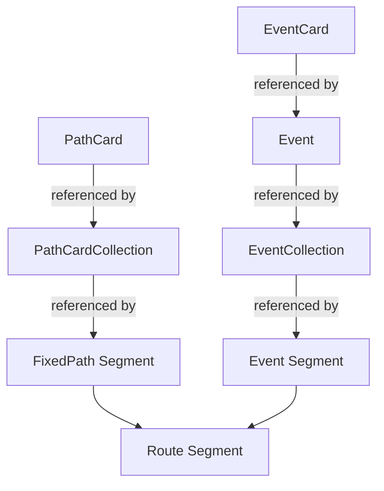

# Travel Event System Normalization

## Overview

This document describes the normalization of the travel event system to eliminate data duplication and create a clean, maintainable architecture.

## Problem Statement

The current implementation violates data normalization principles:
1. Event cards are defined inline within collections rather than as first-class entities
2. Route segments use inline `eventPool` arrays instead of referencing collections
3. Path cards and event cards are conflated in the same structure
4. No clear separation between fixed path segments and random event segments

## Architecture Design

### Core Principle

The system maintains two parallel but distinct card systems:
- **Path System**: For FixedPath segments that always show the same cards
- **Event System**: For Event segments that randomly select from a pool

### Data Flow

```
Path System:
PathCards (defined once) → PathCardCollections (reference by ID) → FixedPath Segments

Event System:
EventCards (defined once) → Events (reference by ID) → EventCollections (reference by ID) → Event Segments
```

### Entity Relationships



## Data Structure

### Path System (Existing)

```json
{
  "pathCards": [
    {
      "id": "common_room",
      "name": "Common Room",
      "staminaCost": 0,
      "narrativeText": "Takes the safe path..."
    }
  ],
  
  "pathCardCollections": [
    {
      "id": "market_to_tavern_seg1",
      "name": "Market to Tavern - Segment 1",
      "pathCardIds": ["common_room", "back_alley"]
    }
  ]
}
```

### Event System (New)

```json
{
  "eventCards": [
    {
      "id": "give_coin_to_beggar",
      "name": "Give Coin",
      "staminaCost": 0,
      "coinRequirement": 1,
      "narrativeText": "You give a coin to help..."
    }
  ],
  
  "events": [
    {
      "id": "beggar_encounter",
      "name": "Beggar Encounter",
      "narrativeText": "A desperate beggar blocks your way...",
      "eventCardIds": ["give_coin_to_beggar", "walk_around_beggar"]
    }
  ],
  
  "eventCollections": [
    {
      "id": "market_common_events",
      "name": "Market Common Events",
      "eventIds": ["clear_path", "beggar_encounter", "street_vendor"]
    }
  ]
}
```

### Route Segments

```json
{
  "routes": [
    {
      "id": "market_to_warehouse",
      "segments": [
        {
          "segmentNumber": 1,
          "type": "FixedPath",
          "pathCollectionId": "market_to_warehouse_seg1"
        },
        {
          "segmentNumber": 2,
          "type": "Event",
          "eventCollectionId": "dock_events"
        }
      ]
    }
  ]
}
```

## Resolution Logic

### FixedPath Segment Resolution
```
1. Get segment's pathCollectionId
2. Look up PathCardCollection
3. Resolve pathCardIds to PathCards
4. Display all cards to player
```

### Event Segment Resolution
```
1. Get segment's eventCollectionId
2. Look up EventCollection
3. Randomly select one eventId from eventIds
4. Look up Event
5. Resolve eventCardIds to EventCards
6. Display event narrative and cards to player
```

## Implementation Classes

### DTOs

```csharp
// Event card definition
public class EventCardDTO
{
    public string Id { get; set; }
    public string Name { get; set; }
    public int StaminaCost { get; set; }
    public int CoinRequirement { get; set; }
    public string PermitRequirement { get; set; }
    public int TravelTimeMinutes { get; set; }
    public int HungerEffect { get; set; }
    public string NarrativeText { get; set; }
    public bool ForceReturn { get; set; }
    public string OneTimeReward { get; set; }
}

// Event with narrative and card references
public class EventDTO
{
    public string Id { get; set; }
    public string Name { get; set; }
    public string NarrativeText { get; set; }
    public List<string> EventCardIds { get; set; }
}

// Collection of events for random selection
public class EventCollectionDTO
{
    public string Id { get; set; }
    public string Name { get; set; }
    public List<string> EventIds { get; set; }
}

// Updated route segment
public class RouteSegmentDTO
{
    public int SegmentNumber { get; set; }
    public string Type { get; set; } // "FixedPath" or "Event"
    public string PathCollectionId { get; set; } // For FixedPath
    public string EventCollectionId { get; set; } // For Event
}
```

## Benefits

1. **No Data Duplication**: Each entity defined once, referenced everywhere
2. **Clear Separation**: Path and event systems are distinct
3. **Type Safety**: Separate DTOs prevent mixing incompatible data
4. **Maintainability**: Easy to add/modify events without touching collections
5. **Deterministic**: Clear resolution chain with predictable outcomes
6. **Extensible**: Can add new event types without changing architecture

## Migration Notes

### From Current Structure
```json
// OLD: Inline path cards in "event" collections
{
  "id": "beggar_event",
  "pathCards": [
    { "id": "give_coin", "name": "Give Coin", ... }
  ]
}
```

### To Normalized Structure
```json
// NEW: Separate entities with references
"eventCards": [{ "id": "give_coin", ... }],
"events": [{ "id": "beggar_encounter", "eventCardIds": ["give_coin"] }],
"eventCollections": [{ "id": "market_events", "eventIds": ["beggar_encounter"] }]
```

## Testing Strategy

1. **Unit Tests**:
   - Event card loading and resolution
   - Random event selection from collections
   - Path vs event segment differentiation

2. **Integration Tests**:
   - Full route traversal with mixed segments
   - Save/load preserving selected events
   - UI correctly displaying cards

3. **E2E Tests**:
   - Player travels through routes
   - Correct cards shown for each segment type
   - "Finish Route" works on last segment