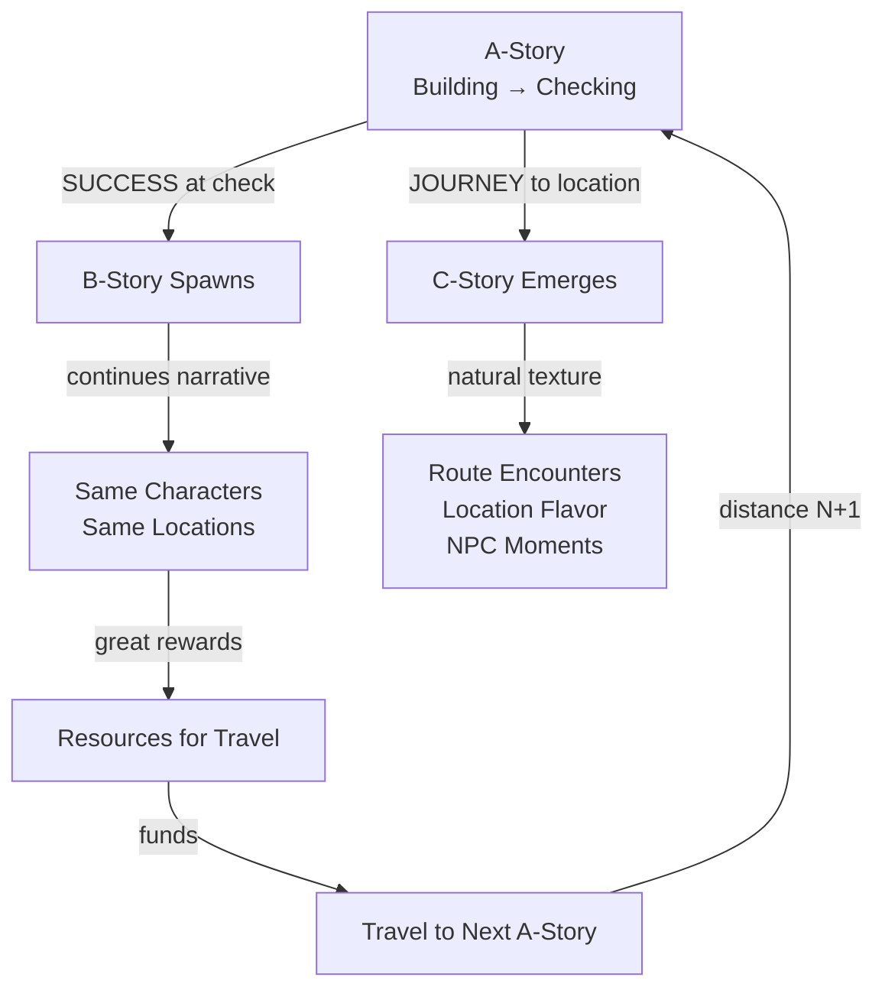
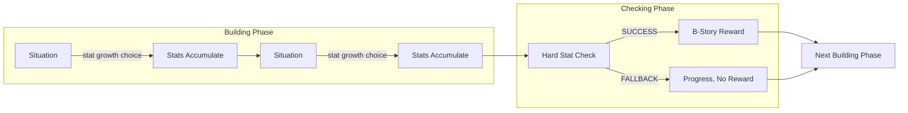
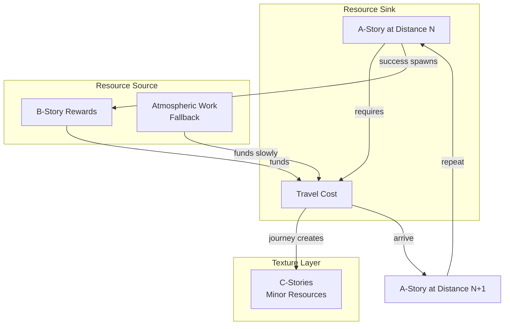

# Endless Story Design - Quick Reference

**Purpose:** One-page overview for session continuity. Details live in referenced documents.

---

## High-Concept Flow Diagrams

### Story Causality



### The A-Story Rhythm



### Economic Loop



### Route Choice (Impossible Choice)

```
                    ┌─────────────────────────────────────────┐
                    │           DESTINATION (A-Story)          │
                    └─────────────────────────────────────────┘
                                        ▲
            ┌───────────────────────────┼───────────────────────────┐
            │                           │                           │
    ┌───────┴───────┐           ┌───────┴───────┐           ┌───────┴───────┐
    │  ROAD (Safe)  │           │ FOREST (Fast) │           │MOUNTAIN(Direct)│
    │───────────────│           │───────────────│           │───────────────│
    │ Time: Long    │           │ Time: Medium  │           │ Time: Short   │
    │ Stamina: Low  │           │ Stamina: High │           │ Stamina: V.High│
    │ Coins: Tolls  │           │ Coins: Free   │           │ Coins: Free   │
    │ C-Story: Law  │           │ C-Story: Ambush│          │ C-Story: Harsh│
    └───────────────┘           └───────────────┘           └───────────────┘
                                        ▲
                                        │
                            ┌───────────┴───────────┐
                            │    ORIGIN (Player)    │
                            └───────────────────────┘

    Cannot optimize all dimensions. Pick your trade-off.
```

---

## The Core Insight

A-Story creates B-Stories (success rewards) and C-Stories (journey texture). They are causally linked, not independent systems.

---

## Detailed Documentation

| Topic | Document | Section |
|-------|----------|---------|
| **Story Category Definitions** | [08_glossary.md](08_glossary.md) | §Story Categories |
| **A/B/C Property Matrix** | [08_glossary.md](08_glossary.md) | Story Category Property Matrix |
| **Travel Cost Gate** | [05_content.md](05_content.md) | §5.7 |
| **Terrain System** | [05_content.md](05_content.md) | §5.7 Terrain Shapes Route Cost |
| **Core Loop Integration** | [03_core_loop.md](03_core_loop.md) | §3.5 |

---

## Key Principles (Summary)

| Principle | Description |
|-----------|-------------|
| **Building → Checking** | A-stories alternate stat growth and stat tests (Sir Brante rhythm) |
| **B = Earned Reward** | B-stories spawn when player succeeds at hard A-story checks |
| **C = Natural Texture** | C-stories emerge from journey—not spawned, experienced |
| **Narrative Continuity** | B-stories continue A-story threads with same characters/locations |
| **Travel Cost Gate** | Distance creates resource demand; B-story rewards fund travel |
| **Terrain Variety** | Route choice = impossible choice (time vs stamina vs coins vs encounters) |

---

## Code References

| Component | Values |
|-----------|--------|
| StoryCategory | MainStory, SideStory, Encounter |

---

## Open Questions

- B-story spawn mechanics (A-story success → B-story creation technically)
- Narrative continuity (same characters/locations carrying forward)
- Terrain-aware C-story archetype selection
- Multiple route alternatives
