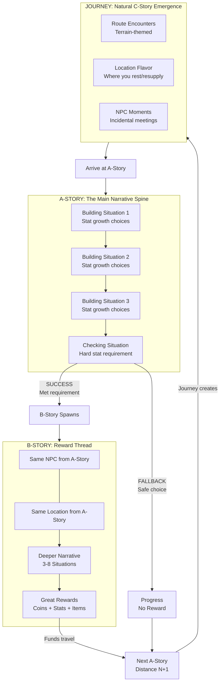
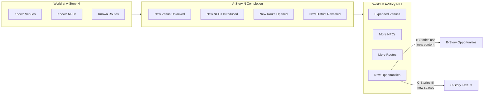
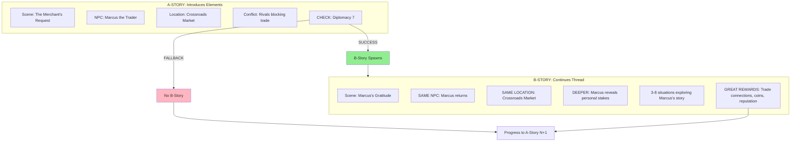

# Endless Story Design - Quick Reference

**Purpose:** One-page overview for session continuity. Details live in referenced documents.

---

## High-Concept Flow Diagrams

### The Complete Player Journey

```
┌─────────────────────────────────────────────────────────────────────────────────────────┐
│                                    ENDLESS STORY LOOP                                    │
└─────────────────────────────────────────────────────────────────────────────────────────┘

    ┌─────────────────────────────────────────────────────────────────────────────────┐
    │                              A-STORY (Main Narrative)                            │
    │                                                                                  │
    │   ┌─────────────┐    ┌─────────────┐    ┌─────────────┐    ┌─────────────┐      │
    │   │  BUILDING   │───▶│  BUILDING   │───▶│  BUILDING   │───▶│  CHECKING   │      │
    │   │  Situation  │    │  Situation  │    │  Situation  │    │  Situation  │      │
    │   │             │    │             │    │             │    │             │      │
    │   │ +Insight    │    │ +Rapport    │    │ +Authority  │    │ HARD CHECK  │      │
    │   │ choice      │    │ choice      │    │ choice      │    │ Insight 8   │      │
    │   └─────────────┘    └─────────────┘    └─────────────┘    └──────┬──────┘      │
    │                                                                   │              │
    └───────────────────────────────────────────────────────────────────┼──────────────┘
                                                                        │
                                    ┌───────────────────────────────────┴───────────────────────────────────┐
                                    │                                                                       │
                                    ▼                                                                       ▼
                    ┌───────────────────────────────┐                           ┌───────────────────────────────┐
                    │         SUCCESS PATH          │                           │        FALLBACK PATH          │
                    │                               │                           │                               │
                    │  "You passed the check!"      │                           │  "You take the safe route"    │
                    │                               │                           │                               │
                    │  ┌─────────────────────────┐  │                           │  Progress continues           │
                    │  │    B-STORY SPAWNS       │  │                           │  No B-story reward            │
                    │  │                         │  │                           │  Slower but never stuck       │
                    │  │  Same NPC returns       │  │                           │                               │
                    │  │  Same location          │  │                           └───────────────┬───────────────┘
                    │  │  Deeper narrative       │  │                                           │
                    │  │  3-8 situations         │  │                                           │
                    │  │                         │  │                                           │
                    │  │  ══════════════════     │  │                                           │
                    │  │  GREAT REWARDS          │  │                                           │
                    │  │  Coins, Stats, Items    │  │                                           │
                    │  └─────────────────────────┘  │                                           │
                    └───────────────┬───────────────┘                                           │
                                    │                                                           │
                                    └─────────────────────────┬─────────────────────────────────┘
                                                              │
                                                              ▼
                              ┌─────────────────────────────────────────────────────────┐
                              │                    NEXT A-STORY                         │
                              │                                                         │
                              │              Spawns at DISTANCE N+1                     │
                              │              Requires TRAVEL                            │
                              │                                                         │
                              └─────────────────────────────┬───────────────────────────┘
                                                            │
                                                            ▼
                              ┌─────────────────────────────────────────────────────────┐
                              │                      JOURNEY                            │
                              │                                                         │
                              │    Player travels through hex grid                      │
                              │    Route choice = Impossible Choice                     │
                              │                                                         │
                              │    ┌─────────────────────────────────────────────────┐  │
                              │    │              C-STORIES EMERGE                   │  │
                              │    │                                                 │  │
                              │    │    Forest hex → Ambush encounter               │  │
                              │    │    Road hex → Merchant encounter               │  │
                              │    │    Mountain hex → Harsh conditions             │  │
                              │    │    Location visit → Local flavor               │  │
                              │    │    NPC meeting → Incidental moment             │  │
                              │    └─────────────────────────────────────────────────┘  │
                              │                                                         │
                              └─────────────────────────────┬───────────────────────────┘
                                                            │
                                                            ▼
                                                    ┌───────────────┐
                                                    │    ARRIVE     │
                                                    │               │
                                                    │  Loop repeats │
                                                    │  Distance N+1 │
                                                    └───────────────┘
```

### Story Causality (Detailed)



### Two Player Paths: Mastery vs Fallback

```
┌─────────────────────────────────────────────────────────────────────────────────────────┐
│                                  THE MASTERY PLAYER                                      │
│                                                                                          │
│    "I invest in stats, succeed at checks, earn B-stories, travel easily"                │
│                                                                                          │
│    ┌──────────┐    ┌──────────┐    ┌──────────┐    ┌──────────┐    ┌──────────┐        │
│    │ A-Story  │───▶│ SUCCESS  │───▶│ B-Story  │───▶│ REWARDS  │───▶│ TRAVEL   │        │
│    │ Building │    │ at Check │    │ Unlocked │    │ Abundant │    │ Easy     │        │
│    └──────────┘    └──────────┘    └──────────┘    └──────────┘    └──────────┘        │
│                                                                                          │
│    Experience: Rich narrative depth, same characters return, world feels connected      │
│    Pace: Fast progression, well-resourced                                               │
│    Feel: "My choices matter, my investment pays off"                                    │
│                                                                                          │
└─────────────────────────────────────────────────────────────────────────────────────────┘

┌─────────────────────────────────────────────────────────────────────────────────────────┐
│                                  THE FALLBACK PLAYER                                     │
│                                                                                          │
│    "I use fallbacks, never stuck, but progress slower without B-story rewards"          │
│                                                                                          │
│    ┌──────────┐    ┌──────────┐    ┌──────────┐    ┌──────────┐    ┌──────────┐        │
│    │ A-Story  │───▶│ FALLBACK │───▶│ No Extra │───▶│ Work for │───▶│ TRAVEL   │        │
│    │ Building │    │ Choice   │    │ B-Story  │    │ Resources│    │ Harder   │        │
│    └──────────┘    └──────────┘    └──────────┘    └──────────┘    └──────────┘        │
│                                                                                          │
│    Experience: Main story only, must grind Atmospheric Work for travel funds            │
│    Pace: Slower progression, resource-constrained                                        │
│    Feel: "I can always progress, but I'm missing optional depth"                        │
│                                                                                          │
└─────────────────────────────────────────────────────────────────────────────────────────┘

                              BOTH PATHS ARE VALID
                              Neither player is stuck
                              Mastery is rewarded, not required
```

### World Expansion Through A-Story



### The Complete Economic Cycle

```
┌─────────────────────────────────────────────────────────────────────────────────────────┐
│                                    ECONOMIC CYCLE                                        │
└─────────────────────────────────────────────────────────────────────────────────────────┘

                                    RESOURCE SINK
                        ┌─────────────────────────────────┐
                        │                                 │
                        │    A-Story at Distance N        │
                        │    ══════════════════════       │
                        │    Travel costs: Stamina        │
                        │    Travel costs: Coins (tolls)  │
                        │    Travel costs: Time           │
                        │                                 │
                        └────────────────┬────────────────┘
                                         │
                                         │ requires resources
                                         ▼
┌─────────────────────────────────────────────────────────────────────────────────────────┐
│                                  RESOURCE SOURCES                                        │
│                                                                                          │
│   ┌─────────────────────────┐    ┌─────────────────────────┐    ┌─────────────────────┐ │
│   │    B-STORY REWARDS      │    │   ATMOSPHERIC WORK      │    │    C-STORY MINOR    │ │
│   │    (Primary Source)     │    │   (Fallback Safety)     │    │    (Incidental)     │ │
│   │                         │    │                         │    │                     │ │
│   │    ★★★★★ Coins          │    │    ★★☆☆☆ Coins          │    │    ★☆☆☆☆ Coins      │ │
│   │    ★★★★☆ Stats          │    │    ☆☆☆☆☆ Stats          │    │    ★☆☆☆☆ Stats      │ │
│   │    ★★★☆☆ Items          │    │    ☆☆☆☆☆ Items          │    │    ★☆☆☆☆ Items      │ │
│   │                         │    │                         │    │                     │ │
│   │    Earned by SUCCESS    │    │    Always available     │    │    Surprises        │ │
│   │    at A-Story checks    │    │    at Commercial        │    │    during journey   │ │
│   │                         │    │    locations            │    │                     │ │
│   └─────────────────────────┘    └─────────────────────────┘    └─────────────────────┘ │
│                                                                                          │
└─────────────────────────────────────────────────────────────────────────────────────────┘
                                         │
                                         │ funds travel
                                         ▼
                        ┌─────────────────────────────────┐
                        │                                 │
                        │    Travel to Next A-Story       │
                        │    at Distance N+1              │
                        │                                 │
                        │    Journey creates C-Stories    │
                        │    (natural texture)            │
                        │                                 │
                        └─────────────────────────────────┘
```

### Narrative Continuity: A to B Story Flow



### Route Choice: The Impossible Choice (Expanded)

```
┌─────────────────────────────────────────────────────────────────────────────────────────┐
│                           ROUTE CHOICE = IMPOSSIBLE CHOICE                               │
│                                                                                          │
│    You must reach the A-Story location. You cannot optimize all dimensions.              │
│    Every route is a trade-off. Pick your sacrifice.                                      │
└─────────────────────────────────────────────────────────────────────────────────────────┘

                              ┌─────────────────────────┐
                              │     DESTINATION         │
                              │     (A-Story Location)  │
                              │     Distance: 12 hexes  │
                              └───────────┬─────────────┘
                                          │
            ┌─────────────────────────────┼─────────────────────────────┐
            │                             │                             │
            ▼                             ▼                             ▼
┌───────────────────────┐   ┌───────────────────────┐   ┌───────────────────────┐
│      ROAD ROUTE       │   │     FOREST ROUTE      │   │    MOUNTAIN ROUTE     │
│                       │   │                       │   │                       │
│  ┌─────────────────┐  │   │  ┌─────────────────┐  │   │  ┌─────────────────┐  │
│  │ Time: 18 hexes  │  │   │  │ Time: 12 hexes  │  │   │  │ Time: 8 hexes   │  │
│  │ (longest path)  │  │   │  │ (direct)        │  │   │  │ (shortest)      │  │
│  └─────────────────┘  │   │  └─────────────────┘  │   │  └─────────────────┘  │
│                       │   │                       │   │                       │
│  ┌─────────────────┐  │   │  ┌─────────────────┐  │   │  ┌─────────────────┐  │
│  │ Stamina: 0      │  │   │  │ Stamina: 24     │  │   │  │ Stamina: 24     │  │
│  │ (roads free)    │  │   │  │ (2 per hex)     │  │   │  │ (3 per hex)     │  │
│  └─────────────────┘  │   │  └─────────────────┘  │   │  └─────────────────┘  │
│                       │   │                       │   │                       │
│  ┌─────────────────┐  │   │  ┌─────────────────┐  │   │  ┌─────────────────┐  │
│  │ Coins: Tolls    │  │   │  │ Coins: Free     │  │   │  │ Coins: Free     │  │
│  │ (pay at gates)  │  │   │  │ (no tolls)      │  │   │  │ (no tolls)      │  │
│  └─────────────────┘  │   │  └─────────────────┘  │   │  └─────────────────┘  │
│                       │   │                       │   │                       │
│  ┌─────────────────┐  │   │  ┌─────────────────┐  │   │  ┌─────────────────┐  │
│  │ C-Stories:      │  │   │  │ C-Stories:      │  │   │  │ C-Stories:      │  │
│  │ • Patrol checks │  │   │  │ • Bandit ambush │  │   │  │ • Rockfall      │  │
│  │ • Merchant meet │  │   │  │ • Wolf pack     │  │   │  │ • Altitude sick │  │
│  │ • Cart hire     │  │   │  │ • Lost path     │  │   │  │ • Shrine        │  │
│  │ (lawful, safe)  │  │   │  │ (dangerous)     │  │   │  │ (harsh, rare)   │  │
│  └─────────────────┘  │   │  └─────────────────┘  │   │  └─────────────────┘  │
│                       │   │                       │   │                       │
│  BEST FOR:            │   │  BEST FOR:            │   │  BEST FOR:            │
│  Low stamina player   │   │  Rich in stamina      │   │  Time-pressured       │
│  Has coins for tolls  │   │  Wants to avoid tolls │   │  High stamina         │
│  Risk-averse          │   │  Combat-ready         │   │  Urgency              │
└───────────────────────┘   └───────────────────────┘   └───────────────────────┘

            │                             │                             │
            └─────────────────────────────┼─────────────────────────────┘
                                          │
                              ┌───────────┴─────────────┐
                              │        ORIGIN           │
                              │        (Player)         │
                              │                         │
                              │   Current State:        │
                              │   Stamina: ???          │
                              │   Coins: ???            │
                              │   Time Pressure: ???    │
                              │                         │
                              │   YOU DECIDE            │
                              └─────────────────────────┘
```

---

## The Core Insight

A-Story creates B-Stories (success rewards) and C-Stories (journey texture). They are causally linked, not independent systems.

---

## Detailed Documentation

| Topic | Document | Section |
|-------|----------|---------|
| **Story Category Definitions** | [08_glossary.md](08_glossary.md) | §Story Categories |
| **A/B/C Property Matrix** | [08_glossary.md](08_glossary.md) | Story Category Property Matrix |
| **Travel Cost Gate** | [05_content.md](05_content.md) | §5.7 |
| **Terrain System** | [05_content.md](05_content.md) | §5.7 Terrain Shapes Route Cost |
| **Core Loop Integration** | [03_core_loop.md](03_core_loop.md) | §3.5 |

---

## Key Principles (Summary)

| Principle | Description |
|-----------|-------------|
| **Building → Checking** | A-stories alternate stat growth and stat tests (Sir Brante rhythm) |
| **B = Earned Reward** | B-stories spawn when player succeeds at hard A-story checks |
| **C = Natural Texture** | C-stories emerge from journey—not spawned, experienced |
| **Narrative Continuity** | B-stories continue A-story threads with same characters/locations |
| **Travel Cost Gate** | Distance creates resource demand; B-story rewards fund travel |
| **Terrain Variety** | Route choice = impossible choice (time vs stamina vs coins vs encounters) |

---

## Code References

| Component | Values |
|-----------|--------|
| StoryCategory | MainStory, SideStory, Encounter |

---

## Open Questions

- B-story spawn mechanics (A-story success → B-story creation technically)
- Narrative continuity (same characters/locations carrying forward)
- Terrain-aware C-story archetype selection
- Multiple route alternatives
