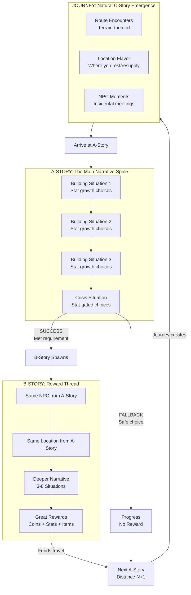
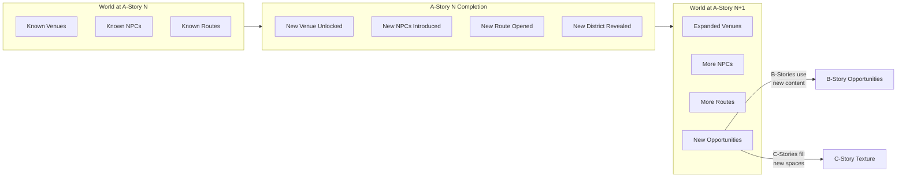
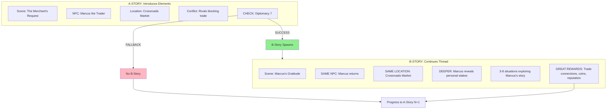

# Endless Story Design - Quick Reference

**Purpose:** One-page overview for session continuity. Details live in referenced documents.

---

## High-Concept Flow Diagrams

### The Complete Player Journey

```
┌─────────────────────────────────────────────────────────────────────────────────────────┐
│                                    ENDLESS STORY LOOP                                    │
└─────────────────────────────────────────────────────────────────────────────────────────┘

    ┌─────────────────────────────────────────────────────────────────────────────────┐
    │                              A-STORY (Main Narrative)                            │
    │                                                                                  │
    │   ┌─────────────┐    ┌─────────────┐    ┌─────────────┐    ┌─────────────┐      │
    │   │  BUILDING   │───▶│  BUILDING   │───▶│  BUILDING   │───▶│   CRISIS    │      │
    │   │  Situation  │    │  Situation  │    │  Situation  │    │  Situation  │      │
    │   │             │    │             │    │             │    │             │      │
    │   │ +Insight    │    │ +Rapport    │    │ +Authority  │    │ STAT-GATED  │      │
    │   │ choice      │    │ choice      │    │ choice      │    │ Insight 8   │      │
    │   └─────────────┘    └─────────────┘    └─────────────┘    └──────┬──────┘      │
    │                                                                   │              │
    └───────────────────────────────────────────────────────────────────┼──────────────┘
                                                                        │
                                    ┌───────────────────────────────────┴───────────────────────────────────┐
                                    │                                                                       │
                                    ▼                                                                       ▼
                    ┌───────────────────────────────┐                           ┌───────────────────────────────┐
                    │         SUCCESS PATH          │                           │        FALLBACK PATH          │
                    │                               │                           │                               │
                    │  "You passed the check!"      │                           │  "You take the safe route"    │
                    │                               │                           │                               │
                    │  ┌─────────────────────────┐  │                           │  Progress continues           │
                    │  │    B-STORY SPAWNS       │  │                           │  No B-story reward            │
                    │  │                         │  │                           │  Slower but never stuck       │
                    │  │  Same NPC returns       │  │                           │                               │
                    │  │  Same location          │  │                           └───────────────┬───────────────┘
                    │  │  Deeper narrative       │  │                                           │
                    │  │  3-8 situations         │  │                                           │
                    │  │                         │  │                                           │
                    │  │  ══════════════════     │  │                                           │
                    │  │  GREAT REWARDS          │  │                                           │
                    │  │  Coins, Stats, Items    │  │                                           │
                    │  └─────────────────────────┘  │                                           │
                    └───────────────┬───────────────┘                                           │
                                    │                                                           │
                                    └─────────────────────────┬─────────────────────────────────┘
                                                              │
                                                              ▼
                              ┌─────────────────────────────────────────────────────────┐
                              │                    NEXT A-STORY                         │
                              │                                                         │
                              │              Spawns at DISTANCE N+1                     │
                              │              Requires TRAVEL                            │
                              │                                                         │
                              └─────────────────────────────┬───────────────────────────┘
                                                            │
                                                            ▼
                              ┌─────────────────────────────────────────────────────────┐
                              │                      JOURNEY                            │
                              │                                                         │
                              │    Player travels through hex grid                      │
                              │    Route choice = Impossible Choice                     │
                              │                                                         │
                              │    ┌─────────────────────────────────────────────────┐  │
                              │    │              C-STORIES EMERGE                   │  │
                              │    │                                                 │  │
                              │    │    Forest hex → Ambush encounter               │  │
                              │    │    Road hex → Merchant encounter               │  │
                              │    │    Mountain hex → Harsh conditions             │  │
                              │    │    Location visit → Local flavor               │  │
                              │    │    NPC meeting → Incidental moment             │  │
                              │    └─────────────────────────────────────────────────┘  │
                              │                                                         │
                              └─────────────────────────────┬───────────────────────────┘
                                                            │
                                                            ▼
                                                    ┌───────────────┐
                                                    │    ARRIVE     │
                                                    │               │
                                                    │  Loop repeats │
                                                    │  Distance N+1 │
                                                    └───────────────┘
```

### Story Causality (Detailed)



### Two Player Paths: Mastery vs Fallback

```
┌─────────────────────────────────────────────────────────────────────────────────────────┐
│                                  THE MASTERY PLAYER                                      │
│                                                                                          │
│    "I invest in stats, succeed at checks, earn B-Consequence, travel easily"            │
│                                                                                          │
│    ┌──────────┐    ┌──────────┐    ┌──────────────┐    ┌──────────┐    ┌──────────┐    │
│    │ A-Story  │───▶│ SUCCESS  │───▶│ B-CONSEQUENCE│───▶│ PREMIUM  │───▶│ TRAVEL   │    │
│    │ Building │    │ at Check │    │ (automatic)  │    │ REWARDS  │    │ Easy     │    │
│    └──────────┘    └──────────┘    └──────────────┘    └──────────┘    └──────────┘    │
│                                                                                          │
│    Experience: Rich narrative depth, same characters return, world feels connected      │
│    Pace: Fast progression, well-resourced                                               │
│    Feel: "My choices matter, my investment pays off"                                    │
│    Resource Strategy: B-Consequence provides everything needed — no grinding            │
│                                                                                          │
└─────────────────────────────────────────────────────────────────────────────────────────┘

┌─────────────────────────────────────────────────────────────────────────────────────────┐
│                                  THE FALLBACK PLAYER                                     │
│                                                                                          │
│    "I use fallbacks, then seek B-Sought work to earn travel funds"                      │
│                                                                                          │
│    ┌──────────┐    ┌──────────┐    ┌───────────┐    ┌───────────┐    ┌──────────┐      │
│    │ A-Story  │───▶│ FALLBACK │───▶│ Need      │───▶│ B-SOUGHT  │───▶│ TRAVEL   │      │
│    │ Building │    │ Choice   │    │ Resources │    │ Job Board │    │ Possible │      │
│    └──────────┘    └──────────┘    └───────────┘    │ NPC Quest │    └──────────┘      │
│                                                      └───────────┘                       │
│                                                                                          │
│    Experience: Main story + side quests, explores world for work opportunities          │
│    Pace: Slower progression, must actively seek income                                  │
│    Feel: "I can always find work, I control my pace"                                    │
│    Resource Strategy: Job boards always have work — effort, not skill, required         │
│                                                                                          │
│    ┌───────────────────────────────────────────────────────────────────────────────┐    │
│    │  LAST RESORT: Atmospheric Work                                                │    │
│    │  If no B-Sought available nearby, simple Work action at Commercial locations  │    │
│    │  Minimal rewards but NEVER soft-locked                                        │    │
│    └───────────────────────────────────────────────────────────────────────────────┘    │
│                                                                                          │
└─────────────────────────────────────────────────────────────────────────────────────────┘

                              BOTH PATHS ARE VALID
                              Neither player is stuck
                              Mastery is rewarded, not required

                 B-Consequence = reward for skill (automatic premium income)
                 B-Sought = fallback for effort (opt-in reliable income)
                 Atmospheric = safety net (always available minimal income)
```

### World Expansion Through A-Story



### The Complete Economic Cycle

```
┌─────────────────────────────────────────────────────────────────────────────────────────┐
│                                    ECONOMIC CYCLE                                        │
└─────────────────────────────────────────────────────────────────────────────────────────┘

                                    RESOURCE SINK
                        ┌─────────────────────────────────┐
                        │                                 │
                        │    A-Story at Distance N        │
                        │    ══════════════════════       │
                        │    Travel costs: Stamina        │
                        │    Travel costs: Coins (tolls)  │
                        │    Travel costs: Time           │
                        │                                 │
                        └────────────────┬────────────────┘
                                         │
                                         │ requires resources
                                         ▼
┌─────────────────────────────────────────────────────────────────────────────────────────┐
│                                  RESOURCE SOURCES                                        │
│                                                                                          │
│  ┌──────────────────────┐  ┌──────────────────────┐  ┌───────────────────────────────┐  │
│  │   B-CONSEQUENCE      │  │      B-SOUGHT        │  │   ATMOSPHERIC    │  C-STORY   │  │
│  │   (Premium Source)   │  │   (Reliable Source)  │  │   (Safety Net)   │  (Minor)   │  │
│  │                      │  │                      │  │                  │            │  │
│  │  ★★★★★ Coins         │  │  ★★★☆☆ Coins         │  │  ★★☆☆☆ Coins     │ ★☆☆☆☆      │  │
│  │  ★★★★☆ Stats         │  │  ★★☆☆☆ Stats         │  │  ☆☆☆☆☆ Stats     │ ★☆☆☆☆      │  │
│  │  ★★★☆☆ Items         │  │  ★★☆☆☆ Items         │  │  ☆☆☆☆☆ Items     │ ★☆☆☆☆      │  │
│  │                      │  │                      │  │                  │            │  │
│  │  Earned by SUCCESS   │  │  Found at Job Boards │  │  Always at       │ Surprises  │  │
│  │  at A-Story checks   │  │  NPC offers, quests  │  │  Commercial loc. │ on journey │  │
│  │  CANNOT DECLINE      │  │  CAN DECLINE         │  │  Simple action   │ Mandatory  │  │
│  └──────────────────────┘  └──────────────────────┘  └───────────────────────────────┘  │
│                                                                                          │
│  Mastery Player Path ───────────────▶│◀─────────────────── Fallback Player Path         │
│                                                                                          │
└─────────────────────────────────────────────────────────────────────────────────────────┘
                                         │
                                         │ funds travel
                                         ▼
                        ┌─────────────────────────────────┐
                        │                                 │
                        │    Travel to Next A-Story       │
                        │    at Distance N+1              │
                        │                                 │
                        │    Journey creates C-Stories    │
                        │    (natural texture)            │
                        │                                 │
                        └─────────────────────────────────┘
```

### Narrative Continuity: A to B Story Flow



### Route Choice: The Impossible Choice (Expanded)

```
┌─────────────────────────────────────────────────────────────────────────────────────────┐
│                           ROUTE CHOICE = IMPOSSIBLE CHOICE                               │
│                                                                                          │
│    You must reach the A-Story location. You cannot optimize all dimensions.              │
│    Every route is a trade-off. Pick your sacrifice.                                      │
└─────────────────────────────────────────────────────────────────────────────────────────┘

                              ┌─────────────────────────┐
                              │     DESTINATION         │
                              │     (A-Story Location)  │
                              │     Distance: 12 hexes  │
                              └───────────┬─────────────┘
                                          │
            ┌─────────────────────────────┼─────────────────────────────┐
            │                             │                             │
            ▼                             ▼                             ▼
┌───────────────────────┐   ┌───────────────────────┐   ┌───────────────────────┐
│      ROAD ROUTE       │   │     FOREST ROUTE      │   │    MOUNTAIN ROUTE     │
│                       │   │                       │   │                       │
│  ┌─────────────────┐  │   │  ┌─────────────────┐  │   │  ┌─────────────────┐  │
│  │ Time: 18 hexes  │  │   │  │ Time: 12 hexes  │  │   │  │ Time: 8 hexes   │  │
│  │ (longest path)  │  │   │  │ (direct)        │  │   │  │ (shortest)      │  │
│  └─────────────────┘  │   │  └─────────────────┘  │   │  └─────────────────┘  │
│                       │   │                       │   │                       │
│  ┌─────────────────┐  │   │  ┌─────────────────┐  │   │  ┌─────────────────┐  │
│  │ Stamina: 0      │  │   │  │ Stamina: 24     │  │   │  │ Stamina: 24     │  │
│  │ (roads free)    │  │   │  │ (2 per hex)     │  │   │  │ (3 per hex)     │  │
│  └─────────────────┘  │   │  └─────────────────┘  │   │  └─────────────────┘  │
│                       │   │                       │   │                       │
│  ┌─────────────────┐  │   │  ┌─────────────────┐  │   │  ┌─────────────────┐  │
│  │ Coins: Tolls    │  │   │  │ Coins: Free     │  │   │  │ Coins: Free     │  │
│  │ (pay at gates)  │  │   │  │ (no tolls)      │  │   │  │ (no tolls)      │  │
│  └─────────────────┘  │   │  └─────────────────┘  │   │  └─────────────────┘  │
│                       │   │                       │   │                       │
│  ┌─────────────────┐  │   │  ┌─────────────────┐  │   │  ┌─────────────────┐  │
│  │ C-Stories:      │  │   │  │ C-Stories:      │  │   │  │ C-Stories:      │  │
│  │ • Patrol checks │  │   │  │ • Bandit ambush │  │   │  │ • Rockfall      │  │
│  │ • Merchant meet │  │   │  │ • Wolf pack     │  │   │  │ • Altitude sick │  │
│  │ • Cart hire     │  │   │  │ • Lost path     │  │   │  │ • Shrine        │  │
│  │ (lawful, safe)  │  │   │  │ (dangerous)     │  │   │  │ (harsh, rare)   │  │
│  └─────────────────┘  │   │  └─────────────────┘  │   │  └─────────────────┘  │
│                       │   │                       │   │                       │
│  BEST FOR:            │   │  BEST FOR:            │   │  BEST FOR:            │
│  Low stamina player   │   │  Rich in stamina      │   │  Time-pressured       │
│  Has coins for tolls  │   │  Wants to avoid tolls │   │  High stamina         │
│  Risk-averse          │   │  Combat-ready         │   │  Urgency              │
└───────────────────────┘   └───────────────────────┘   └───────────────────────┘

            │                             │                             │
            └─────────────────────────────┼─────────────────────────────┘
                                          │
                              ┌───────────┴─────────────┐
                              │        ORIGIN           │
                              │        (Player)         │
                              │                         │
                              │   Current State:        │
                              │   Stamina: ???          │
                              │   Coins: ???            │
                              │   Time Pressure: ???    │
                              │                         │
                              │   YOU DECIDE            │
                              └─────────────────────────┘
```

---

## The Core Insight

A-Story creates B-Consequence (success rewards) and C-Stories (journey texture). B-Sought provides fallback income. They are causally linked, not independent systems.

---

## The Two B-Story Types

```
┌─────────────────────────────────────────────────────────────────────────────────────────┐
│                              B-STORY: TWO DISTINCT TYPES                                 │
└─────────────────────────────────────────────────────────────────────────────────────────┘

┌─────────────────────────────────────────────────────────────────────────────────────────┐
│                           B-CONSEQUENCE (Earned Reward)                                  │
│                                                                                          │
│    Spawn Trigger: A-story choice SUCCESS (stat check met, challenge won)                │
│    Player Agency: MANDATORY — cannot decline, just happens                              │
│    Narrative: CONTINUES A-story — same NPCs, same locations, deeper story              │
│    Rewards: PREMIUM — major resources for demonstrated mastery                          │
│    Repeatability: ONE-TIME per trigger                                                  │
│                                                                                          │
│    Sir Brante Pattern: Certain scenes only unlock from specific prior choices           │
│                                                                                          │
│    ┌──────────────┐         ┌──────────────┐         ┌──────────────┐                   │
│    │   A-Story    │ SUCCESS │ B-Consequence│         │   Premium    │                   │
│    │  Hard Check  │────────▶│   Spawns     │────────▶│   Rewards    │                   │
│    │  Insight 8   │         │  (automatic) │         │ Same NPC etc │                   │
│    └──────────────┘         └──────────────┘         └──────────────┘                   │
│                                                                                          │
└─────────────────────────────────────────────────────────────────────────────────────────┘

┌─────────────────────────────────────────────────────────────────────────────────────────┐
│                             B-SOUGHT (Player-Initiated)                                  │
│                                                                                          │
│    Spawn Trigger: Player ACCEPTANCE (takes quest, accepts contract, agrees to help)     │
│    Player Agency: OPT-IN — can decline, player controls engagement                      │
│    Narrative: INDEPENDENT — new characters, new situations                              │
│    Rewards: BASIC — reliable income for effort invested                                 │
│    Repeatability: SYSTEM-REPEATABLE — job boards always have work                       │
│                                                                                          │
│    Anti-Soft-Lock: Player can always earn resources through available work              │
│                                                                                          │
│    ┌──────────────┐         ┌──────────────┐         ┌──────────────┐                   │
│    │  Need Coins  │  SEEK   │   Job Board  │ ACCEPT  │   B-Sought   │                   │
│    │  for Travel  │────────▶│   NPC Offer  │────────▶│   Scene      │                   │
│    │              │         │   Discovery  │         │   Rewards    │                   │
│    └──────────────┘         └──────────────┘         └──────────────┘                   │
│                                                                                          │
│    Sources: Job Boards, NPC Offers, Exploration, Accepted Obligations                   │
│                                                                                          │
└─────────────────────────────────────────────────────────────────────────────────────────┘

┌─────────────────────────────────────────────────────────────────────────────────────────┐
│                              WHY BOTH TYPES EXIST                                        │
│                                                                                          │
│    B-Consequence: Rewards MASTERY — skilled players never need to grind                 │
│    B-Sought: Prevents SOFT-LOCK — struggling players always have options                │
│                                                                                          │
│    Together: Skill is rewarded, but never required for progression                      │
│                                                                                          │
└─────────────────────────────────────────────────────────────────────────────────────────┘
```

---

## B-Story Rhythm: Challenge → Payoff

B-Stories follow a distinct rhythm optimized for **resource acquisition**, not stat investment.

```
┌─────────────────────────────────────────────────────────────────────────────────────────┐
│                     A-STORY vs B-STORY: DIFFERENT RHYTHMS                                │
└─────────────────────────────────────────────────────────────────────────────────────────┘

┌─────────────────────────────────────────────────────────────────────────────────────────┐
│                       A-STORY: BUILDING → CRISIS                                         │
│                       (Stat Investment Cycle)                                            │
│                                                                                          │
│   ┌─────────────┐    ┌─────────────┐    ┌─────────────┐    ┌─────────────┐              │
│   │  BUILDING   │───▶│  BUILDING   │───▶│  BUILDING   │───▶│   CRISIS    │              │
│   │  Situation  │    │  Situation  │    │  Situation  │    │  Situation  │              │
│   │             │    │             │    │             │    │             │              │
│   │ GRANTS      │    │ GRANTS      │    │ GRANTS      │    │ TESTS       │              │
│   │ stats       │    │ stats       │    │ stats       │    │ stats       │              │
│   └─────────────┘    └─────────────┘    └─────────────┘    └─────────────┘              │
│                                                                                          │
│   Purpose: Character GROWS through the arc                                               │
│   Outcome: B-Consequence spawns when Crisis choice succeeds                             │
│                                                                                          │
└─────────────────────────────────────────────────────────────────────────────────────────┘

┌─────────────────────────────────────────────────────────────────────────────────────────┐
│                       B-STORY: CHALLENGE → PAYOFF                                        │
│                       (Resource Acquisition Cycle)                                       │
│                                                                                          │
│   ┌─────────────┐    ┌─────────────┐    ┌─────────────┐    ┌─────────────┐              │
│   │  CHALLENGE  │───▶│  CHALLENGE  │───▶│  CHALLENGE  │───▶│   PAYOFF    │              │
│   │  Situation  │    │  Situation  │    │  Situation  │    │  Situation  │              │
│   │             │    │             │    │             │    │             │              │
│   │ COSTS       │    │ COSTS       │    │ COSTS       │    │ GRANTS      │              │
│   │ resources   │    │ resources   │    │ resources   │    │ resources   │              │
│   └─────────────┘    └─────────────┘    └─────────────┘    └─────────────┘              │
│                                                                                          │
│   Purpose: Player's WEALTH grows through the arc                                         │
│   Outcome: Resources to fund A-story travel                                             │
│                                                                                          │
└─────────────────────────────────────────────────────────────────────────────────────────┘
```

### Why Different Rhythms?

| Aspect | A-Story (Building → Crisis) | B-Story (Challenge → Payoff) |
|--------|----------------------------|------------------------------|
| **What accumulates** | Stats (character capability) | Resources (economic wealth) |
| **Intermediate situations** | GRANT stats (investment) | COST resources/test skills |
| **Final situation** | TEST accumulated stats | GRANT resources |
| **Fallback required** | Yes (can never fail) | No (can fail) |
| **Net resource flow** | Sink (travel costs) | Source (income) |

### Challenge Situations (Position 1 to N-1)

Challenge situations present **obstacles requiring effort, risk, or resources**:

| Challenge Type | Example | Player Experience |
|----------------|---------|-------------------|
| **Resource Cost** | Pay informant, bribe guard | Spend coins to progress |
| **Skill Test** | Investigate clues, negotiate | Test stats without investing |
| **Time Investment** | Wait for contact, scout area | Spend Time blocks |
| **Risk Acceptance** | Expose position, make enemies | Accept future complications |

**No fallback safety valve** — B-Stories CAN fail. Player chose to engage; failure returns them to the world, not a dead end.

### Payoff Situation (Position N, Final)

The final situation **guarantees resource reward** upon successful completion:

| Payoff Type | Example | Reward Pattern |
|-------------|---------|----------------|
| **Quest Completion** | Deliver cargo, complete escort | Coins + reputation |
| **Investigation Result** | Report findings, solve mystery | Information + coins |
| **Contract Fulfillment** | Satisfy employer requirements | Payment + relationship |
| **Discovery Reward** | Find treasure, unlock secret | Items + coins |

**Payoff is guaranteed** — Every B-Story template MUST end with resource grants. This is the "quest reward" pattern familiar from RPGs.

### B-Consequence vs B-Sought Template Pools

Both follow Challenge → Payoff rhythm, but use different template pools:

| Type | Template Pool | Challenge Character | Payoff Character |
|------|---------------|--------------------|--------------------|
| **B-Consequence** | Continuation templates | Deepens A-story relationship | Premium rewards (mastery earned) |
| **B-Sought** | Quest templates | Tests generic skills | Basic rewards (effort invested) |

**B-Consequence challenges** involve the same NPCs from A-story — the challenges feel personal and narratively connected.

**B-Sought challenges** involve new NPCs — the challenges feel like professional work, quest content.

### Template Structure Examples

**Short B-Story (2 situations):**
```
Challenge 1: Accept contract terms (costs Time)
Payoff: Complete delivery (grants Coins)
```

**Standard B-Story (4 situations):**
```
Challenge 1: Negotiate with employer (tests Diplomacy)
Challenge 2: Travel to location (costs Stamina)
Challenge 3: Overcome obstacle (tests stat or costs resource)
Payoff: Report success (grants Coins + reputation)
```

**Extended B-Story (6-8 situations):**
```
Challenge 1-2: Setup and investigation
Challenge 3-4: Complications and setbacks
Challenge 5-6: Resolution attempts
Payoff: Major reward for sustained effort
```

---

## Detailed Documentation

| Topic | Document | Section |
|-------|----------|---------|
| **Story Category Definitions** | [08_glossary.md](08_glossary.md) | §Story Categories |
| **A/B/C Property Matrix** | [08_glossary.md](08_glossary.md) | Story Category Property Matrix |
| **Travel Cost Gate** | [05_content.md](05_content.md) | §5.7 |
| **Terrain System** | [05_content.md](05_content.md) | §5.7 Terrain Shapes Route Cost |
| **Core Loop Integration** | [03_core_loop.md](03_core_loop.md) | §3.5 |

---

## Key Principles (Summary)

| Principle | Description |
|-----------|-------------|
| **A-Story: Building → Crisis** | A-Story scenes follow stat investment cycle; Building GRANTS stats; Crisis TESTS them |
| **B-Story: Challenge → Payoff** | B-Story scenes follow resource acquisition cycle; Challenge COSTS resources; Payoff GRANTS them |
| **C-Story: Single Situation** | C-Stories are single-situation texture; no rhythm pattern needed |
| **Scene = Arc** | Each A-Story scene IS an arc; last situation is always Crisis; Building situations lead up |
| **Template + Context** | SceneTemplates define structure (constant); context injection creates variety (variable) |
| **B-Consequence = Earned** | Spawns when player takes stat-gated choice in Crisis; mandatory; same NPCs/locations |
| **B-Sought = Fallback** | Player seeks out via job boards; opt-in; repeatable; prevents soft-lock |
| **Narrative Continuity** | B-Consequence continues A-story threads via categorical PlacementFilter matching |
| **Travel Cost Gate** | Distance creates resource demand; B-stories fund travel |
| **Payoff Guarantee** | Every B-Story MUST end with resource reward; this is enforced at template level |

---

## Mechanical Definitions

### Scene = Arc (The Core Model)

Each A-Story **scene IS an arc**. Not "multiple scenes form an arc"—ONE scene = ONE arc.

```
SceneTemplate (pre-authored, parsed at game start)
    │
    ├── Situation 1: Building (stat growth, narrative setup)
    ├── Situation 2: Building (investment accumulates)
    ├── Situation 3: Building (stakes rise)
    ├── ...
    └── Situation N: CRISIS (stat-gated choices, B-Consequence triggers)
                     ↑
                     Always the LAST situation
```

### Template Constants vs Instance Variables

| CONSTANT (per template) | VARIABLE (per instance) |
|------------------------|------------------------|
| Number of situations | NPCs (PlacementFilter resolution) |
| Arc structure | Locations (PlacementFilter resolution) |
| Mechanical flow baseline | Concrete stat values (context injection) |
| Crisis position (always last) | Narrative flavor (AI generation) |

**Why same template doesn't get stale:**
- Different NPCs resolve each time (categorical matching)
- Different locations based on player position
- Different stat thresholds from player investment state
- Different narrative from AI Pass 2

### Procedural Selection + Context Injection

```
Game State + Player Choices + Anti-Repetition Rules
    ↓
Procedural Selection (deterministic)
    ↓
SceneTemplate chosen (defines structure)
    ↓
Context Injection (categorical properties)
    ↓
Scene Instance (unique experience)
```

| Concept | Mechanism | Status |
|---------|-----------|--------|
| **SceneTemplate** | Pre-authored JSON, parsed at game start | ✓ Exists |
| **Template Selection** | Procedural rules based on game state | ✓ Exists |
| **Context Injection** | Categorical properties influence generation | ✓ Exists |
| **Crisis Position** | Always last situation in A-Story scene | Design rule |
| **B-Consequence Trigger** | Choice with `ScenesToSpawn` + stat requirements | ✓ Mechanism exists |
| **Narrative Continuity** | EntityResolver + PlacementFilter | ✓ Exists (HIGHLANDER) |

> **Note:** There is no "success/failure" dichotomy. Each choice has OR-requirements and consequences (positive, negative, or trade-offs). B-Consequence spawns when player takes a stat-gated choice vs fallback.

---

## Code References

| Component | Values |
|-----------|--------|
| StoryCategory | MainStory, SideStory, Encounter |
| RhythmPattern | Building, Crisis, Mixed |
| PlacementProximity | SameLocation, SameVenue, SameDistrict, AdjacentLocation, etc. |
| EntityResolver | Find-only queries using PlacementFilter |
| PlacementFilter | Categorical filter specification (profession, personality, proximity) |
| SceneInstantiator | Orchestrates find-or-create for entity resolution |

---

## Implementation Gaps

| Gap | Status | Notes |
|-----|--------|-------|
| **B-Consequence authoring** | Design ready | Need: A-story choices with `ScenesToSpawn` pointing to SideStory templates |
| **B-Sought discovery** | Design only | Need: Job boards, NPC offers, exploration rewards |
| **C-story emergence** | Partial | Currently hardcoded encounters, need terrain-aware selection |
| **Distance-based A-story** | Design only | Need: A-story N spawns at distance N |
| **Multiple routes** | Design only | Current: Single optimal path per transport type |

See [08_glossary.md](08_glossary.md) §Story Categories for complete B-Consequence vs B-Sought distinction.
